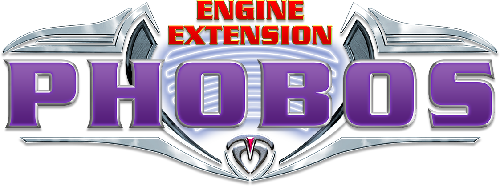

**Phobos** is a WIP community project providing a set of new features and fixes for Yuri's Revenge based on [modified YRpp](https://github.com/Metadorius/YRpp) and [Syringe](https://github.com/Ares-Developers/Syringe) to allow injecting code. It's meant to accompany [Ares](https://github.com/Ares-Developers/Ares) rather than replace it, thus it won't introduce incompatibilities.

For now you can discuss the project at a dedicated [channel on C&C Mod Haven](https://discord.gg/sZeMzz6qVg) (which is my C&C modding server).

Refer to the [wiki](https://github.com/Phobos-developers/Phobos/wiki) to see the full list of features.

Building
--------

Windows:

0. Install Visual Studio with "Desktop development with C++" workload, "C++ Windows XP Support for VS 2017 (v141) tools" individual component and clone this repo recursively.
1. Open the solution file in VS and build it.

Upon build completion place the resulting `Phobos.dll` in your YR directory and launch Syringe targeting your YR executable (usually `gamemd.exe`).

You can also get test a nightly version for a specific commit which is built automatically with a GitHub Actions workflow, just press on a green tick, open the workflow, find and download the build artifact (a ZIP containing the extension's DLL). Those versions have build information (commit and branch/tag) in them which is displayed ingame and can't be turned off. **Those versions are bleeding edge, do not redistribute them in mods!**

Credits
-------

- Belonit (Gluk-v48), Metadorius (Kerbiter) - project authors
- misha135n2 - YRpp edits
- tomsons26, CCHyper - all-around help, assistance and guidance in reverse-engineering, YR binary mappings
- Ares developers - YRpp and Syringe which are used, save/load, project foundation and generally useful code from Ares; 
- DCoder - unused deployer fixes that are now included in Phobos
- CCHyper - current project logo
- ZΞPHYɌUS - win/lose themes code
- ayylmao, SMxReaver, 4SG, FS-21 - help with docs
- wiktorderelf, Metadorius (Kerbiter) - overhauled Unicode font
- Thrifinesma (Uranusian) - mind control range limit and custom warhead splash list implementation
- SEC-SOME (secsome) - debug info dump hotkey, refactoring & porting of Ares helper code, introducing more Ares-derived stuff, disguise removal warhead, mind control removal warhead, general help
- Otamaa (BoredEXE) - help with CellSpread
- E1 Elite - TileSet 255 and above bridge repair fix
- FS-21 - improvements to debug info code, Powered.KillSpawns
- AutoGavy - interceptor logic

Thanks to everyone who uses Phobos, tests changes and reports bugs! You can show your appreciation and help project by displaying the logo (monochrome version can be found [here](logo-mono.png)) in your client/launcher, [contributing](https://github.com/Phobos-developers/Phobos/wiki/Contributing) or donating to us via links on the right and the `Sponsor` button on top of the repo.

Legal and License
-----

The Phobos project is an unofficial open-source community collaboration project to extend the Red Alert 2 Yuri's Revenge engine for modding and compatibility purposes.

This project has no direct affiliation with Electronic Arts Inc. Command & Conquer, Command & Conquer Red Alert 2, Command & Conquer Yuri's Revenge are registered trademarks of Electronic Arts Inc. All Rights Reserved.

