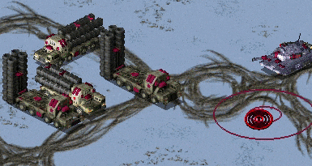
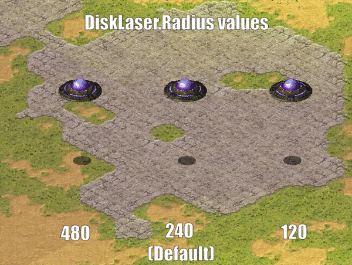

# Fixed / Improved Logics

This page describes all ingame logics that are fixed or improved in Phobos without adding anything significant.

## Bugfixes and miscellaneous

- Fixed the bug that GameModeOptions are not correctly saved. For example, `BuildOffAlly` is corrupted after load a save.
- Fixed the bug that light tint created by buildings can never be removed (light tint persists even if the building is destroyed/sold) after loading a game
- Fixed the bug when reading a map which puts `Preview(Pack)` after `Map` lead to the game fail to draw the preview
- Fixed the bug when retinting map lighting with a map action corrupted light sources.
- Fixed the bug when deploying mindcontrolled vehicle into a building permanently transferred the control to the house which mindcontrolled it.
- Fixed the bug when capturing a mind-controlled building with an engineer fail to break the mind-control link.
- Removed the EVA_BuildingCaptured event when capturing a building considered as a vehicle.
- Fixed the bug when units are already dead but still in map (for sinking, crashing, dying animation, etc.), they could die again.
- Fixed the bug when cloaked Desolator was unable to fire his deploy weapon.
- Fixed the bug that temporaryed unit cannot be erased correctly and no longer raise an error.
- Fixed `DebrisMaximums` (spawned debris type amounts cannot go beyond specified maximums anymore). Only applied when `DebrisMaximums` values amount is more than 1 for compatibility reasons.
- Fixed building and defense tab hotkeys not enabling the placement mode after `Cannot build here.` triggered and the placement mode cancelled.
- Fixed buildings with `UndeployInto` playing `EVA_NewRallypointEstablished` on undeploying.
- Fixed buildings with `Naval=yes` ignoring `WaterBound=no` to be forced to place onto water.
- Fixed AI Aircraft docks bug when Ares tag `[GlobalControls]` > `AllowParallelAIQueues=no` is set.
- Fixed laser drawing code to allow for thicker lasers in house color draw mode.
- Fixed `DeathWeapon` not detonating properly.
  - Some settings are still ignored like `PreImpactAnim` *(Ares feature)*, this might change in future.
- Fixed the bug when occupied building's `MuzzleFlashX` is drawn on the center of the building when `X` goes past 10.
- Fixed jumpjet units that are `Crashable` not crashing to ground properly if destroyed while being pulled by a `Locomotor` warhead.
- Fixed jumpjet units being unable to turn to the target when firing from a different direction.
- Fixed jumpjet units being able to continue firing at enemy target when crashing.


*Jumpjet turning to target applied in [Robot Storm X](https://www.moddb.com/mods/cc-robot-storm-x)*

- Fixed turreted jumpjet units always facing bottom-right direction when motion stops.
- Fixed jumpjet objects being unable to use `Sensors`.
- Fixed interaction of `UnitAbsorb` & `InfantryAbsorb` with `Grinding` buildings. The keys will now make the building only accept appropriate types of objects.
- Fixed missing 'no enter' cursor for VehicleTypes being unable to enter a `Grinding` building.
- Fixed Engineers being able to enter `Grinding` buildings even when they shouldn't (such as ally building at full HP).
- Allowed usage of `AlternateFLH` of vehicles in `OpenTopped` transport.
- Improved the statistic distribution of the spawned crates over the visible area of the map so that they will no longer have a higher chance to show up near the edges.
- Allowed usage of TileSet of 255 and above without making NE-SW broken bridges unrepairable.
- Added a "Load Game" button to the retry dialog on mission failure.


*Side offset voxel turret in Breaking Blue project*

- `TurretOffset` tag for voxel turreted TechnoTypes now accepts FLH (forward, lateral, height) values like `TurretOffset=F,L` or `TurretOffset=F,L,H`, which means turret location can be adjusted in all three axes.
- `TurretOffset` is now supported for SHP vehicles.
- `InfiniteMindControl` with `Damage=1` can now control more than 1 unit.
- Aircraft with `Fighter` set to false or those using strafing pattern (weapon projectile `ROT` is below 2) now take weapon's `Burst` into accord for all shots instead of just the first one.
- Vehicles using `DeployFire` will now use `DeployFireWeapon` for firing the deploy weapon if explicitly set, if not it behaves like previously (`Primary` if can fire, `Secondary` if not) and respect `FireOnce` setting on weapon and any stop commands issued during firing. If `FireOnce` is set to true the unit won't accept further deploy commands for number of frames that is equal to whichever is smaller between weapon `ROF` and `[Unload]` -> `Rate` times 900.
- Infantry with `DeployFireWeapon=-1` can now fire both weapons (decided by its target), regardless of deployed or not.


*Nod arty keeping target on attack order in [C&C: Reloaded](https://www.moddb.com/mods/cncreloaded/)*

- Vehicle to building deployers now keep their target when deploying with `DeployToFire`.
- Effects like lasers are no longer drawn from wrong firing offset on weapons that use Burst.
- Animations can now be offset on the X axis with `XDrawOffset`.
- `IsSimpleDeployer` units now only play `DeploySound` and `UndeploySound` once, when done with (un)deploying instead of repeating it over duration of turning and/or `DeployingAnim`.
- AITrigger can now recognize Building Upgrades as legal condition.
- `EWGates` and `NSGates` now will link walls like `xxGateOne` and `xxGateTwo` do.
- Fixed interaction of `UnitAbsorb` & `InfantryAbsorb` with `Grinding` buildings. The keys will now make the building only accept appropriate types of objects.
- Fixed missing 'no enter' cursor for VehicleTypes being unable to enter a `Grinding` building.
- Fixed Engineers being able to enter `Grinding` buildings even when they shouldn't (such as ally building at full HP).
- Aircraft & jumpjet units are now affected by speed modifiers such as `SpeedAircraft/Infantry/UnitsMult` on `Countries`, `VeteranSpeed` and Crates / AttachEffect (Ares feature).
- Both voxel and SHP vehicle units should now correctly respect custom palette set through `Palette`.
- Weapons fired by EMPulse superweapons without `EMPulse.TargetSelf=true` *(Ares feature)* can now create radiation.
- Setting `RadarInvisible` to true on TerrainTypes now hides them from minimap display.
- Mind control indicator animations will now correctly restore on mind controlled objects when uncloaked.
- Animations from Warhead `AnimList` & `SplashList` etc. as well as animations created through map trigger `41 Play Anim At` now have the appropriate house set as owner of the animation by default.
- Nuke carrier & payload weapons now respect `Bright` setting on the weapons always when appropriate (previously only payload did and only if Superweapon had `Nuke.SiloLaunch=false` *(Ares feature)*).
- Self-healing pips from `InfantryGainSelfHeal` & `UnitsGainSelfHeal` now respect unit's `PixelSelectionBracketDelta` like health bar pips do.
- Fixed the bug where the health bar of a unit being attacked by temporal weapons would not disappear after mouse hover, causing it to remain visible even when the mouse moved away.
- Buildings using `SelfHealing` will now correctly revert to undamaged graphics if their health is restored back by self-healing.
- Allow use of `Foundation=0x0` on TerrainTypes without crashing for similar results as for buildings.
- Projectiles now remember the house of the firer even if the firer is destroyed before the projectile detonates. Does not currently apply to some Ares-introduced Warhead effects like EMP.
- `OpenTopped` transports now take `OpenTransportWeapon` setting of passengers into consideration when determining weapon range used for threat scanning and approaching targets.
- Trailer animations now inherit the owner of the object (animation, projectile or aircraft) they are attached to.
- Buildings now correctly use laser parameters set for Secondary weapons instead of reading them from Primary weapon.
- Fixed an issue that caused vehicles killed by damage dealt by a known house but without a known source TechnoType (f.ex animation warhead damage) to not be recorded as killed correctly and thus not spring map trigger events etc.


*Animated trees used in [Ion Shock](https://www.moddb.com/mods/tiberian-war-ionshock)*

- `IsAnimated`, `AnimationRate` and `AnimationProbability` now work on TerrainTypes without `SpawnsTiberium` set to true. Note that this might impact performance.
- Fixed transports recursively put into each other not having a correct killer set after second transport when being killed by something.


*Example gradient SHP drawing with 75% translucency, before and after*

- Translucent RLE SHPs will now be drawn using a more precise and performant algorithm that has no green tint and banding. Can be disabled with `rulesmd.ini->[General]->FixTransparencyBlitters=no`.
  - Only applies to Z-aware drawing mode for now.
- Fixed projectiles with `Inviso=true` suffering from potential inaccuracy problems if combined with `Airburst=yes` or Warhead with `EMEffect=true`.
- Fixed the bug when `MakeInfantry` logic on BombClass resulted in `Neutral` side infantry.
- Fixed railgun particles being drawn to wrong coordinate against buildings with non-default `TargetCoordOffset` or when force-firing on bridges.
- Fixed building `TargetCoordOffset` not being taken into accord for several things like fire angle calculations and target lines.
- In singleplayer missions, the player can now see cloaked objects owned by allied houses.
- IvanBomb images now display and the bombs detonate at center of buildings instead of in top-leftmost cell of the building foundation.
- Fixed BibShape drawing for a couple of frames during buildup for buildings with long buildup animations.
- Animation with `Tiled=yes` now supports `CustomPalette`.
- Attempted to avoid units from retaining previous orders (attack,grind,garrison,etc) after changing ownership (mind-control,abduction,etc).
- Fixed buildings' `NaturalParticleSystem` being created for in-map pre-placed structures.
- Fixed jumpjet units being unable to visually tilt or be flipped if `TiltCrashJumpjet=no`.
- Unlimited (more than 5) `AlternateFLH` entries for units.
- Warheads spawning debris now use `MaxDebris` as an actual cap for number of debris to spawn instead of `MaxDebris` - 1.
 If both `Primary` and `Secondary` weapons can fire at air targets (projectile has `AA=true`), `Primary` can now be picked instead of always forcing `Secondary`. Also applies to `IsGattling=true`, with odd-numbered and even-numbered `WeaponX` slots instead of `Primary` and `Secondary`, respectively.
- `IsGattling=true` can now fall back to secondary weapon slot (even-numbered `WeaponX` slots) if primary one (odd-numbered) cannot fire at current target (armor type, `CanTarget(Houses)`, shield etc).
- Fixed `LandTargeting=1` not preventing from targeting TerrainTypes (trees etc.) on land.
- Fixed `NavalTargeting=6` not preventing from targeting empty water cells or TerrainTypes (trees etc.) on water.
- Fixed `NavalTargeting=7` and/or `LandTargeting=2` resulting in still targeting TerrainTypes (trees etc.) on land with `Primary` weapon.
- Fixed infantry without `C4=true` being killed in water if paradropped, chronoshifted etc. even if they can normally enter water.
- Allowed MCV to redeploy in campaigns using a new toggle different from `[MultiplayerDialogSettings]->MCVRedeploys`.
- Fixed buildings with `UndeploysInto` but `Unsellable=no` & `ConstructionYard=no` unable to be sold normally. Restored `EVA_StructureSold` for buildings with `UndeploysInto` when being selled.
- Fixed `WaterBound=true` buildings with `UndeploysInto` not correctly setting the location for the vehicle to move into when undeployed.
- Buildings with `CanC4=false` used to take 1 point of damage if hit by damage below 1 (calculated after `Verses` are applied but before veterancy, crate and AttachEffect modifiers). This no longer applies to negative damage under any conditions and can be disabled for zero damage by setting `CanC4.AllowZeroDamage` to true.
- Buildings with primary weapon that has `AG=false` projectile now have attack cursor when selected.
- Weapons with `AA=true` projectiles can now be set to fire exclusively at air targets by setting `AAOnly=true`, regardless of other conditions. This is useful because `AG=false` only prevents targeting ground cells (and cannot be changed without breaking existing behaviour) and for cases where `LandTargeting` cannot be used.
- Transports with `OpenTopped=true` and weapon that has `Burst` above 1 and passengers firing out no longer have the passenger firing offset shift lateral position based on burst index.
- Fixed disguised infantry not using custom palette for drawing the disguise when needed.
- Disguised infantry now show appropriate insignia when disguise is visible, based on the disguise type and house. Original unit's insignia is always shown to observers and if disguise blinking is enabled for the current player by `[General]`->`DisguiseBlinkingVisibility`.
- Buildings with superweapons no longer display `SuperAnimThree` at beginning of match if pre-placed on the map.
- `SpySat=yes` can now be applied using building upgrades.
- AI players can now build `Naval=true` and `Naval=false` vehicles concurrently like human players do.
- Fixed the bug when jumpjets were snapping into facing bottom-right when starting movement (observable when the starting unit is a jumpjet and is ordered to move).
- Objects with `Palette` set now have their color tint adjusted accordingly by superweapons, map retint actions etc. if they belong to a house using any color scheme instead of only those from the first half of `[Colors]` list.
- Animations using `AltPalette` are now remapped to their owner's color scheme instead of first listed color scheme and no longer draw over shroud. Color scheme from `[AudioVisual]` -> `AnimRemapDefaultColorScheme` is used if anim has no owner, which defaults to first listed color scheme from `[Colors]` still.
  - They can also have map lighting apply on them if `AltPalette.ApplyLighting` is set to true.
- Fixed `DeployToFire` not considering building placement rules for `DeploysInto` buildings and as a result not working properly with `WaterBound` buildings.
- Fixed `DeployToFire` not recalculating firer's position on land if it cannot currently deploy.
- `Arcing=true` projectile elevation inaccuracy can now be fixed by setting `Arcing.AllowElevationInaccuracy=false`.
- `EMPulseCannon=yes` building weapons now respect `Floater` and Phobos-added `Gravity` setting.
- You can now specify houses named `<Player @ A>` through `<Player @ H>` as the owner of TechnoTypes preplaced on the map in the editor, and they will be correctly given to players starting on points 1-8. Originally, it was only possible to use these house names in events, actions and teams.
- Wall overlays are now drawn with the custom palette defined in `Palette` in `artmd.ini` if possible.
- `Secondary` will now be used against walls if `Primary` weapon Warhead has `Wall=false`, `Secondary` has `Wall=true` and the firer does not have `NoSecondaryWeaponFallback` set to true.
- Setting `ReloadInTransport` to true on units with `Ammo` will allow the ammo to be reloaded according to `Reload` or `EmptyReload` timers even while the unit is inside a transport.
- It is now possible to enable `Verses` and `PercentAtMax` to be applied on negative damage by setting `ApplyModifiersOnNegativeDamage` to true on the Warhead.
- Attached animations on flying units now have their layer updated immediately after the parent unit, if on same layer they always draw above the parent.
- Fixed the issue where the powered anims of `Powered`/`PoweredSpecial` buildings cease to update when being captured by enemies.
- Fix a glitch related to incorrect target setting for missiles.
- Fix [EIP 00529A14](https://modenc.renegadeprojects.com/Internal_Error/YR#eip_00529A14) when attempting to read `[Header]` section of campaign maps.
- Units will no longer rotate its turret under EMP.
- Jumpjets will no longer wobble under EMP.
- Removed jumpjet units' deceleration when crashing onto buildings.
- Fixed `AmbientDamage` when used with `IsRailgun=yes` being cut off by elevation changes.
- Fixed railgun and fire particles being cut off by elevation changes.
- Fixed teleport units' (for example CLEG) frozen-still timer being cleared after load game.
- Fixed teleport units being unable to visually tilt on slopes.
- Fixed rockets' shadow location.
- Fixed units with Teleport, Tunnel or Fly locomotor being unable to be visually flipped like other locomotors do.
- Aircraft docking on buildings now respect `[AudioVisual]`->`PoseDir` as the default setting and do not always land facing north or in case of pre-placed buildings, the building's direction.
- Spawned aircraft now align with the spawner's facing when landing.
- Fixed the bug that waypointing unarmed infantries with agent/engineer/occupier to a spyable/capturable/occupiable building triggers EnteredBy event by executing capture mission.
- `PowerUpN` building animations can now use `Powered` & `PoweredLight/Effect/Special` keys.
- Fixed a desync potentially caused by displaying of cursor over selected `DeploysInto` units.
- Skipped drawing rally point line when undeploying a factory.

## Fixes / interactions with other extensions

- All forms of type conversion (including Ares') now correctly update `OpenTopped` state of passengers in transport that is converted.
- Fixed an issue introduced by Ares that caused `Grinding=true` building `ActiveAnim` to be incorrectly restored while `SpecialAnim` was playing and the building was sold, erased or destroyed.
- Fixed Ares jumpjet height sync issue during type conversion between types with different `JumpjetHeight` was not changed to unit instance.

## Aircraft

### Carryall pickup voice

- It is now possible to override `VoiceMove` for `Carryall=true` aircraft for when commanding it to pick up vehicles by setting `VoicePickup`.

In `rulesmd.ini`:
```ini
[SOMEAIRCRAFT]  ; AircraftType
VoicePickup=    ; Sound
```

### Fixed spawn distance & spawn height for airstrike / SpyPlane aircraft

- It is now possible to have aircraft spawned from `(Elite)AirstrikeTeamType` or `Type=SpyPlane` superweapons to be created at fixed distance from their intended target/destination instead of from edge of the map by setting `SpawnDistanceFromTarget`.
- `SpawnHeight` can also be used to override the initial height of the aircraft, which defaults to `FlightLevel`, or if not set then `[General]` -> `FlightLevel`.

In `rulesmd.ini`:
```ini
[SOMEAIRCRAFT]            ; AircraftType
SpawnDistanceFromTarget=  ; floating point value, distance in cells
SpawnHeight=              ; integer, height in leptons
```

### Landing direction

- By default aircraft land facing the direction specified by `[AudioVisual]`->`PoseDir`. This can now be customized per AircraftType via `LandingDir`, defaults to `[AudioVisual]`->`PoseDir`. If the building the aircraft is docking to has [aircraft docking direction](#aircraft-docking-direction) set, that setting takes priority over this.
  - Negative values are allowed as a special case for `AirportBound=false` aircraft which makes them land facing their current direction.

In `rulesmd.ini`:
```ini
[SOMEAIRCRAFT]  ; AircraftType
LandingDir=     ; Direction type (integers from 0-255). Accepts negative values as a special case.
```

## Animations

### Animation weapon and damage settings

- `Weapon` can be set to a WeaponType, to create a projectile and immediately detonate it instead of simply dealing `Damage` by `Warhead`. This allows weapon effects to be applied.
- `Damage.Delay` determines delay between two applications of `Damage`. Requires `Damage` to be set to 1.0 or above. Value of 0 disables the delay. Keep in mind that this is measured in animation frames, not game frames. Depending on `Rate`, animation may or may not advance animation frames on every game frame.
- `Damage.DealtByInvoker`, if set to true, makes any `Damage` dealt to be considered as coming from the animation's invoker (f.ex, firer of the weapon if it is Warhead `AnimList/SplashList` animation, the destroyed vehicle if it is `DestroyAnim` animation or the object the animation is attached to). If invoker has died or does not exist, the house the invoker belonged to is still used to deal damage and apply Phobos-introduced Warhead effects. Does not affect which house the `Damage` dealt by `Warhead` is dealt by.
- `Damage.ApplyOncePerLoop`, if set to true, makes `Damage` be dealt only once per animation loop (on single loop animations, only once, period) instead of on every frame or intervals defined by `Damage.Delay`. The frame on which it is dealt is determined by `Damage.Delay`, defaulting to after the first animation frame.

In `artmd.ini`:
```ini
[SOMEANIM]                     ; AnimationType
Weapon=                        ; WeaponType
Damage.Delay=0                 ; integer, animation frames
Damage.DealtByInvoker=false    ; boolean
Damage.ApplyOncePerLoop=false  ; boolean
```

```{note}
`Weapon` and `Damage.Delay`, beyond the other additions, should function similarly to the equivalent features introduced by Ares and take precedence over them if Phobos is used together with Ares.
```

### Attached animation position customization

- You can now customize whether or not animations attached to objects are centered at the object's actual center rather than the bottom of their top-leftmost cell (cell #0).

In `artmd.ini`:
```ini
[SOMEANIM]                       ; AnimationType
UseCenterCoordsIfAttached=false  ; boolean
```

### Customizable debris & meteor impact and warhead detonation behaviour

- `ExplodeOnWater` can be set to true to make the animation explode on impact with water. `ExpireAnim` will be played and `Warhead` is detonated or used to deal damage / generate light flash.
- `Warhead.Detonate`, if set to true, makes the `Warhead` fully detonate instead of simply being used to deal damage and generate light flash if it has `Bright=true`.
- `WakeAnim` contains a wake animation to play if `ExplodeOnWater` is not set and the animation impacts with water. Defaults to `[General]` -> `Wake` if `IsMeteor` is not set to true, otherwise no animation.
- `SplashAnims` contains list of splash animations used if `ExplodeOnWater` is not set and the animation impacts with water. Defaults to `[CombatDamage]` -> `SplashList`.
  - If `SplashAnims.PickRandom` is set to true, picks a random animation from `SplashAnims` to use on each impact with water. Otherwise last listed animation from `SplashAnims` is used.
- `ExtraShadow` can be set to false to disable the display of shadows on the ground.

In `artmd.ini`:
```ini
[SOMEANIM]                    ; AnimationType
ExplodeOnWater=false          ; boolean
Warhead.Detonate=false        ; boolean
WakeAnim=                     ; Animation
SplashAnims=                  ; list of animations
SplashAnims.PickRandom=false  ; boolean
ExtraShadow=true              ; boolean
```

### Layer on animations attached to objects

- You can now customize whether or not animations attached to objects follow the object's layer or respect their own `Layer` setting. If this is unset, attached animations use `ground` layer.

In `artmd.ini`:
```ini
[SOMEANIM]             ; AnimationType
Layer.UseObjectLayer=  ; boolean
```

### Ore stage threshold for `HideIfNoOre`

- You can now customize which growth stage should an ore/tiberium cell have to have animation with `HideIfNoOre` displayed. Cells with growth stage less than specified value won't allow the anim to display.

In `artmd.ini`:
```ini
[SOMEANIM]               ; AnimationType
HideIfNoOre.Threshold=0  ; integer, minimal ore growth stage
```

## Buildings

### Aircraft docking direction

- It is now possible to customize the landing direction for docking aircraft via `AircraftDockingDir(N)` (`N` optionally replaced by 0-based index for each `DockingOffset` separately, `AircraftDockingDir` and `AircraftDockingDir0` are synonymous and will be used if direction is not set for a specific offset) on the dock building. This overrides the aircraft's own [landing direction](#landing-direction) setting and defaults to `[AudioVisual]` -> `PoseDir`.

In `rulesmd.ini`:
```ini
[SOMEBUILDING]          ; BuildingType
AircraftDockingDir(N)=  ; Direction type (integers from 0-255)
```

### Airstrike target eligibility

- By default whether or not a building can be targeted by airstrikes depends on value of `CanC4`, which also affects other things. This can now be changed independently by setting `AllowAirstrike`. If not set, defaults to value of `CanC4`.

In `rulesmd.ini`:
```ini
[SOMEBUILDING]   ; BuildingType
AllowAirstrike=  ; boolean
```

### Apply ZShapePointMove during buildups

- By default buildings do not apply `ZShapePointMove` (which offsets the 'z shape' applied on buildings which is used to adjust them in depth buffer and is used to fix issues related to that such as corners of buildings getting cut off when drawn) when buildup is being displayed. This behaviour can now be toggled by setting `ZShapePointMove.OnBuildup`.

In `artmd.ini`:
```ini
[SOMEBUILDING]                   ; BuildingType
ZShapePointMove.OnBuildup=false  ; boolean
```

### Buildings considered as vehicles

- By default game considers buildings with both `UndeploysInto` set and `Foundation` equaling `1x1` as vehicles, in a manner of speaking. This behaviour can now be toggled individually of these conditions by setting `ConsideredVehicle`. These buildings are counted as vehicles for unit count tracking, are not considered as base under attack when damaged and can be mass selected by default, for an example.
- When capturing such "buildings", the player won't be notified by EVA capture event.

In `rulesmd.ini`:
```ini
[SOMEBUILDING]      ; BuildingType
ConsideredVehicle=  ; boolean
```

### Customizable & new grinder properties


*Using ally grinder, restricting to vehicles only and refund display ([Project Phantom](https://www.moddb.com/mods/project-phantom))*

- You can now customize which types of objects a building with `Grinding` set can grind as well as the grinding sound.
  - `Grinding.AllowAllies` changes whether or not to allow units to enter allies' buildings.
  - `Grinding.AllowOwner` changes whether or not to allow units to enter your own buildings.
  - `Grinding.AllowTypes` can be used to define InfantryTypes and VehicleTypes that can be grinded by the building. Listing any will disable grinding for all types except those listed.
  - `Grinding.DisallowTypes` can be used to exclude InfantryTypes or VehicleTypes from being able to enter the grinder building.
  - `Grinding.PlayDieSound` controls if the units' `DieSound` and `VoiceDie` are played when entering the grinder. Default to `yes`.
  - `Grinding.Sound` is a sound played by when object is grinded by the building. If not set, defaults to `[AudioVisual]`->`EnterGrinderSound`.
  - `Grinding.Weapon` is a weapon fired at the building & by the building when it grinds an object. Will only be fired if at least weapon's `ROF` amount of frames have passed since it was last fired.
    - `Grinding.Weapon.RequiredCredits` can be set to have the weapon require accumulated credits from grinding to fire. Accumulated credits for this purpose are reset every time when the weapon fires.
- For money string indication upon grinding, please refer to [`DisplayIncome`](User-Interface.md/#Visual-indication-of-income-from-grinders-and-refineries).

In `rulesmd.ini`:
```ini
[SOMEBUILDING]                     ; BuildingType
Grinding.AllowAllies=false         ; boolean
Grinding.AllowOwner=true           ; boolean
Grinding.AllowTypes=               ; List of InfantryTypes / VehicleTypes
Grinding.DisallowTypes=            ; List of InfantryTypes / VehicleTypes
Grinding.PlayDieSound=true         ; boolean
Grinding.Sound=                    ; Sound
Grinding.Weapon=                   ; WeaponType
Grinding.Weapon.RequiredCredits=0  ; integer
```

### Customizable selling buildup sequence length for buildings that can undeploy

- By default buildings with `UndeploysInto` will only play 23 frames of their buildup sequence (in reverse starting from last frame) when being sold as opposed to being undeployed. This can now be customized via `SellBuildupLength`.

In `rulesmd.ini`:
```ini
[SOMEBUILDING]        ; BuildingType
SellBuildupLength=23  ; integer, number of buildup frames to play
```

## Particle systems

### Fire particle target coordinate adjustment when firer rotates

- By default particle systems with `BehavesLike=Fire` shift their target coordinates if the object that created the particle system (e.g firer of a weapon) is rotating. This behavior can now be disabled per particle system type.

In `rulesmd.ini`:
```ini
[SOMEPARTICLESYSTEM]               ; ParticleSystemType
AdjustTargetCoordsOnRotation=true  ; boolean
```

## Particles

### Customizable gas particle speed

- Gas particles can now drift at a custom speed.

In `rulesmd.ini`:
```ini
[GASPARTICLE]          ; Particle with BehavesLike=Gas
Gas.MaxDriftSpeed=2    ; integer (TS default is 5)
```

## Projectiles

### Cluster scatter distance customization

- `ClusterScatter.Min` and `ClusterScatter.Max` can be used to set minimum and maximum distance, respectively, in cells from the original detonation coordinate any additional detonations if `Cluster` is set to value higher than 1 can appear at.

In `rulesmd.ini`:
```ini
[SOMEPROJECTILE]        ; Projectile
ClusterScatter.Min=1.0  ; float, distance in cells
ClusterScatter.Max=2.0  ; float, distance in cells
```

### Customizable projectile gravity

-  You can now specify individual projectile gravity.
    - Setting `Gravity=0` is not recommended as it will cause the projectile to fly backwards and be unable to hit the target which is not at the same height. We suggest to use `Straight` Trajectory instead. See [here](New-or-Enhanced-Logics.md#projectile-trajectories).

In `rulesmd.ini`:
```ini
[SOMEPROJECTILE]        ; Projectile
Gravity=6.0             ; floating point value
```

### FlakScatter distance customization

- By default `FlakScatter=true` makes `Inviso=true` projectiles scatter by random distance (in cells) from 0 to `[CombatDamage]` -> `BallisticScatter`. This distance range can now be customized by setting `BallisticScatter.Min` & `BallisticScatter.Max` on the projectile. If not set, the default values are used.

In `rulesmd.ini`:
```ini
[SOMEPROJECTILE]      ; Projectile
BallisticScatter.Min= ; float, distance in cells
BallisticScatter.Max= ; float, distance in cells
```

## Technos

### Building-provided self-healing customization

- It is now possible to set a global cap for the effects of `InfantryGainSelfHeal` and `UnitsGainSelfHeal` by setting `InfantryGainSelfHealCap` & `UnitsGainSelfHealCap` under `[General]`, respectively.
- Whether or not `MultiplayPassive=true` houses benefit from these effects can be controlled via `GainSelfHealAllowMultiplayPassive`.
- It is also possible to change the pip frames displayed from `pips.shp` individually for infantry, units and buildings by setting the frames for infantry & unit self-healing on `Pips.SelfHeal.Infantry/Units/Buildings` under `[AudioVisual]`, respectively.
  - `Pips.SelfHeal.Infantry/Units/Buildings.Offset` can be used to customize the pixel offsets for the displayed pips, individually for infantry, units and buildings.
- Whether or not a TechnoType benefits from effects of `InfantryGainSelfHeal` or `UnitsGainSelfHeal` buildings or neither can now be controlled by setting `SelfHealGainType`.
  - If `SelfHealGainType` is not set, InfantryTypes and VehicleTypes with `Organic` set to true gain self-healing from `InfantryGainSelfHeal`, other VehicleTypes from `UnitsGainSelfHeal` and AircraftTypes & BuildingTypes never gain self-healing.

In `rulesmd.ini`:
```ini
[General]
InfantryGainSelfHealCap=                ; integer, maximum amount of InfantryGainSelfHeal that can be in effect at once, must be 1 or higher
UnitsGainSelfHealCap=                   ; integer, maximum amount of UnitsGainSelfHeal that can be in effect at once, must be 1 or higher
GainSelfHealAllowMultiplayPassive=true  ; boolean

[AudioVisual]
Pips.SelfHeal.Infantry=13,20            ; integer, frames of pips.shp for infantry & unit-self healing pips, respectively
Pips.SelfHeal.Units=13,20               ; integer, frames of pips.shp for infantry & unit-self healing pips, respectively
Pips.SelfHeal.Buildings=13,20           ; integer, frames of pips.shp for infantry & unit-self healing pips, respectively
Pips.SelfHeal.Infantry.Offset=25,-35    ; X,Y, pixels relative to default
Pips.SelfHeal.Units.Offset=33,-32       ; X,Y, pixels relative to default
Pips.SelfHeal.Buildings.Offset=15,10    ; X,Y, pixels relative to default

[SOMETECHNO]                            ; TechnoType
SelfHealGainType=                       ; Self-Heal Gain Type Enumeration (none|infantry|units)
```

### Chrono sparkle animation customization & improvements

- It is now possible to customize the frame delay between instances of `[General]` -> `ChronoSparkle1` animations created on objects being warped by setting `[General]` -> `ChronoSparkleDisplayDelay`.
- By default on buildings with `MaxOccupants` higher than 0, chrono sparkle animation would be shown at each of the `MuzzleFlashN` coordinates. This behaviour is now customizable, and supports `MuzzleFlashN` indices higher than 10.
  - `[General]` -> `ChronoSparkleBuildingDisplayPositions` can be set to show the sparkle animation on the building (`building`), muzzle flash coordinates of current occupants (`occupants`), muzzle flash coordinates of all occupant slots (`occupantslots`) or any combination of these.
    - If `occupants` or `occupantslots` is listed without `building`, a single chrono sparkle animation is still displayed on building if it doesn't have any occupants or it has `MaxOccupants` value less than 1, respectively.
- The chrono sparkle animation that is displayed on building itself is also now displayed at the center of it rather than at center of its topmost cell.

In `rulesmd.ini`:
```ini
[General]
ChronoSparkleDisplayDelay=24                         ; integer, game frames
ChronoSparkleBuildingDisplayPositions=occupantslots  ; list of chrono sparkle position enum (building | occupants | occupantslots | all)
```

### Customizable veterancy insignias

- You can now customize veterancy insignia of TechnoTypes.
  - `Insignia.(Rookie|Veteran|Elite)` can be used to set a custom insignia file, optionally for each veterancy stage. Like the original / default file, `pips.shp`, they are drawn using `palette.pal` as palette.
  - `InsigniaFrame(.Rookie|Veteran|Elite)` can be used to set (zero-based) frame index of the insignia to display, optionally for each veterancy stage. Using -1 uses the default setting. Default settings are -1 (none) for rookie, 14 for veteran and 15 for elite.
    - A shorthand `InsigniaFrames` can be used to list them in order from rookie, veteran and elite instead as well. `InsigniaFrame(.Rookie|Veteran|Elite)` takes priority over this.
  - Normal insignia can be overridden for specific weapon modes of `Gunner=true` units by setting `Insignia(.Frame/.Frames).WeaponN` where `N` stands for 1-based weapon mode index. If not set, defaults to non-mode specific insignia settings.
  - `Insignia.ShowEnemy` controls whether or not the insignia is shown to enemy players. Defaults to `[General]` -> `EnemyInsignia`, which in turn defaults to true.

In `rulesmd.ini`:
```ini
[General]
EnemyInsignia=true                ; boolean

[SOMETECHNO]                      ; TechnoType
Insignia=                         ; filename - excluding the .shp extension
Insignia.Rookie=                  ; filename - excluding the .shp extension
Insignia.Veteran=                 ; filename - excluding the .shp extension
Insignia.Elite=                   ; filename - excluding the .shp extension
InsigniaFrame=-1                  ; int, frame of insignia shp (zero-based) or -1 for default
InsigniaFrame.Rookie=-1           ; int, frame of insignia shp (zero-based) or -1 for default
InsigniaFrame.Veteran=-1          ; int, frame of insignia shp (zero-based) or -1 for default
InsigniaFrame.Elite=-1            ; int, frame of insignia shp (zero-based) or -1 for default
InsigniaFrames=-1,-1,-1           ; int, frames of insignia shp (zero-based) or -1 for default
Insignia.WeaponN=                 ; filename - excluding the .shp extension
Insignia.WeaponN.Rookie=          ; filename - excluding the .shp extension
Insignia.WeaponN.Veteran=         ; filename - excluding the .shp extension
Insignia.WeaponN.Elite=           ; filename - excluding the .shp extension
InsigniaFrame.WeaponN=-1          ; int, frame of insignia shp (zero-based) or -1 for default
InsigniaFrame.WeaponN.Rookie=-1   ; int, frame of insignia shp (zero-based) or -1 for default
InsigniaFrame.WeaponN.Veteran=-1  ; int, frame of insignia shp (zero-based) or -1 for default
InsigniaFrame.WeaponN.Elite=-1    ; int, frame of insignia shp (zero-based) or -1 for default
InsigniaFrames.WeaponN=-1,-1,-1   ; int, frames of insignia shp (zero-based) or -1 for default
Insignia.ShowEnemy=               ; boolean
```

```{note}
Insignia customization besides the `InsigniaFrames` shorthand should function similarly to the equivalent feature introduced by Ares and takes precedence over it if Phobos is used together with Ares.
```

### Customizable harvester ore gathering animation


*Custom ore gathering anims in [Project Phantom](https://www.moddb.com/mods/project-phantom)*

- You can now specify which anim should be drawn when a harvester of specified type is gathering specified type of ore.

In `rulesmd.ini`:
```ini
[SOMETECHNO]                     ; TechnoType
OreGathering.Anims=              ; list of animations
OreGathering.FramesPerDir=15     ; list of integers
OreGathering.Tiberiums=0         ; list of Tiberium IDs
```

### Customizable Teleport/Chrono Locomotor settings per TechnoType


*Chrono Legionnaire and Ronco using different teleportation settings in [YR: New War](https://www.moddb.com/mods/yuris-revenge-new-war)*

- You can now specify Teleport/Chrono Locomotor settings per TechnoType to override default rules values. Unfilled values default to values in `[General]`.
- Only applicable to Techno that have Teleport/Chrono Locomotor attached.

In `rulesmd.ini`:
```ini
[SOMETECHNO]            ; TechnoType
WarpOut=                ; Anim (played when Techno warping out), default to [General] WarpOut
WarpIn=                 ; Anim (played when Techno warping in), default to [General] WarpIn
WarpAway=               ; Anim (played when Techno chronowarped by chronosphere), default to [General] WarpOut
ChronoTrigger=          ; boolean, if yes then delay varies by distance, if no it is a constant
ChronoDistanceFactor=   ; integer, amount to divide the distance to destination by to get the warped out delay
ChronoMinimumDelay=     ; integer, the minimum delay for teleporting, no matter how short the distance
ChronoRangeMinimum=     ; integer, can be used to set a small range within which the delay is constant
ChronoDelay=            ; integer, delay after teleport for chronosphere
```

### Customizable target evaluation map zone check behaviour

- By default, any non-AircraftType units seeking targets via ScriptType team mission (action) `0 Attack Target Type` or any [attack team missions introduced in Phobos](AI-Scripting-and-Mapping.md#10000-10049-attack-actions) check if the potential target is in same map zone as the attacking unit to be able to pick it as a target. This can now be customized to allow objects from any map zone with no constraints (`TargetZoneScanType=any`) or only if they are within weapon range (`TargetZoneScanType=inrange`).

In `rulesmd.ini`:
```ini
[SOMETECHNO]             ; TechnoType
TargetZoneScanType=same  ; target zone scan enumeration (same|any|inrange)
```

### Customizable unit image in art

- `Image` tag in art INI is no longer limited to AnimationTypes and BuildingTypes, and can be applied to all TechnoTypes (InfantryTypes, VehicleTypes, AircraftTypes, BuildingTypes).
- The tag specifies **only** the file name (without extension) of the asset that replaces TechnoType's graphics. If the name in `Image` is also an entry in the art INI, **no tags will be read from it**.
- **By default this feature is disabled** to remain compatible with YR. To use this feature, enable it in rules with `ArtImageSwap=true`.
- This feature supports SHP images for InfantryTypes, SHP and VXL images for VehicleTypes and VXL images for AircraftTypes.

In `rulesmd.ini`:
```ini
[General]
ArtImageSwap=false  ; disabled by default
```

In `artmd.ini`:
```ini
[SOMETECHNO]
Image=              ; name of the file that will be used as image, without extension
```

### Customize resource storage

- Now Ares `Storage` feature can set which Tiberium type from `[Tiberiums]` list should be used for storing resources in structures with `Refinery.UseStorage=yes` and `Storage` > 0.
- This tag can not be used without Ares.

In `rulesmd.ini`:
```ini
[General]
Storage.TiberiumIndex=-1  ; integer, [Tiberiums] list index
```

### Exploding object customizations

- By default `Explodes=true` TechnoTypes have all of their passengers killed when they are destroyed. This behaviour can now be disabled by setting `Explodes.KillPassengers=false`.
- BuildingTypes with `Explodes=true` can by default explode even when they are still being built or sold. This can be disabled by setting `Explodes.DuringBuildup` to false. This causes them to behave as if `Explodes` was set to false while being built up or sold.

In `rulesmd.ini`:
```ini
[SOMETECHNO]                 ; TechnoType
Explodes.KillPassengers=true ; boolean

[SOMEBUILDING]               ; BuildingType
Explodes.DuringBuildup=true  ; boolean
```

### IronCurtain effects on organics customization
- In vanilla game, when iron-curtain is applied on organic units like infantries and squids, they could only get killed instantly by C4Warhead. This behavior is now dehardcoded, and the effect under iron-curtain can now be chosen among
  - `kill` : Iron-Curtain kills the organic object with a specifc warhead.
  - `invulnerable` : Iron-Curtain makes the organic object invulnerable like buildings and vehicles.
  - `ignore` : Iron-Curtain doesn't give any effect on the organic object.

In `rulesmd.ini`
```ini
[CombatDamage]
IronCurtain.EffectOnOrganics=kill  ; IronCurtain effect Enumeration (kill | invulnerable | ignore), IronCurtain to Infantry and Techno with Organic=yes
IronCurtain.KillOrganicsWarhead=   ; IronCurtain uses this warhead to kill organics, default to [CombatDamage]->C4Warhead

[SOMETECHNO]                       ; InfantryType or Organic TechnoType
IronCurtain.Effect=                ; IronCurtain effect Enumeration (kill | invulnerable | ignore), default to [CombatDamage]-> IronCurtain.EffectOnOrganics
IronCurtain.KillWarhead=           ; IronCurtain uses this warhead to kill this organic, default to [CombatDamage]->IronCurtain.KillWarhead
```

### Jumpjet rotating on crashing toggle

- Jumpjet that is going to crash starts to change its facing uncontrollably, this can now be turned off.

In `rulesmd.ini`:

```ini
[SOMETECHNO]    ; TechnoType
JumpjetRotateOnCrash=true  ; boolean
```

```{warning}
This may subject to further changes.
```
### Jumpjet: convert unit type in air and force unit always be in air

`AlwaysBeInAir` designed to use with Ares type conversion logic (`IsSimpleDeployer=true` and `Convert.Deploy=TECHNOTYPE`) and will convert unit in air instead of convert type during deploy on ground as`BalloonHover` does.

`AlwaysBeInAir.StayGrounded` prevents `AlwaysBeInAir` tagged unit to being immediately ascended in case if initial unit type has `AlwaysBeInAir=false` and converted unit type hasn't.

```ini
[SOMETECHNO]    ; TechnoType
AlwaysBeInAir=false  ; boolean
AlwaysBeInAir.StayGrounded=false  ; boolean
```

### Kill spawns on low power

- `Powered=yes` structures that spawns aircraft like Aircrafts Carriers will stop targeting the enemy if low power.
- Spawned aircrafts self-destruct if they are flying.

In `rulesmd.ini`:
```ini
[SOMESTRUCTURE]          ; BuildingType
Powered.KillSpawns=false ; boolean
```

### PipScale pip customizations

- It is now possible to change the size of pips (or more accurately the pixel increment to the next pip drawn) displayed on `PipScale`.
  - `Pips.Generic.(Buildings.)Size` is for non-ammo pips on non-building TechnoTypes / buildings, accordingly, and `Pips.Ammo.(Buildings.)Size` is in turn for ammo pips, split similarly between non-building technos and buildings.
  - Ammo pip size can also be overridden on per TechnoType-basis using `AmmoPipSize`.
- Ammo pip frames can now also be customized.
  - `AmmoPipFrame` and `AmmoPipFrame` are frames (zero-based) of `pips2.shp` used for ammo pip and empty ammo pip (this is not set by default) for when `PipWrap=0` (this is the default).
  - `AmmoPipWrapStartFrame` is used as start frame (zero-based, from `pips2.shp`) for when `PipWrap` is above 0. The start frame is the empty frame and up to `Ammo` divided by `PipWrap` frames after it are used for the different reload stages.
  - `AmmoPipOffset` can be used to shift the starting position of ammo pips.
- Pips for TechnoTypes with `Spawns` can now also be customized.
  - `ShowSpawnsPips` determines whether or not these pips are shown at all, as they are independent from `PipScale` setting.
  - `SpawnsPipFrame` and `EmptySpawnsPipFrame` are frames (zero-based) of `pips.shp` (for buildings) or `pips2.shp` (for others) used for a spawnee pip and empty spawnee pip, respectively.
  - `SpawnsPipSize` determines the pixel increment to the next pip drawn. Defaults to `[AudioVisual]` -> `Pips.Generic.(Buildings.)Size` if not set.
  - `SpawnsPipoffset` can be used to shift the starting position of spawnee pips.
- Pips for `Storage` can now also be customized via new keys in `[AudioVisual]`.
  - `Pips.Tiberiums.Frames` can be used to list frames (zero-based) of `pips.shp` (for buildings) or `pips2.shp` (for others) used for tiberium types, in the listed order corresponding to tiberium type index. Defaults to 5 for tiberium type index 1, otherwise 2.
    - `Pips.Tiberiums.EmptyFrame` can be used to set the frame for empty slots, defaults to 0.
  - `Pips.Tiberiums.DisplayOrder` controls in which order the tiberium type pips are displayed, takes a list of tiberium type indices. Any tiberium type not listed will be displayed in sequential order after the listed ones.
  - `Pips.Tiberiums.WeedFrame` controls which frame is displayed on Technos with `Weeder=yes`, takes a (zero-based) index of a frame in `pips.shp` (for buildings) or `pips2.shp` (for others). Defaults to 1.
    - `Pips.Tiberiums.WeedEmptyFrame` can be used to set the frame for empty weed slots, defaults to 0.

In `rulesmd.ini`:
```ini
[AudioVisual]
Pips.Generic.Size=4,0                ; X,Y, increment in pixels to next pip
Pips.Generic.Buildings.Size=4,2      ; X,Y, increment in pixels to next pip
Pips.Ammo.Size=4,0                   ; X,Y, increment in pixels to next pip
Pips.Ammo.Buildings.Size=4,2         ; X,Y, increment in pixels to next pip
Pips.Tiberiums.EmptyFrame=0          ; integer, frame of pips.shp (buildings) or pips2.shp (others) (zero-based)
Pips.Tiberiums.Frames=2,5,2,2        ; list of integers, frames of pips.shp (buildings) or pips2.shp (others) (zero-based)
Pips.Tiberiums.DisplayOrder=0,2,3,1  ; list of integers, tiberium type indices
Pips.Tiberiums.WeedEmptyFrame=0      ; integer, frame of pips.shp (buildings) or pips2.shp (others) (zero-based)
Pips.Tiberiums.WeedFrame=1           ; integer, frame of pips.shp (buildings) or pips2.shp (others) (zero-based)

[SOMETECHNO]                         ; TechnoType
AmmoPipFrame=13                      ; integer, frame of pips2.shp (zero-based)
EmptyAmmoPipFrame=-1                 ; integer, frame of pips2.shp (zero-based)
AmmoPipWrapStartFrame=14             ; integer, frame of pips2.shp (zero-based)
AmmoPipSize=                         ; X,Y, increment in pixels to next pip
AmmoPipOffset=0,0                    ; X,Y, position offset from default
ShowSpawnsPips=true                  ; boolean
SpawnsPipFrame=1                     ; integer, frame of pips.shp (buildings) or pips2.shp (others) (zero-based)
EmptySpawnsPipFrame=0                ; integer, frame of pips.shp (buildings) or pips2.shp (others) (zero-based)
SpawnsPipSize=                       ; X,Y, increment in pixels to next pip
SpawnsPipOffset=0,0                  ; X,Y, position offset from default
```

### Re-enable obsolete [JumpjetControls]

- Re-enable obsolete [JumpjetControls], the keys in it will be as the default value of jumpjet units.
  - Moreover, added two tags for missing ones.

In `rulesmd.ini`:
```ini
[JumpjetControls]
Crash=5.0        ; floating point value
NoWobbles=false  ; boolean
```

```{note}
`CruiseHeight` is for `JumpjetHeight`, `WobblesPerSecond` is for `JumpjetWobbles`, `WobbleDeviation` is for `JumpjetDeviation`, and `Acceleration` is for `JumpjetAccel`. All other corresponding keys just simply have no Jumpjet prefix.
```

### Voxel body multi-section shadows

- It is also now possible for vehicles and aircraft to display shadows for multiple sections of the voxel body at once, instead of just one section specified by `ShadowIndex`, by specifying the section indices in `ShadowIndices` (which defaults to `ShadowIndex`) in unit's `artmd.ini` entry.
  - `ShadowIndex.Frame` and `ShadowIndices.Frame` can be used to customize which frame of the HVA animation for the section from `ShadowIndex` and `ShadowIndices` is used to display the shadow, respectively. -1 is special value which means currently shown frame is used, and `ShadowIndices.Frame` defaults to this.

In `artmd.ini`:
```ini
[SOMETECHNO]          ; TechnoType
ShadowIndices=        ; list of integers (voxel section indices)
ShadowIndex.Frame=0   ; integer (HVA animation frame index)
ShadowIndices.Frame=  ; list of integers (HVA animation frame indices)
```

### Voxel shadow scaling in air

- It is now possible to adjust how voxel air units (`VehicleType` & `AircraftType`) shadows scale in air. By default the shadows scale by `AirShadowBaseScale` (defaults to 0.5) amount if unit is `ConsideredAircraft=true`.
  - If `HeightShadowScaling=true`, the shadow is scaled by amount that is determined by following formula: `Max(AirShadowBaseScale ^ (currentHeight / ShadowSizeCharacteristicHeight), HeightShadowScaling.MinScale)`, where `currentHeight` is unit's current height in leptons, `ShadowSizeCharacteristicHeight` overrideable value that defaults to the maximum cruise height (`JumpjetHeight`, `FlightLevel` etc) and `HeightShadowScaling.MinScale` sets a floor for the scale.

In `rulesmd.ini`:
```ini
[AudioVisual]
AirShadowBaseScale=0.5            ; floating point value
HeightShadowScaling=false         ; boolean
HeightShadowScaling.MinScale=0.0  ; floating point value

[SOMETECHNO]                      ; TechnoType
ShadowSizeCharacteristicHeight=   ; integer, height in leptons
```

### Forbid parallel AI queues

- You can now set if specific types of factories do not have AI production cloning issue instead of Ares' indiscriminate behavior of `AllowParallelAIQueues=no`.
  - If `AllowParallelAIQueues=no` (*Ares feature*) is set, the tags have no effect.

In `rulesmd.ini`
```ini
[GlobalControls]
AllowParallelAIQueues=yes           ; must be set yes/true unless you don't use Ares
ForbidParallelAIQueues.Infantry=no  ; boolean
ForbidParallelAIQueues.Vehicle=no   ; boolean
ForbidParallelAIQueues.Navy=no      ; boolean
ForbidParallelAIQueues.Aircraft=no  ; boolean
ForbidParallelAIQueues.Building=no  ; boolean
```

## Terrains

### Customizable ore spawners


*Different ore spawners in [Rise of the East](https://www.moddb.com/mods/riseoftheeast) mod*

- You can now specify which type of ore certain TerrainType would generate.
- It's also now possible to specify a range value for an ore generation area different compared to standard 3x3 rectangle. Ore will be uniformly distributed across all affected cells in a spread range.
- You can specify which ore growth stage will be spawned and how many cells will be filled with ore per ore generation animation. Corresponding tags accept either a single integer value or two comma-separated values to allow randomized growth stages from the range (inclusive).

In `rulesmd.ini`:
```ini
[SOMETERRAINTYPE]             ; TerrainType
SpawnsTiberium.Type=0         ; tiberium/ore type index
SpawnsTiberium.Range=1        ; integer, radius in cells
SpawnsTiberium.GrowthStage=3  ; integer - single or comma-sep. range
SpawnsTiberium.CellsPerAnim=1 ; integer - single or comma-sep. range
```

### Minimap color customization

- TerrainTypes can now be made to display on minimap with different colors by setting `MinimapColor`.

In `rulesmd.ini`:
```ini
[SOMETERRAINTYPE]  ; TerrainType
MinimapColor=      ; integer - Red,Green,Blue
```

### Passable & buildable-upon TerrainTypes

- TerrainTypes can now be made passable or buildable upon by setting `IsPassable` or `CanBeBuiltOn`, respectively.
  - Movement cursor is displayed on `IsPassable` TerrainTypes unless force-firing.
  - `CanBeBuiltOn=true` terrain objects are removed when building is placed on them.

In `rulesmd.ini`:
```ini
[SOMETERRAINTYPE]   ; TerrainType
IsPassable=false    ; boolean
CanBeBuiltOn=false  ; boolean
```

## Tiberiums (ores)

### Minimap color customization

- Ore can now be made to display on minimap with different colors by setting `MinimapColor` on Tiberiums.

In `rulesmd.ini`:
```ini
[SOMEORE]      ; Tiberium
MinimapColor=  ; integer - Red,Green,Blue
```

## Vehicles

### Customizing crushing tilt and slowdown

- Vehicles with `Crusher=true` and `OmniCrusher=true` / `MovementZone=CrusherAll` were hardcoded to tilt when crushing vehicles / walls respectively. This now obeys `TiltsWhenCrushes` but can be customized individually for these two scenarios using `TiltsWhenCrusher.Vehicles` and `TiltsWhenCrusher.Overlays`, which both default to `TiltsWhenCrushes`.
- `CrushForwardTiltPerFrame` determines how much the forward tilt is adjusted per frame when crushing overlays or vehicles. Defaults to -0.02 for vehicles using Ship locomotor crushing overlays, -0.050000001 for all other cases.
- `CrushOverlayExtraForwardTilt` is additional forward tilt applied after an overlay has been crushed by the vehicle.
- It is possible to customize the movement speed slowdown when `MovementZone=CrusherAll` vehicle crushes walls by setting `CrushSlowdownMultiplier`.

In `rulesmd.ini`:
```ini
[SOMEVEHICLE]                      ; VehicleType
TiltsWhenCrushes.Vehicles=         ; boolean
TiltsWhenCrushes.Overlays=         ; boolean
CrushForwardTiltPerFrame=          ; floating point value
CrushOverlayExtraForwardTilt=0.02  ; floating point value
CrushSlowdownMultiplier=0.2        ; floating point value
```

### Destroy animations

- `DestroyAnim` has been extended to work with VehicleTypes, with option to pick random animation if `DestroyAnim.Random` is set to true. These animations store owner and facing information for use with [CreateUnit logic](New-or-Enhanced-Logics.md#anim-to-unit).

In `rulesmd.ini`:
```ini
[SOMEVEHICLE]                          ; VehicleType
DestroyAnim=                           ; list of animations
DestroyAnim.Random=true                ; boolean
```

### IsSimpleDeployer vehicle deploy animation / direction customization

- `DeployingAnim.AllowAnyDirection` if set, disables any direction constraints for deployers with `DeployingAnim` set. Only works for ground units.
- `DeployingAnim.KeepUnitVisible` determines if the unit is hidden while the animation is playing.
- `DeployingAnim.ReverseForUndeploy` controls whether or not the animation is played in reverse for undeploying.
- `DeployingAnim.UseUnitDrawer` controls whether or not the animation is displayed in the unit's palette and team colours or regular animation palette, including a potential custom palette.

In `rulesmd.ini`:
```ini
[SOMEVEHICLE]                          ; VehicleType
DeployingAnim.AllowAnyDirection=false  ; boolean
DeployingAnim.KeepUnitVisible=false    ; boolean
DeployingAnim.ReverseForUndeploy=true  ; boolean
DeployingAnim.UseUnitDrawer=true       ; boolean
```

### Preserve Iron Curtain status on type conversion


*Bugfix in action*

- Iron Curtain status is now preserved by default when converting between TechnoTypes via `DeploysInto`/`UndeploysInto`.
  - This behavior can be turned off per-TechnoType and global basis.
  - `IronCurtain.Modifier` is re-applied upon type conversion.

In `rulesmd.ini`:
```ini
[CombatDamage]
IronCurtain.KeptOnDeploy=yes ; boolean

[SOMETECHNO]                 ; VehicleType with DeploysInto or BuildingType with UndeploysInto
IronCurtain.KeptOnDeploy=    ; boolean, default to [CombatDamage]->IronCurtain.KeptOnDeploy
```

### Stationary vehicles

- Setting VehicleType `Speed` to 0 now makes game treat them as stationary, behaving in very similar manner to deployed vehicles with `IsSimpleDeployer` set to true. Should not be used on buildable vehicles, as they won't be able to exit factories.

### Voxel turret shadow

- Vehicle voxel turrets can now draw shadows if `[AudioVisual]` -> `DrawTurretShadow` is set to true. This can be overridden per VehicleType by setting `TurretShadow` in the vehicle's `artmd.ini` section.

In `rulesmd.ini`:
```ini
[AudioVisual]
DrawTurretShadow=false  ; boolean
```

In `artmd.ini`:
```ini
[SOMEUNIT]      ; UnitType
TurretShadow=   ; boolean
```

### `IsSimpleDeployer` vehicle auto-deploy / deploy block on ammo change

- Vehicle deployment can now be affected by ammo count.
  - `Ammo.AutoDeployMinimumAmount` determines the minimal number of ammo at which a vehicle converts/deploys automatically.
  - `Ammo.DeployUnlockMinimumAmount` determines the minimal number of ammo that unlocks issuing vehicle converting/deploying command.
    - `Ammo.AutoDeployMaximumAmount` and `Ammo.DeployUnlockMaximumAmount` behave analogically.
    - Setting a negative number will disable ammo count check.

In `rulesmd.ini`:
```ini
[SOMEVEHICLE]                        ; VehicleType
Ammo.AutoDeployMinimumAmount=-1      ; integer
Ammo.AutoDeployMaximumAmount=-1      ; integer
Ammo.DeployUnlockMinimumAmount=-1    ; integer
Ammo.DeployUnlockMaximumAmount=-1    ; integer
```

```{warning}
Auto-deploy feature requires `Convert.Deploy` from [Ares Type Conversion](https://ares-developers.github.io/Ares-docs/new/typeconversion.html) to change type. Unit without it will constantly use deploy command on self until ammo is changed.
```

### `IsSimpleDeployer` vehicle ammo change on deploy

- `Ammo.AddOnDeploy` determines the number of ammo added or substracted on unit deploy.

In `rulesmd.ini`:
```ini
[SOMEVEHICLE]           ; VehicleType
Ammo.AddOnDeploy=0      ; integer
```


## Veinholes & Weeds

### Veinholes

- Veinhole monsters now work like they used to in Tiberian Sun.
- Their core parameters are still loaded from `[General]`
- The Warhead used by veins is specified under `[CombatDamage]`. The warhead has to be properly listed under `[Warheads]` as well. The warhead has to have `Veinhole=yes` set.
- Veinholes are hardcoded to use several overlay types.
- The vein attack animation specified under `[AudioVisual]` is what deals the damage. The animation has to be properly listed under `[Animations]` as well.
- Units can be made immune to veins the same way as in Tiberian Sun.
- The monster itself is represented by the `VEINTREE` TerrainType, which has `IsVeinhole=true` set. Its strength is what determines the strength of the Veinhole.

```{note}
Everything listed below functions identically to Tiberian Sun.
Many of the tags from Tiberian Sun have been re-enabled. The values provided below are identical to those found in TS and YR rules. You can read more about them on ModENC:
[VeinholeGrowthRate](https://modenc.renegadeprojects.com/VeinholeGrowthRate), [VeinholeShrinkRate](https://modenc.renegadeprojects.com/VeinholeShrinkRate), [MaxVeinholeGrowth](https://modenc.renegadeprojects.com/MaxVeinholeGrowth), [VeinDamage](https://modenc.renegadeprojects.com/VeinDamage), [VeinholeTypeClass](https://modenc.renegadeprojects.com/VeinholeTypeClass),
[VeinholeWarhead](https://modenc.renegadeprojects.com/VeinholeWarhead), [Veinhole](https://modenc.renegadeprojects.com/Veinhole), [VeinAttack](https://modenc.renegadeprojects.com/VeinAttack), [ImmuneToVeins](https://modenc.renegadeprojects.com/ImmuneToVeins), [IsVeinhole](https://modenc.renegadeprojects.com/IsVeinhole)
```

In `rulesmd.ini`:
```ini
[General]
VeinholeGrowthRate=300        ; integer
VeinholeShrinkRate=100        ; integer
MaxVeinholeGrowth=2000        ; integer
VeinDamage=5                  ; integer
VeinholeTypeClass=VEINTREE    ; TerrainType

[CombatDamage]
VeinholeWarhead=VeinholeWH    ; Warhead

[VeinholeWH]
Veinhole=yes

[AudioVisual]
VeinAttack=VEINATAC           ; Animation

[TechnoType]
EliteAbilities=VEIN_PROOF
ImmuneToVeins=yes

[VEINTREE]
IsVeinhole=true
Strength=1000                 ; integer - the strength of the Veinhole
```

```{warning}
The game expects certain overlays related to Veinholes to have certain indices, they are listed below. Please keep in mind that the indices in the OverlayTypes list are 0-based, formed internally by the game, and the identifiers left of "=" don't matter. Vanilla `rulesmd.ini` already has the required overlays listed at the correct indices.
```

In `rulesmd.ini`:
```ini
[OverlayTypes]
126=VEINS                     ; The veins (weeds)
167=VEINHOLE                  ; The Veinhole itself
178=VEINHOLEDUMMY             ; A technical overlay
```


### Weeds & Weed Eaters

- Vehicles with `Weeder=yes` can now collect weeds. The weeds can then be deposited into a building with `Weeder=yes`.
- Weeds are not stored in a building's storage, but rather in a House's storage. The weed capacity is listed under `[General]->WeedCapacity`.
- Weeders now show the ore gathering animation. It can be customized the same way as for harvesters.
- Weeders can use the Teleport locomotor like chrono miners.
- Total amount of weeds in storage can be displayed on sidebar, see [Weeds counter](User-Interface.md#weeds-counter).

### Weed-consuming superweapons

- Superweapons can consume weeds to recharge, like the Chemical Missile special in Tiberian Sun.

```{note}
As the code for the Chemical Missile had been removed, setting `Type=ChemMissile` will not work.
```

In `rulesmd.ini`:
```ini
[SuperWeaponType]
UseWeeds=no                                     ; boolean - should the SW use weeds to recharge?
UseWeeds.Amount=                                ; integer - how many? default is General->WeedCapacity
UseWeeds.StorageTimer=no                        ; boolean - should the counter on the sidebar display the % of weeds stored?
UseWeeds.ReadinessAnimationPercentage=0.9       ; double - when this many weeds % are stored, the SW will show it's ready on the building (open nuke/open chrono, etc.)
```

## VoxelAnims

### Customizable debris & meteor impact and warhead detonation behaviour

- The INI keys and behaviour is mostly identical to the [equivalent behaviour available to regular animations](#customizable-debris-%26-meteor-impact-and-warhead-detonation-behaviour). Main difference is that the keys must be listed in the VoxelAnim's entry in `rulesmd.ini`, not `artmd.ini`.

## Warheads

### Customizable Warhead animation behaviour

- It is possible to make game play random animation from `AnimList` by setting `AnimList.PickRandom` to true. The result is similar to what `EMEffect=true` produces, however it comes with no side-effects (`EMEffect=true` prevents `Inviso=true` projectiles from snapping on targets, making them miss moving targets).
- If `AnimList.CreateAll` is set to true, all animations from `AnimList` are created, instead of a single anim based on damage or random if  `AnimList.PickRandom` is set to true.
- If `AnimList.CreationInterval` is set to a value higher than 0, there will be that number of detonations of the Warhead before animations from `AnimList` will be created again. If the Warhead had a TechnoType firing it, this number is remembered by the TechnoType across all Warheads fired by it, otherwise it is shared between all detonations of same WarheadType period. This can be useful for things like `Airburst` with large spread where one might want uniform distribution of animations to appear but not on every detonation.
- `SplashList` can be used to override animations displayed if the Warhead has `Conventional=true` and it hits water, by default animations from `[CombatDamage]` -> `SplashList` are used.
  - `SplashList.PickRandom`, `SplashList.CreateAll` and `SplashList.CreationInterval` apply to these animations in same manner as the `AnimList` equivalents.
- `CreateAnimsOnZeroDamage`, if set to true, makes it so that `AnimList` or `SplashList` animations are created even if the weapon that fired the Warhead deals zero damage.
- Setting `Conventional.IgnoreUnits` to true on Warhead with `Conventional=true` will make the Warhead detonate on non-underwater VehicleTypes on water tiles as if they are water tiles, instead of treating it as land.

In `rulesmd.ini`:
```ini
[SOMEWARHEAD]                   ; WarheadType
AnimList.PickRandom=false       ; boolean
AnimList.CreateAll=false        ; boolean
AnimList.CreationInterval=0     ; integer
SplashList=                     ; List of animations
SplashList.PickRandom=false     ; boolean
SplashList.CreateAll=false      ; boolean
SplashList.CreationInterval=0   ; integer
CreateAnimsOnZeroDamage=false   ; boolean
Conventional.IgnoreUnits=false  ; boolean
```

### Custom debris animations and additional debris spawn settings

- You can now use `DebrisAnims` to specify a list of debris animations to spawn instead of animations from `[General]` -> `MetallicDebris` when Warhead with `MaxDebris` > 0 and no `DebrisTypes` (VoxelAnims) listed is detonated.
- `Debris.Conventional`, if set to true, makes `DebrisTypes` or `DebrisAnims` only spawn if Warhead is fired on non-water cell.

In `rulesmd.ini`:
```ini
[SOMEWARHEAD]              ; WarheadType
DebrisAnims=               ; List of animations
Debris.Conventional=false  ; boolean
```

### Allowing damage dealt to firer

- You can now allow warhead to deal damage (and apply damage-adjacent effects such as `KillDriver` and `DisableWeapons/Sonar/Flash.Duration` *(Ares features)*) on the object that is considered as the firer of the Warhead even if it does not have `DamageSelf=true`.
  - Note that effect of `Psychedelic=true`, despite being tied to damage will still fail to apply on the firer as it does not affect any objects belonging to same house as the firer, including itself.

In `rulesmd.ini`:
```ini
[SOMEWARHEAD]            ; WarheadType
AllowDamageOnSelf=false  ; boolean
```

### Customizing decloak on damaging targets

- You can now specify whether or not the warhead decloaks objects that are damaged by the warhead.

In `rulesmd.ini`:
```ini
[SOMEWARHEAD]               ; WarheadType
DecloakDamagedTargets=true  ; boolean
```

### Restricting screen shaking to current view

- You can now specify whether or not the warhead can only shake screen (`ShakeX/Ylo/hi`) if it is detonated while visible on current screen view.

In `rulesmd.ini`:
```ini
[SOMEWARHEAD]       ; WarheadType
ShakeIsLocal=false  ; boolean
```

## Weapons

### AmbientDamage customizations

- You can now specify separate Warhead used for `AmbientDamage` via `AmbientDamage.Warhead` or make it never apply to weapon's main target by setting `AmbientDamage.IgnoreTarget` to true.

In `rulesmd.ini`:
```ini
[SOMEWEAPON]                      ; WeaponType
AmbientDamage.Warhead=            ; WarheadType
AmbientDamage.IgnoreTarget=false  ; boolean
```

### Customizable disk laser radius


- You can now set disk laser animation radius using a new tag.

In `rulesmd.ini`:
```ini
[SOMEWEAPON]          ; WeaponType
DiskLaser.Radius=240  ; floating point value
                      ; 240 is the default saucer disk radius
```

### Customizable ROF random delay

- By default weapon `ROF` has a random delay of 0 to 2 frames added to it. This random delay is now customizable, globally and on per-WeaponType basis.

In `rulesmd.ini`:
```ini
[CombatDamage]
ROF.RandomDelay=0,2  ; integer - single or comma-sep. range (game frames)

[SOMEWEAPON]         ; WeaponType
ROF.RandomDelay=     ; integer - single or comma-sep. range (game frames)
```

### Single-color lasers


*Comparison of `IsSingleColor=yes` lasers with higher thickness to regular ones* ([RA2: Reboot](https://www.moddb.com/mods/reboot))

- You can now set laser to draw using only `LaserInnerColor` by setting `IsSingleColor`, in same manner as `IsHouseColor` lasers do using player's team color. These lasers respect laser thickness. Note that this is not available on prism support weapons.

In `rulesmd.ini`:
```ini
[SOMEWEAPON]         ; WeaponType
IsSingleColor=false  ; boolean
```

### Toggle-able ElectricBolt visuals


*EBolt customization utilized for different Tesla bolt weapon usage* ([RA2: Reboot](https://www.moddb.com/mods/reboot))

- You can now specify individual bolts you want to disable for `IsElectricBolt=true` weapons. Note that this is only a visual change.

In `rulesmd.ini`:
```ini
[SOMEWEAPONTYPE]       ; WeaponType
Bolt.Disable1=false    ; boolean
Bolt.Disable2=false    ; boolean
Bolt.Disable3=false    ; boolean
```

```{note}
Due to technical constraints, this does not work with electric bolts created from support weapon of Ares' Prism Forwarding.
```

### Customizable ElectricBolt Arcs

- By default `IsElectricBolt=true` effect draws a bolt with 8 arcs. This can now be customized per WeaponType with `Bolt.Arcs`. Value of 0 results in a straight line being drawn.

In `rulesmd.ini`:
```ini
[SOMEWEAPONTYPE]       ; WeaponType
Bolt.Arcs=8            ; integer, number of arcs in a bolt
```

```{note}
Due to technical constraints, this does not work with electric bolts created from support weapon of Ares' Prism Forwarding.
```

## RadialIndicator visibility

In vanilla game, a structure's radial indicator can be drawn only when it belongs to the player. Now it can also be visible to observer.
On top of that, you can specify its visibility from other houses.

In `rulesmd.ini`:
```ini
[AudioVisual]
RadialIndicatorVisibility=allies  ; list of Affected House Enumeration (owner/self | allies/ally | enemies/enemy | all)
```

## Crate generation

The statistic distribution of the randomly generated crates is now more uniform within the visible map region by using an optimized sampling procedure.
- You can now limit the crates' spawn region to land only.

In `rulesmd.ini`:
```ini
[CrateRules]
CrateOnlyOnLand=no  ; boolean
```

## DropPod

DropPod properties can now be customized on a per-InfantryType basis.
- Note that the DropPod is actually the infantry itself with a different shp image.
- If you want to attach the trailer animation to the pod, set `DropPod.Trailer.Attached` to yes.
- By default LaserTrails that are attached to the infantry will not be drawn if it's on DropPod.
  - If you really want to use it, set `DropPodOnly` on the LaserTrail's type entry in art.
- If you want `DropPod.Weapon` to be fired only upon hard landing, set `DropPod.Weapon.HitLandOnly` to true.
- The landing speed is not smaller than it's current height /10 + 2 for unknown reason. A small `DropPod.Speed` value therefore results in exponential deceleration.

In `rulesmd.ini`
```ini
[SOMEINFANTRY]
DropPod.Angle =               ; double, default to [General]->DropPodAngle, measured in radians
DropPod.AtmosphereEntry =     ; anim, default to [AudioVisual]->AtmosphereEntry
DropPod.GroundAnim =          ; 2 anims, default to [General]->DropPod
DropPod.AirImage =            ; SHP file, the pod's shape, default to POD
DropPod.Height =              ; int, default to [General]->DropPodHeight
DropPod.Puff =                ; anim, default to [General]->DropPodPuff
DropPod.Speed =               ; int, default to [General]->DropPodSpeed
DropPod.Trailer =             ; anim, default to [General]->DropPodTrailer, which by default is SMOKEY
DropPod.Trailer.Attached =    ; boolean, default to no
DropPod.Trailer.SpawnDelay =  ; int, number of frames between each spawn of DropPod.Trailer, default to 6
DropPod.Weapon =              ; weapon, default to [General]->DropPodWeapon
DropPod.Weapon.HitLandOnly =  ; boolean, default to no
```
