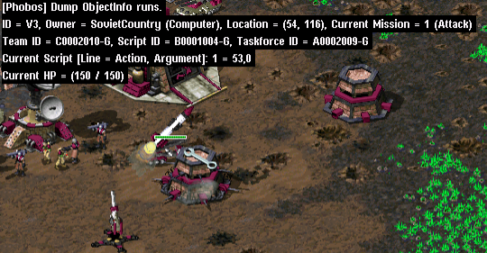

# Miscellanous

This page describes every change in Phobos that wasn't categorized into a proper category yet.

## Blowfish Dependency

`BLOWFISH.DLL` is no longer required to start the game.

## Developer tools

### Additional sync logging

- Phobos writes additional information to the `SYNC#.txt` log files when a desynchronization occurs such as calls to random number generator functions, facing / target / destination changes etc.

### Display Damage Numbers

- There's a [new hotkey](User-Interface.md#display-damage-numbers) to show exact numbers of damage dealt on units & buildings. The numbers are shown in red (blue against shields) for damage, and for healing damage in green (cyan against shields). They are shown on the affected units and will move upwards after appearing. Available only if `DebugKeysEnabled` under `[GlobalControls]` is set to true in `rulesmd.ini`.

### Dump Object Info


*Object info dump from [CnC: Reloaded](https://www.moddb.com/mods/cncreloaded/)*

- There's a [new hotkey](User-Interface.md#dump-object-info) to dump selected/hovered object info on press. Available only if `DebugKeysEnabled` under `[GlobalControls]` is set to true in `rulesmd.ini`.

### Frame Step In

- There's a [new hotkey](User-Interface.md#toggle-frame-by-frame-mode) to execute the game frame by frame for development usage.
  - You can switch to frame by frame mode and then use frame step in command to forward 1, 5, 10, 15, 30 or 60 frames by one hit.

### Logging missing audio files (samples)

- While parsing `soundmd.ini`, Phobos prints information in debug log about any missing audio files (samples).

### Save variables to file

- There's a [new hotkey](User-Interface.md#save-variables) to write all local variables to `locals.ini` and all global variables to `globals.ini`. Available only if `DebugKeysEnabled` under `[GlobalControls]` is set to true in `rulesmd.ini`.
- Variables will be also automatically saved to file on scenario end if `[General] -> SaveVariablesOnScenarioEnd=true` is set in `rulesmd.ini`.
- Variable section will use the same name as the mission file name in capital letters, i.e. `[MYCAMPAIGN.MAP]`.
  - Variables will be written as key-value pairs, i.e. `MyVariable=1`.
- If an INI file with the same name (`locals.ini`/`globals.ini`) doesn't exist, it will be created. If it exists, all sections will be preserved.

In `rulesmd.ini`:
```ini
[General]
SaveVariablesOnScenarioEnd=false    ; boolean
```

### Semantic locomotor aliases

- It's now possible to write locomotor aliases instead of their CLSIDs in the `Locomotor` tag value. Use the table below to find the needed alias for a locomotor.

| *Alias* | *CLSID*                                  |
|--------:|:----------------------------------------:|
|Drive    | `{4A582741-9839-11d1-B709-00A024DDAFD1}` |
|Hover    | `{4A582742-9839-11d1-B709-00A024DDAFD1}` |
|Tunnel   | `{4A582743-9839-11d1-B709-00A024DDAFD1}` |
|Walk     | `{4A582744-9839-11d1-B709-00A024DDAFD1}` |
|DropPod  | `{4A582745-9839-11d1-B709-00A024DDAFD1}` |
|Fly      | `{4A582746-9839-11d1-B709-00A024DDAFD1}` |
|Teleport | `{4A582747-9839-11d1-B709-00A024DDAFD1}` |
|Mech     | `{55D141B8-DB94-11d1-AC98-006008055BB5}` |
|Ship     | `{2BEA74E1-7CCA-11d3-BE14-00104B62A16C}` |
|Jumpjet  | `{92612C46-F71F-11d1-AC9F-006008055BB5}` |
|Rocket   | `{B7B49766-E576-11d3-9BD9-00104B972FE8}` |

```{note}
`Chrono` is not a standard Alias, but since the default behavior of using `Teleport` will be triggered when the value of `Locomotor` is incorrect, the result of the operation will appear as if `Chrono` has taken effect.
```

### Insignia Type

- It is now possible to define the properties of insignia in an entity, so that all properties in it will be used once it's applied to a techno.

In `rulesmd.ini`:
```ini
[InsigniaTypes]
0=SOMEINSIGNIATYPE

[SOMEINSIGNIATYPE]                       ; InsigniaType
Insignia=                                ; filename - excluding the .shp extension
Insignia.Rookie=                         ; filename - excluding the .shp extension
Insignia.Veteran=                        ; filename - excluding the .shp extension
Insignia.Elite=                          ; filename - excluding the .shp extension
InsigniaFrame=-1                         ; int, frame of insignia shp (zero-based) or -1 for default
InsigniaFrame.Rookie=-1                  ; int, frame of insignia shp (zero-based) or -1 for default
InsigniaFrame.Veteran=-1                 ; int, frame of insignia shp (zero-based) or -1 for default
InsigniaFrame.Elite=-1                   ; int, frame of insignia shp (zero-based) or -1 for default

[SOMETECHNO]                             ; TechnoType
InsigniaType=                            ; InsigniaType
InsigniaType.WeaponN=                    ; InsigniaType
InsigniaType.PassengersN=                ; InsigniaType
```

## Game Speed

### Campaign default game speed

- It is now possible to change the default (GS4/Fast/30FPS) campaign game speed with `CampaignDefaultGameSpeed`.

In `RA2MD.INI`:
```ini
[Phobos]
CampaignDefaultGameSpeed=4  ; integer
```

### Custom game speed

- Each of the 7 game speed slider positions (GameSpeed 0-6) can have a custom target FPS set independently. A value of `0` keeps that position at its vanilla FPS.
- When used, **game speeds are unified across all game modes** - skirmish, campaign, and multiplayer all use the same FPS values for each speed position.
- Per-speed keys (`CustomGameSpeedFPS.N`) set individual positions.
- Practical maximum is ~1000 FPS (limited by `timeGetTime()` resolution).

In `rulesmd.ini`:
```ini
[General]
EnableCustomFPS=false            ; boolean (default: false)
CustomGameSpeedFPS.0=0           ; integer, GameSpeed 0 target FPS (default: 0 = vanilla 60 FPS)
CustomGameSpeedFPS.1=0           ; integer, GameSpeed 1 target FPS (default: 0 = vanilla 45 FPS)
CustomGameSpeedFPS.2=0           ; integer, GameSpeed 2 target FPS (default: 0 = vanilla 30 FPS)
CustomGameSpeedFPS.3=0           ; integer, GameSpeed 3 target FPS (default: 0 = vanilla 20 FPS)
CustomGameSpeedFPS.4=0           ; integer, GameSpeed 4 target FPS (default: 0 = vanilla 15 FPS)
CustomGameSpeedFPS.5=0           ; integer, GameSpeed 5 target FPS (default: 0 = vanilla 12 FPS)
CustomGameSpeedFPS.6=0           ; integer, GameSpeed 6 target FPS (default: 0 = vanilla 10 FPS)
```


## INI

### Include files

```{note}
This feature must be enabled via a command line argument `-Include`.
```

- INI files can now include other files (merge them into self) using `[$Include]` section.
  - `[$Include]` section contains a list of files to read and include. Files can be directly in the Red Alert 2 directory or in a loaded MIX file.
  - Files will be added in the same order they are defined. Index of each file **must be unique among all included files**.
  - Inclusion can be nested recursively (included files can include files further). Recursion is depth-first (before including next file, check if the current one includes anything).
  - When the same entry exists in two files, then the one read later will overwrite the value.
  - This feature can be used in *any* INI file, be it `rulesmd.ini`, `artmd.ini`, `soundmd.ini`, map file or anything else.

In any file:
```ini
[$Include]
0=somefile.ini  ; file name
```

```{warning}
Due to a technical issue, there is a chance that ***the first line of a included file will be skipped!*** To prevent this, included files should start with an empty line or a comment.
```

```{warning}
When this feature is enabled, `[#include]` (equivalent [Ares feature](https://ares-developers.github.io/Ares-docs/new/misc/include.html)) is disabled because of technical incompatibilities.
```

### Section inheritance

```{note}
This feature must be enabled via a command line argument `-Inheritance`.
```

- You can now make sections (children) inherit entries from other sections (parents) with `$Inherits` entry.
  - When a section has no value set for an entry (or an entry is missing), the game will attempt to use parent's value. If no value is found, only then the default will be used.
  - When multiple parents are specified, the order of inheritance is "first come, first served", looking up comma separated parents from left to right.
  - Inheritance can be nested recursively (parent sections can have their own parents). Recursion is depth-first (before inheriting from the next parent, check if the current parent has parents).
  - This feature can be used in *any* INI file, be it `rulesmd.ini`, `artmd.ini`, `soundmd.ini`, map file or anything else.

In any file:
```ini
[PARENT1SECTION]

[PARENT2SECTION]

[CHILDSECTION]
$Inherits=PARENT1SECTION,PARENT2SECTION...  ; section names
```

```{warning}
When this feature is enabled, the Ares equivalent of `$Inherits` (undocumented) is disabled!
```

```{warning}
This feature may noticeably increase game loading time, depending on the size of game rules and used hardware.
```

### Turning off/on in-game exception handling

You can turn on/off the exception handler of the game's main loop using the following command line arg: `-ExceptionHandler=boolean` where `boolean` is `(true|false|yes|no|1|0)`.

```{note}
In **debug** builds the in-game exception handler is **turned off** by default.
```

```{warning}
The CnCNet 5 spawner uses the main loop exception handler for fixes. If you get any issues (crashes, bugs) in combination with that then please first test with the exception handler enabled.
```

## Player colors

### Unlimited skirmish colors

- It is now possible to have an unlimited number of skirmish/multiplayer player colors, as opposed to 8 in Yuri's Revenge and 16 with Ares.
- This feature must be enabled with `SkirmishUnlimitedColors=true` in `[General]` section of game rules.
- When enabled, the game will treat color indices passed from spawner as indices for `[Colors]` section entries.
  - In example, with original rules, index 6 will correspond to color `Orange=25,230,255`.

In `rulesmd.ini`:
```ini
[General]
SkirmishUnlimitedColors=false  ; boolean
```

```{note}
This feature should only be used if you use a spawner/outside client (i.e. CNCNet client). Using it in the original YR launcher will produce undesireable effects.
```

```{warning}
Due to technical incompatibilities, enabling this feature disables [Ares' Customizable Dropdown Colors](https://ares-developers.github.io/Ares-docs/ui-features/customizabledropdowncolors.html).
```
