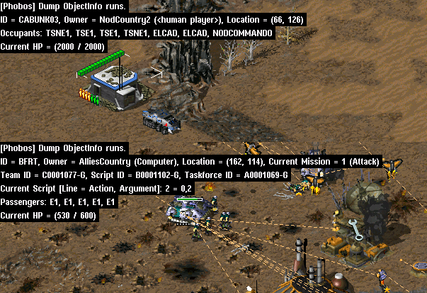

# Miscellanous

This page describes every change in Phobos that wasn't categorized into a proper category yet.

## Player colors

### Unlimited skirmish colors

- It is now possible to have an unlimited number of skirmish/multiplayer player colors, as opposed to 8 in Yuri's Revenge and 16 with Ares.
- This feature must be enabled with `SkirmishUnlimitedColors=true` in `[General]` section of game rules.
- When enabled, the game will treat color indices passed from spawner as indices for `[Colors]` section entries.
  - In example, with original rules, index 6 will correspond to color `Orange=25,230,255`.

```{note}
This feature should only be used if you use a spawner/outside client (i.e. CNCNet client). Using it in the original YR launcher will produce undesireable effects.
```

```{warning}
Due to technical incompatibilities, enabling this feature disables [Ares' Customizable Dropdown Colors](https://ares-developers.github.io/Ares-docs/ui-features/customizabledropdowncolors.html).
```

In `rulesmd.ini`:
```ini
[General]
SkirmishUnlimitedColors=false	; boolean
```

## Developer tools

### Additional sync logging

- Phobos writes additional information to the `SYNC#.txt` log files when a desynchronization occurs such as calls to random number generator functions, facing / target / destination changes etc.

### Dump Object Info


*Object info dump from [CnC: Reloaded](https://www.moddb.com/mods/cncreloaded/)*

- There's a new hotkey to dump selected/hovered object info on press. Available only if `DebugKeysEnabled` under `[GlobalControls]` is set to true in `rulesmd.ini`.

### Display Damage Numbers

- There's a new hotkey to show exact numbers of damage dealt on units & buildings. The numbers are shown in red (blue against shields) for damage, and for healing damage in green (cyan against shields). They are shown on the affected units and will move upwards after appearing. Available only if `DebugKeysEnabled` under `[GlobalControls]` is set to true in `rulesmd.ini`.

### Frame Step In

- There's a new hotkey to execute the game frame by frame for development usage.
	- You can switch to frame by frame mode and then use frame step in command to forward 1, 5, 10, 15, 30 or 60 frames by one hit.

### Save variables to file

- There's a new hotkey to write all local variables to `locals.ini` and all global variables to `globals.ini`. Available only if `DebugKeysEnabled` under `[GlobalControls]` is set to true in `rulesmd.ini`.
- Variables will be also automatically saved to file on scenario end if `[General]SaveVariablesOnScenarioEnd=true` is set in `rulesmd.ini`.
- Variable section will use the same name as the mission file name in capital letters, i.e. `[MYCAMPAIGN.MAP]`.
  - Variables will be written as key-value pairs, i.e. `MyVariable=1`
- If an INI file with the same name (`locals.ini`/`globals.ini`) doesn't exist, it will be created. If it exists, all sections will be preserved.

In `rulesmd.ini`:
```ini
[General]
SaveVariablesOnScenarioEnd=false    ; boolean
```

### Semantic locomotor aliases

- It's now possible to write locomotor aliases instead of their CLSIDs in the `Locomotor` tag value. Use the table below to find the needed alias for a locomotor.

| *Alias*| *CLSID*                                  |
| -----: | :--------------------------------------: |
Drive    | `{4A582741-9839-11d1-B709-00A024DDAFD1}` |
Jumpjet  | `{92612C46-F71F-11d1-AC9F-006008055BB5}` |
Hover    | `{4A582742-9839-11d1-B709-00A024DDAFD1}` |
Rocket   | `{B7B49766-E576-11d3-9BD9-00104B972FE8}` |
Tunnel   | `{4A582743-9839-11d1-B709-00A024DDAFD1}` |
Walk     | `{4A582744-9839-11d1-B709-00A024DDAFD1}` |
DropPod  | `{4A582745-9839-11d1-B709-00A024DDAFD1}` |
Fly      | `{4A582746-9839-11d1-B709-00A024DDAFD1}` |
Teleport | `{4A582747-9839-11d1-B709-00A024DDAFD1}` |
Mech     | `{55D141B8-DB94-11d1-AC98-006008055BB5}` |
Ship     | `{2BEA74E1-7CCA-11d3-BE14-00104B62A16C}` |

## Game Speed

### Single player game speed

- It is now possible to change the default (GS4/Fast/30FPS) campaign game speed with `CampaignDefaultGameSpeed`.
- It is now possible to change the *values* of single player game speed, by inputing a pair of values. This feature must be enabled with `CustomGS=true`. **Only values between 10 and 60 FPS can be consistently achieved.**
  - Custom game speed is achieved by periodically manipulating the delay between game frames, thus increasing or decreasing FPS.
  - `CustomGSN.ChangeInterval` describes the frame interval between applying the effect. A value of 2 means "every other frame", 3 means "every 3 frames" etc. Increase of speedup/slowdown is approximately logarithmic.
  - `CustomGSN.ChangeDelay` sets the delay (game speed number) to use every `CustomGSN.ChangeInterval` frames.
  - `CustomGSN.DefaultDelay` sets the delay (game speed number) to use on other frames.
  - Using game speed 6 (Fastest) in either `CustomGSN.ChangeDelay` or `CustomGSN.DefaultDelay` allows to set FPS above 60. **However, the resulting FPS may vary on different machines.**

```{note}
Currently there is no way to set desired FPS directly. Use the generator below to get required values. The generator supports values from 10 to 60.
```

In `rulesmd.ini`:
```ini
[General]
CustomGS=false              ; boolean
CustomGSN.ChangeInterval=-1 ; integer >= 1
CustomGSN.ChangeDelay=N     ; integer between 0 and 6
CustomGSN.DefaultDelay=N    ; integer between 0 and 6
; where N = 0, 1, 2, 3, 4, 5, 6
```

In `RA2MD.ini`:
```ini
[Phobos]
CampaignDefaultGameSpeed=4  ; integer
```

<details>
<summary>Click to show the generator</summary>
<input id="customGameSpeedIn" type=number placeholder="Enter desired FPS" oninput="onInput()">
<p>Results (remember to replace N with your game speed number!):</p>
<div id="codeBlockHere1"></div>
</details>
<script>
makeINICodeBlock(document.getElementById("codeBlockHere1"), "customGameSpeedOut", 400);
let fpsArray = [];
for (let d = 0; d <= 5; d++) {
	for (let c = 0; c <= 5; c++) {
		for (let i = 1; i <= 40; i++) {
			fpsArray.push(Math.round(formula(c, d, i)));
		}
	}
}
function formula(c, d, i) {
	return (60/(6-c)+60/(6-d)*((i-1)/(6-c)))/(1+(i-1)/(6-c));
}
function onInput() {
	let fps = document.getElementById("customGameSpeedIn");
	let out = document.getElementById("customGameSpeedOut");
	out.textContent = ''; // remove all children
	out.appendChild(document.createElement("span"));
	let j = 0;
	let foundAny = false;
	while (true) {
		j = fpsArray.indexOf(parseInt(fps.value), j);
		if (j == -1) {
			break;
		}
		d = Math.floor(j / 240);
		c = Math.floor(j % 240 / 40);
		i = j % 40 + 1;
		j += 1;
		let content = [];
		if (foundAny) {
			content.push({key: null, value: null, comment: "// Or"});
		}
		content.push({key: "CustomGSN.DefaultDelay", value: d, comment: null});
		content.push({key: "CustomGSN.ChangeDelay", value: c, comment: null});
		content.push({key: "CustomGSN.ChangeInterval", value: i, comment: null});
		content.forEach(line => addINILine(out, line));
		foundAny = true;
	}
	if (!foundAny) {
		addINILine(out, {key: null, value: null, comment: "// Sorry, couldn't find anything!"});
	}
}
</script>

## INI

### Include files

```{note}
This feature must be enabled via a command line argument `-Include`.
```

- INI files can now include other files (merge them into self) using `[$Include]` section.
  - `[$Include]` section contains a list of files to read and include. Files can be directly in the Red Alert 2 directory or in a loaded MIX file.
  - Files will be added in the same order they are defined. Index of each file **must be unique among all included files**.
  - Inclusion can be nested recursively (included files can include files further). Recursion is depth-first (before including next file, check if the current one includes anything).
  - When the same entry exists in two files, then the one read later will overwrite the value.
  - This feature can be used in *any* INI file, be it `rulesmd.ini`, `artmd.ini`, `soundmd.ini`, map file or anything else.

```{warning}
Due to a technical issue, there is a chance that ***the first line of a included file will be skipped!*** To prevent this, included files should start with an empty line or a comment.
```

```{warning}
When this feature is enabled, the [Ares equivalent of `[$Include]`](https://ares-developers.github.io/Ares-docs/new/misc/include.html) is disabled!
```

In any file:
```ini
[$Include]
0=somefile.ini	; file name
```

### Section inheritance

```{note}
This feature must be enabled via a command line argument `-Inheritance`.
```

- You can now make sections (children) inherit entries from other sections (parents) with `$Inherits` entry.
  - When a section has no value set for an entry (or an entry is missing), the game will attempt to use parent's value. If no value is found, only then the default will be used.
  - When multiple parents are specified, the order of inheritance is "first come, first served", looking up comma separated parents from left to right.
  - Inheritance can be nested recursively (parent sections can have their own parents). Recursion is depth-first (before inheriting from the next parent, check if the current parent has parents).
  - This feature can be used in *any* INI file, be it `rulesmd.ini`, `artmd.ini`, `soundmd.ini`, map file or anything else.

```{warning}
When this feature is enabled, the Ares equivalent of `$Inherits` (undocumented) is disabled!
```

```{warning}
This feature may noticeably increase game loading time, depending on the size of game rules and used hardware.
```

In any file:
```ini
[PARENT1SECTION]

[PARENT2SECTION]

[CHILDSECTION]
$Inherits=PARENT1SECTION,PARENT2SECTION...  ; section names
```
