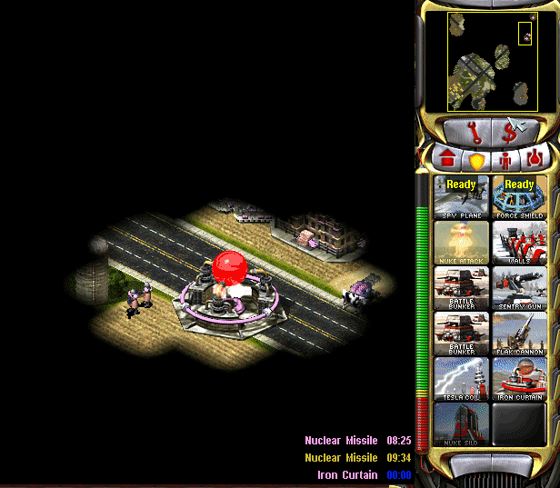

# New / Enhanced Logics

This page describes all the engine features that are either new and introduced by Phobos or significantly extended or expanded.

## New types / ingame entities

### Custom Radiation Types

  
*Mixing different radiation types*

- Allows to have custom radiation type for any weapon now. More details on radiation [here](https://www.modenc.renegadeprojects.com/Radiation).

In `rulesmd.ini`:
```ini
[RadiationTypes]
0=SOMERADTYPE

[SOMEWEAPON]                    ; WeaponType
RadType=Radiation               ; RadType to use instead
                                ; of default [Radiation]

[SOMERADTYPE]                   ; custom RadType name
RadDurationMultiple=1           ; int
RadApplicationDelay=16          ; int
RadApplicationDelay.Building=0  ; int
RadLevelMax=500                 ; int
RadLevelDelay=90                ; int
RadLightDelay=90                ; int
RadLevelFactor=0.2              ; double
RadLightFactor=0.1              ; double
RadTintFactor=1.0               ; double
RadColor=0,255,0                ; RGB
RadSiteWarhead=RadSite          ; WarheadType
```

### Laser Trails

  
*Laser trails used in [Rise of the East](https://www.moddb.com/mods/riseoftheeast)*

- Technos, Projectiles, and VoxelAnims can now have colorful trails of different transparency, thickness and color, which are drawn via laser drawing code.
- Technos, Projectiles, and VoxelAnims can have multiple laser trails. For technos each trail can have custom laser trail type and FLH offset relative to turret and body.

```{warning}
Laser trails are very resource intensive! Due to the game not utilizing GPU having a lot of trails can quickly drop the FPS on even good machines. To reduce that effect:
 - don't put too many laser trails on units and projectiles;
 - make sure you set as high `SegmentLength` value as possible without trails being too jagged;
 - try to keep the length of the trail minimal (can be achieved with smaller `FadeDuration` durations).
```

In `artmd.ini`:
```ini
[LaserTrailTypes]
0=SOMETRAIL

[SOMETRAIL]                 ; LaserTrailType name
IsHouseColor=no             ; boolean
Color=255,0,0               ; integer - Red,Green,Blue
FadeDuration=64             ; integer
Thickness=4                 ; integer
SegmentLength=128           ; integer, minimal length of each trail segment
IgnoreVertical=no           ; boolean, whether the trail won't be drawn on vertical movement
IsIntense=no                ; boolean, whether the laser is "supported" (AKA prism forwarding)

[SOMEPROJECTILE]            ; BulletType Image
LaserTrail.Types=SOMETRAIL  ; list of LaserTrailTypes

[SOMETECHNO]                ; TechnoType Image
LaserTrailN.Type=SOMETRAIL  ; LaserTrailType
LaserTrailN.FLH=0,0,0       ; integer - Forward,Lateral,Height
LaserTrailN.IsOnTurret=no   ; boolean, whether the trail origin is turret
; where N = 0, 1, 2, ...
```

in `rulesmd.ini`:
```ini
[SOMEVOXELANIM]             ; VoxelAnim
LaserTrail.Types=SOMETRAIL  ; list of LaserTrailTypes
```

### Shields

  
*Buildings, Infantries and Vehicles with Shield in [Fantasy ADVENTURE](https://www.moddb.com/mods/fantasy-adventure)*

In `rulesmd.ini`:
```ini
[AudioVisual]
Pips.Shield=-1,-1,-1           ; int, frames of pips.shp for Green, Yellow, Red
Pips.Shield.Building=-1,-1,-1  ; int, frames of pips.shp for Green, Yellow, Red

[ShieldTypes]
0=SOMESHIELDTYPE

[SOMESHIELDTYPE]                     ; ShieldType name
Strength=0                           ; integer
InitialStrength=0                    ; integer
Armor=none                           ; ArmorType
Powered=false                        ; boolean
AbsorbOverDamage=false               ; boolean
SelfHealing=0.0                      ; double, percents or absolute
SelfHealing.Rate=0.0                 ; double, ingame minutes
Respawn=0.0                          ; double, percents or absolute
Respawn.Rate=0.0                     ; double, ingame minutes
BracketDelta=0                       ; integer - pixels
IdleAnim=                            ; animation
IdleAnim.OfflineAction=Hides         ; AttachedAnimFlag (None, Hides, Temporal, Paused or PausedTemporal)
IdleAnim.TemporalAction=Hides        ; AttachedAnimFlag (None, Hides, Temporal, Paused or PausedTemporal)
BreakAnim=                           ; animation
HitAnim=                             ; animation
BreakWeapon=                         ; WeaponType
AbsorbPercent=1.0                    ; double, percents
PassPercent=0.0                      ; double, percents
AllowTransfer=                       ; boolean

[SOMETECHNO]                         ; TechnoType
ShieldType=SOMESHIELDTYPE            ; ShieldType; none by default

[SOMEWARHEAD]                        ; WarheadType
Shield.Penetrate=false               ; boolean
Shield.Break=false                   ; boolean
Shield.BreakAnim=                    ; animation
Shield.HitAnim=                      ; animation
Shield.BreakWeapon=                  ; WeaponType
Shield.AbsorbPercent=                ; double, percents
Shield.PassPercent=                  ; double, percents
Shield.Respawn.Duration=0            ; integer, game frames
Shield.Respawn.Amount=0.0            ; double, percents or absolute
Shield.Respawn.Rate=-1.0             ; double, ingame minutes
Shield.Respawn.ResetTimer=false      ; boolean
Shield.SelfHealing.Duration=0        ; integer, game frames
Shield.SelfHealing.Amount=0.0        ; double, percents or absolute
Shield.SelfHealing.Rate=-1.0         ; double, ingame minutes
Shield.SelfHealing.ResetTimer=false  ; boolean
Shield.AffectTypes=                  ; List of ShieldType names
Shield.AttachTypes=                  ; List of ShieldType names
Shield.RemoveTypes=                  ; List of ShieldType names
Shield.ReplaceOnly=false             ; boolean
Shield.ReplaceNonRespawning=false    ; boolean
Shield.MinimumReplaceDelay=0         ; integer, game frames
Shield.InheritStateOnReplace=false   ; boolean
```
- Now you can have a shield for any TechnoType. It serves as a second health pool with independent `Armor` and `Strength` values.
  - Negative damage will recover shield, unless shield has been broken. If shield isn't full, all negative damage will be absorbed by shield.
  - When the TechnoType with a unbroken shield, `[ShieldType]->Armor` will replace `[TechnoType]->Armor` for game calculation.
  - `InitialStrength` can be used to set a different initial strength value from maximum.
- When executing `DeploysInto` or `UndeploysInto`, if both of the TechnoTypes have shields, the transformed unit/building would keep relative shield health (in percents), same as with `Strength`. If one of the TechnoTypes doesn't have shields, it's shield's state on conversion will be preserved until converted back.
  - This also works with Ares' `Convert.*`.
- `Powered` controls whether or not the shield is active when a unit is running low on power or it is affected by EMP.
  - Attention, if TechnoType itself is not `Powered`, then the shield won't be offline when low power. 
- `AbsorbOverDamage` controls whether or not the shield absorbs damage dealt beyond shield's current strength when the shield breaks.
- `SelfHealing` and `Respawn` respect the following settings: 0.0 disables the feature, 1%-100% recovers/respawns the shield strength in percentage, other number recovers/respawns the shield strength directly. Specially, `SelfHealing` with a negative number deducts the shield strength.
  - If you want shield recovers/respawns 1 HP per time, currently you need to set tag value to any number between 1 and 2, like `1.1`.
- `SelfHealing.Rate` and `Respawn.Rate` respect the following settings: 0.0 instantly recovers the shield, other values determine the frequency of shield recovers/respawns in ingame minutes.
- `IdleAnim`, if set, will be played while the shield is intact. This animation is automatically set to loop indefinitely.
  - `Bouncer=yes` animations are not supported at the moment.
- `IdleAnim.OfflineAction` indicates what happens to the animation when the shield is in a low power state.
- `IdleAnim.TemporalAction` indicates what happens to the animation when the shield is attacked by temporal weapons.
- `BreakAnim`, if set, will be played when the shield has been broken.
- `HitAnim`, if set, will be played when the shield is attacked, similar to `WeaponNullifyAnim` for Iron Curtain.
- `BreakWeapon`, if set, will be fired at the TechnoType once the shield breaks.
- `AbsorbPercent` controls the percentage of damage that will be absorbed by the shield. Defaults to 1.0, meaning full damage absorption.
- `PassPercent` controls the percentage of damage that will *not* be absorbed by the shield, and will be dealt to the unit directly even if the shield is active. Defaults to 0.0 - no penetration.
- `AllowTransfer` controls whether or not the shield can be transferred if the TechnoType changes (such as `(Un)DeploysInto` or Ares type conversion). If not set, defaults to true if shield was attached via `Shield.AttachTypes`, otherwise false.
- A TechnoType with a shield will show its shield Strength. An empty shield strength bar will be left after destroyed if it is respawnable.
  - Buildings now use the 5th frame of `pips.shp` to display the shield strength while other units uses the 16th frame by default.
  - `Pips.Shield` can be used to specify which pip frame should be used as shield strength. If only 1 digit set, then it will always display it, or if 3 digits set, it will respect `ConditionYellow` and `ConditionRed`. `Pips.Shield.Building` is used for BuildingTypes.
  - `pipbrd.shp` will use its 4th frame to display an infantry's shield strength and the 3th frame for other units if `pipbrd.shp` has extra 2 frames. And `BracketDelta` can be used as additional `PixelSelectionBracketDelta` for shield strength.
- Warheads have new options that interact with shields.
  - `Shield.Penetrate` allows the warhead ignore the shield and always deal full damage to the TechnoType itself. It also allows targeting the TechnoType as if shield doesn't exist.
  - `Shield.Break` allows the warhead to always break shields of TechnoTypes. This is done before damage is dealt.
  - `Shield.BreakAnim` will be displayed instead of ShieldType `BreakAnim` if the shield is broken by the Warhead, either through damage or `Shield.Break`.
  - `Shield.HitAnim` will be displayed instead of ShieldType `HitAnim` if set when Warhead hits the shield.
  - `Shield.BreakWeapon` will be fired instead of ShieldType `BreakWeapon` if the shield is broken by the Warhead, either through damage or `Shield.Break`.
  - `Shield.AbsorbPercent` overrides the `AbsorbPercent` value set in the ShieldType that is being damaged.
  - `Shield.PassPercent` overrides the `PassPercent` value set in the ShieldType that is being damaged.
  - `Shield.Respawn.Rate` & `Shield.Respawn.Amount` override ShieldType `Respawn.Rate` and `Respawn.Amount` for duration of `Shield.Respawn.Duration` amount of frames. Negative rate & zero or lower amount default to ShieldType values. If `Shield.Respawn.ResetTimer` is set, currently running shield respawn timer is reset, otherwise the timer's duration is adjusted to match `Shield.Respawn.Rate` without restarting the timer.  If the effect expires while respawn timer is running, remaining time is adjusted to match ShieldType `Respawn.Rate`. Re-applying the effect resets the duration to `Shield.Respawn.Duration`
  - `Shield.SelfHealing.Rate` & `Shield.SelfHealing.Amount` override ShieldType `SelfHealing.Rate` and `SelfHealing.Amount` for duration of `Shield.SelfHealing.Duration` amount of frames. Negative rate & zero or lower amount default to ShieldType values. If `Shield.SelfHealing.ResetTimer` is set, currently running self-healing timer is restarted, otherwise timer's duration 'is adjusted to match `Shield.SelfHealing.Rate` without restarting the timer. If the effect expires while self-healing timer is running, remaining time is adjusted to match ShieldType `SelfHealing.Rate`. Re-applying the effect resets the duration to `Shield.SelfHealing.Duration`.
  - `Shield.AffectsTypes` allows listing which ShieldTypes can be affected by any of the effects listed above. If none are listed, all ShieldTypes are affected.
  - `Shield.AttachTypes` & `Shield.RemoveTypes` allows listing ShieldTypes that are attached or removed, respectively from any targets affected by the warhead (positive `Verses` values). Normally only first listed ShieldType in `Shield.AttachTypes` is applied.
    - If `Shield.ReplaceOnly` is set, shields from `Shield.AttachTypes` are only applied to affected targets from which shields were simultaneously removed, matching the order listed in `Shield.RemoveTypes`. If `Shield.AttachTypes` contains less items than `Shield.RemoveTypes`, last item from the former is used for any remaining removed shields.
    - If `Shield.ReplaceNonRespawning` is set, shield from `Shield.AttachTypes` replaces existing shields that have been broken and cannot respawn on their own.
      - `Shield.MinimumReplaceDelay` can be used to control how long after the shield has been broken (in game frames) can it be replaced. If not enough frames have passed, it won't be replaced.
    - If `Shield.InheritStateOnReplace` is set, shields replaced via `Shield.ReplaceOnly` inherit the current strength (relative to ShieldType `Strength`) of the previous shield and whether or not the shield was currently broken. Self-healing and respawn timers are always reset.

## Animations

### Anim-to-Unit

  

- Animations can now create (or "convert" to) units when they end.
  - Because in most cases animations do not have owner, the unit will be created with civilian owner unless you use `DestroyAnim` which was modified to store owner and facing information from the destroyed unit, or animation from Warhead `AnimList` or one created through map trigger action `41 Play Anim At`.

In `rulesmd.ini`:
```ini
[SOMEUNIT]                  ; UnitType
DestroyAnim.Random=yes      ; boolean, whether to randomize DestroyAnim
```

In `artmd.ini`:
```ini
[SOMEANIM]                          ; AnimationType
CreateUnit=                         ; UnitType
CreateUnit.Facing=0                 ; unsigned short, `CreateUnit` facings in range of 0-255
CreateUnit.RandomFacing=yes         ; boolean, `CreateUnit` use random facings
CreateUnit.InheritFacings=no        ; boolean, inherit facing from destroyed unit
CreateUnit.InheritTurretFacings=no  ; boolean, inherit facing from destroyed unit
CreateUnit.RemapAnim=no             ; boolean, whether to remap anim to owner color
CreateUnit.Mission=Guard            ; MissionType
CreateUnit.Owner=Victim             ; owner house kind, Invoker/Killer/Victim/Civilian/Special/Neutral/Random
CreateUnit.ConsiderPathfinding=no   ; boolean, whether to consider if the created unit can move in the cell and look for eligible cells nearby instead.
```

## Buildings

### Extended building upgrades

  
*Upgrading own and allied Power Plants in [CnC: Final War](https://www.moddb.com/mods/cncfinalwar)*

- Building upgrades now can be placed on own buildings, on allied buildings and/or on enemy buildings. These three owners can be specified via a new tag, comma-separated. When upgrade is placed on building, it automatically changes it's owner to match the building's owner.
- One upgrade can now be applied to multiple buildings via a new tag, comma-separated.
  - Ares-introduced build limit for building upgrades works with this feature. 

In `rulesmd.ini`:
```ini
[UPGRADENAME]       ; BuildingType
PowersUp.Owner=Self ; list of Affected House Enumeration (none|owner/self|allies/ally|team|enemies/enemy|all)
PowersUp.Buildings= ; list of BuildingTypes
```

### Power plant enhancer

- When it exists, it can increase the power amount generated by the power plants. 
  - When enchancing structures are sold or destroyed, the power amount returns to normal.

In `rulesmd.ini`:
```ini
[SOMEBUILDING]                     ; BuildingType
PowerPlantEnhancer.PowerPlants=    ; list of BuildingTypes
PowerPlantEnhancer.Amount=0        ; integer
PowerPlantEnhancer.Factor=1.0      ; float
```

## Infantry

### Default disguise for individual InfantryTypes

- Infantry can now have its `DefaultDisguise` overridden per-type.
  - This tag's priority is higher than Ares' per-side `DefaultDisguise`.

In `rulesmd.ini`:
```ini
[SOMEINFANTRY]      ; InfantryType
DefaultDisguise=E2  ; InfantryType              
```

### Random death animaton for NotHuman Infantry

- Infantry with `NotHuman=yes` can now play random death anim sequence between `Die1` to `Die5` instead of the hardcoded `Die1`.
  - Do not forget to tweak infantry anim sequences before enabling this feature, otherwise it will play invisible anim sequence.

In `rulesmd.ini`:
```ini
[SOMEINFANTRY]                    ; InfantryType
NotHuman.RandomDeathSequence=yes  ; boolean
```

### Shared Ammo

- Transports with `OpenTopped=yes` and `Ammo.Shared=yes` will transfer ammo to passengers that have `Ammo.Shared=yes`.
In addition, a transport can filter who will receive ammo if passengers have the same value in `Ammo.Shared.Group=<integer>` of the transport, ignoring other passengers with different groups values.
- Transports with `Ammo.Shared.Group=-1` will transfer ammo to any passenger with `Ammo.Shared=yes` ignoring the group.
- Transports must have ammo and should be able to reload ammo.

In `rulesmd.ini`:
```ini
[SOMETECHNO1]                           ; TechnoType, transport with OpenTopped=yes
Ammo.Shared=no                          ; boolean
Ammo.Shared.Group=-1                    ; integer

[SOMETECHNO2]                           ; TechnoType, passenger
Ammo.Shared=no                          ; boolean
Ammo.Shared.Group=-1                    ; integer
```

## Projectiles

### Projectile interception logic

  
*Interception logic used in [Tiberium Crisis](https://www.moddb.com/mods/tiberium-crisis) mod*

- Projectiles can now be made targetable by certain TechnoTypes. Interceptor TechnoType's projectile must be `Inviso=yes` and `AA=yes` in order for it to work properly and the projectile must be used in a primary Weapon.
  - `Interceptor.GuardRange` is maximum range of the unit to intercept projectile. The unit weapon range will limit the unit interception range though.
  - `Interceptor.EliteGuardRange` value is used if the unit veterancy is Elite.
  - `Interceptor.MinimumGuardRange` is the minimum range of the unit to intercept projectile. Any projectile under this range will not be intercepted.
  - `Interceptor.EliteMinimumGuardRange` value is used if the unit veterancy is Elite.

In `rulesmd.ini`:
```ini
[SOMETECHNO]                            ; TechnoType
Interceptor=no                          ; boolean
Interceptor.GuardRange=0.0              ; double
Interceptor.EliteGuardRange=0.0         ; double
Interceptor.MinimumGuardRange=0.0       ; double
Interceptor.EliteMinimumGuardRange=0.0  ; double

[SOMEPROJECTILE] ; Projectile
Interceptable=no ; boolean
```

### Projectile trajectories

- Projectiles can now have customizable trajectories.
  - `Trajectory` should not be combined with original game's projectile trajectory logics (`Arcing`, `ROT` or `Inviso`).

#### Straight trajectory

- Self-explanatory, is a straight-shot trajectory.
  - Initial speed is determined by weapon's `Trajectory.Speed`.

In `rulesmd.ini`
```ini
[SOMEPROJECTILE]     ; Projectile
Trajectory=Straight  ; Trajectory type
```

#### Bombard trajectory

- Similar trajectory to `Straight`, but targets a coordinate above the intended target (height determined by `Trajectory.Bombard.Height`). When the projectile approaches that coordinate, it will free fall and explodes when it hits the target or ground.
  - Initial speed is determined by weapon's `Trajectory.Speed`.

In `rulesmd.ini`
```ini
[SOMEPROJECTILE]               ; Projectile
Trajectory=Bombard             ; Trajectory type
Trajectory.Bombard.Height=0.0  ; double
```

### Shrapnel enhancement
- Shrapnel behavior can be triggered on the ground and buildings.

In `rulesmd.ini`:
```ini
[SOMEPROJECTILE]              ; Projectile
Shrapnel.AffectsGround=no     ; boolean
Shrapnel.AffectsBuildings=no  ; boolean
```

## Script actions

### `71` Timed Area Guard

- Puts the TaskForce into Area Guard Mode for the given units of time. Unlike the original timed Guard script (`5,n`) that just stays in place doing a basic guard operation the "Area Guard" action has a more active role attacking nearby invaders or defending units that needs protection.

In `aimd.ini`:
```ini
[SOMESCRIPTTYPE]  ; ScriptType
x=71,n            ; integer, time in ingame seconds
```

### `72` Load Onto Transports

- If the TaskForce contains unit(s) that can be carried by the transports of the same TaskForce then this action will make the units enter the transports. In Single player missions the next action must be "Wait until fully loaded" (`43,0`) or the script will not continue.

In `aimd.ini`:
```ini
[SOMESCRIPTTYPE]  ; ScriptType
x=72,0
```

### `73` Wait until ammo is full

- If the TaskForce contains unit(s) that use ammo then the the script will not continue until all these units have fully refilled the ammo.

In `aimd.ini`:
```ini
[SOMESCRIPTTYPE]  ; ScriptType
x=73,0
```

### `74-81` Generic Target Type Attack Action

- These Actions instruct the TeamType to use the TaskForce to approach and attack the target specified by the second parameter which is an index of a generic pre-defined group. Look at the tables below for the possible Actions (first parameter value) and Arguments (the second parameter value).
  - For threat-based attack actions `TargetSpecialThreatCoefficientDefault` and `EnemyHouseThreatBonus` tags from `rulesmd.ini` are accounted.
  - All Aircrafts that attack other air units will end the script. This behavior is intentional because without it aircrafts had some bugs that weren't fixable at the time of developing the feature.

In `aimd.ini`:
```ini
[SOMESCRIPTTYPE]  ; ScriptType
x=i,n             ; where 74 <= i <= 81
```

| *Action* | *Argument*   | *Repeats* | *Target Priority* | *Description*                                 |
| :------: | :----------: | :-------: | :---------------: | :-------------------------------------------: |
74         | Target Type# | Yes | Closer, higher threat |  |
75         | Target Type# | Yes | Farther, higher threat |  |
76         | Target Type# | Yes | Closer |  |
77         | Target Type# | Yes | Farther |  |
78         | Target Type# | No | Closer, higher threat | Ends when a team member kill the designated target |
79         | Target Type# | No | Farther, higher threat | Ends when a team member kill the designated target |
80         | Target Type# | No | Closer | Ends when a team member kill the designated target |
81         | Target Type# | No | Farther | Ends when a team member kill the designated target |

- The following values are the *Target Type#* which can be used as second parameter of the new attack script actions:

| *Value* | *Target Type*     | *Description*                                 |
| :-----: | :---------------: | :-------------------------------------------: |
1         | Anything          |	Any enemy `VehicleTypes`, `AircraftTypes`, `InfantryTypes` and `BuildingTypes` |
2         | Structures        |	Any enemy `BuildingTypes` without `Artillary=yes`, `TickTank=yes`, `ICBMLauncher=yes` or `SensorArray=yes` |
3         | Ore Miners        |	Any enemy `VehicleTypes` with `Harvester=yes` or `ResourceGatherer=yes`, `BuildingTypes` with `ResourceGatherer=yes` |
4         | Infantry          |	Any enemy `InfantryTypes` |
5         | Vehicles          |	Any enemy `VehicleTypes`, `AircraftTypes`, `BuildingTypes` with `Artillary=yes`, `TickTank=yes`, `ICBMLauncher=yes` & `SensorArray=yes` |
6         | Factories         |	Any enemy `BuildingTypes` with a Factory= setting |
7         | Base Defenses     |	Any enemy `BuildingTypes` with `IsBaseDefense=yes` |
8         | House Threats     |	Any object that targets anything of the Team's House or any enemy that is near to the Team Leader |
9         | Power Plants      |	Any enemy `BuildingTypes` with positive `Power=` values |
10        | Occupied          |	Any `BuildingTypes` with garrisoned infantry |
11        | Tech Buildings    |	Any `BuildingTypes` with `Unsellable=yes`, `Capturable=yes`, negative `TechLevel=` values or appears in `[AI]>NeutralTechBuildings=` list |
12        |	Refinery          |	Any enemy `BuildingTypes` with `Refinery=yes` or `ResourceGatherer=yes`, `VehicleTypes` with `ResourceGatherer=yes` & `Harvester=no` (i.e. Slave Miner) |
13        |	Mind Controller   |	Anything `VehicleTypes`, `AircraftTypes`, `InfantryTypes` and `BuildingTypes` with `MindControl=yes` in the weapons Warheads |
14        |	Air Units         |	Any enemy `AircraftTypes`, flying `VehicleTypes` or `InfantryTypes` |
15        |	Naval             |	Any enemy `BuildingTypes` and `VehicleTypes` with a `Naval=yes`, any enemy `VehicleTypes`, `AircraftTypes`, `InfantryTypes` in a water cell |
16        |	Disruptors        |	Any enemy objects with positive `InhibitorRange=` values, positive `RadarJamRadius=` values, `CloakGenerator=yes` or `GapGenerator=yes` |
17        |	Ground Vehicles   |	Any enemy `VehicleTypes` without `Naval=yes`, landed `AircraftTypes`, Deployed vehicles into `BuildingTypes` |
18        |	Economy           |	Any enemy `VehicleTypes` with `Harvester=yes` or `ResourceGatherer=yes`, `BuildingTypes` with `Refinery=yes`, `ResourceGatherer=yes` or `OrePurifier=yes` |
19        |	Infantry Factory  |	Any enemy `BuildingTypes` with `Factory=InfantryType` |
20        |	Vehicle Factory   |	Any enemy `BuildingTypes` with `Factory=UnitType` |
21        |	Aircraft Factory  |	Any enemy `BuildingTypes` with `Factory=AircraftType` |
22        |	Radar             |	Any enemy `BuildingTypes` with `Radar=yes` or `SpySat=yes` |
23        |	Tech Lab          |	Any enemy `BuildingTypes` in `[AI]>BuildTech=` list |
24        |	Naval Factory     |	Any enemy `BuildingTypes` with `Naval=yes` and `Factory=UnitType` |
25        |	Super Weapon      |	Any enemy `BuildingTypes` with `SuperWeapon=`, `SuperWeapon2=` or `SuperWeapons=` |
26        |	Construction Yard |	Any enemy `BuildingTypes` with `ConstructionYard=yes` and `Factory=BuildingType` |
27        |	Neutrals          |	Any neutral object (Civilian) |
28        |	Generators        |	Any enemy `BuildingTypes` with `CloakGenerator=yes` or `GapGenerator=yes` |
29        |	Radar Jammer      |	Any enemy objects with positive `RadarJamRadius=` values |
30        |	Inhibitors        |	Any enemy objects with positive `InhibitorRange=` values |
31        |	Naval Units       |	Any enemy `VehicleTypes` with a `Naval=yes` or any enemy `VehicleTypes`, `AircraftTypes`, `InfantryTypes` in a water cell |
32        | Mobile Units      |	Anything `VehicleTypes`, `AircraftTypes` and `InfantryTypes` |
33        |	Capturable        |	Any `BuildingTypes` with `Capturable=yes` or any `BuildingTypes` with `BridgeRepairHut=yes` and `Repairable=yes` |
34         | Area Threats     |	Any enemy object that is inside of the Team Leader's Guard Area |

### `82` Decrease AI Trigger Current Weight

- When executed this decreases the current Weight of the AI Trigger.The current Weight will never surprass the Minimum Weight and Maximum Weight limits of the AI Trigger. Take note that all TeamTypes of the same AI Trigger will update sooner or later the AI Trigger Current Weight. The second parameter is a positive value. Take note that the original game only uses the first of the two Teams for calculating the AI Trigger Current Weight at the end of the Trigger life, this action ignores if the Team is the first or the second of the AI Trigger and the Current Weight is calculated when is executed the action.

In `aimd.ini`:
```ini
[SOMESCRIPTTYPE]  ; ScriptType
x=82,n
```

### `83` Increase AI Trigger Current Weight

- When executed this increases the current Weight of the AI Trigger.The current Weight will never surprass the Minimum Weight and Maximum Weight limits of the AI Trigger. Take note that all TeamTypes of the same AI Trigger will update sooner or later the AI Trigger Current Weight. The second parameter is a positive value. Take note that the original game only uses the first of the two Teams for calculating the AI Trigger Current Weight at the end of the Trigger life, this action ignores if the Team is the first or the second of the AI Trigger and the Current Weight is calculated when is executed the action.

In `aimd.ini`:
```ini
[SOMESCRIPTTYPE]  ; ScriptType
x=83,n
```

### `84-91`, `104-105` `AITargetTypes` Attack Action

- These Actions instruct the TeamType to use the TaskForce to approach and attack the target specified by the second parameter which is an index of a modder-defined group from `AITargetTypess`. Look at the tables below for the possible Actions (first parameter value) and Arguments (the second parameter value).
  - For threat-based attack actions `TargetSpecialThreatCoefficientDefault` and `EnemyHouseThreatBonus` tags from `rulesmd.ini` are accounted.
  - All Aircrafts that attack other air units will end the script. This behavior is intentional because without it aircrafts had some bugs that weren't fixable at the time of developing the feature.

In `aimd.ini`:
```ini
[SOMESCRIPTTYPE]  ; ScriptType
x=i,n             ; where 84 <= i <= 91 or 104 <= i <= 105
```

| *Action* | *Argument*   | *Repeats* | *Target Priority* | *Description*                                 |
| :------: | :----------: | :-------: | :---------------: | :-------------------------------------------: |
84         | `AITargetTypes` index# | Yes | Closer, higher threat |  |
85         | `AITargetTypes` index# | Yes | Farther, higher threat |  |
86         | `AITargetTypes` index# | Yes | Closer |  |
87         | `AITargetTypes` index# | Yes | Farther |  |
88         | `AITargetTypes` index# | No | Closer, higher threat | Ends when a team member kill the designated target |
89         | `AITargetTypes` index# | No | Farther, higher threat | Ends when a team member kill the designated target |
90         | `AITargetTypes` index# | No | Closer | Ends when a team member kill the designated target |
91         | `AITargetTypes` index# | No | Farther | Ends when a team member kill the designated target |
104        | `AITargetTypes` index# | Yes | Closer | Picks 1 random target from the list |
105        | `AITargetTypes` index# | Yes | Farther | Picks 1 random target from the list |

- The second parameter with a 0-based index for the `AITargetTypes` section specifies the list of possible `VehicleTypes`, `AircraftTypes`, `InfantryTypes` and `BuildingTypes` that can be evaluated. The new `AITargetTypes` section must be declared in `rulesmd.ini` for making this script work:

In `rulesmd.ini`:
```ini
[AITargetTypes]  ; List of TechnoType lists
0=SOMETECHNOTYPE,SOMEOTHERTECHNOTYPE,SAMPLETECHNOTYPE
1=ANOTHERTECHNOTYPE,YETANOTHERTECHNOTYPE
; ...
```

### `92` Wait If No Target Found

- When executed before a new Attack ScriptType Actions like `74-81` and `84-91` the TeamType will remember that must wait 1 second if no target was selected. The second parameter is a positive value that specifies how much retries the Attack will do when no target was found before new Attack ScriptType Action is discarded & the script execution jumps to the next line. The value `0` means infinite retries.

In `aimd.ini`:
```ini
[SOMESCRIPTTYPE]  ; ScriptType
x=92,n            ; integer n=0
```

### `93` Team's Trigger Weight Reward

- When executed before a new Attack ScriptType Actions like `74-81` and `84-91` the TeamType will remember that must be rewarded increasing the current Weight of the AI Trigger when the TeamType Target was killed by any of the Team members. The current Weight will never surprass the Minimum Weight and Maximum Weight limits of the AI Trigger. The second parameter is a positive value.

In `aimd.ini`:
```ini
[SOMESCRIPTTYPE]  ; ScriptType
x=93,n            ; integer n=0
```

### `94` Pick A Random Script

- When executed this action picks a random Script Type and replaces the current script by the new picked. The second parameter is a 0-based index from the new section `AIScriptsList` explained below.

In `aimd.ini`:
```ini
[SOMESCRIPTTYPE]  ; ScriptType
x=94,n
```

The second parameter is a 0-based index for the `AIScriptsList` section that specifies the list of possible `ScriptTypes` that can be evaluated. The new `AIScriptsList` section must be declared in `rulesmd.ini` for making this script work:

In `rulesmd.ini`:
```ini
[AIScriptsList]  ; List of ScriptType lists
0=SOMESCRIPTTYPE,SOMEOTHERSCRIPTTYPE,SAMPLESCRIPTTYPE
1=ANOTHERSCRIPTTYPE,YETANOTHERSCRIPTTYPE
; ...
```

### `95-98`, `106-109` Moving Team to techno location

- These Actions instructs the TeamType to use the TaskForce to approach the target specified by the second parameter. Look at the tables below for the possible Actions (first parameter value).

In `aimd.ini`:
```ini
[SOMESCRIPTTYPE]  ; ScriptType
x=i,n             ; where 95 <= i <= 98 or 106 <= i <= 109
```

| *Action* | *Argument*    | Target Owner | *Target Priority* | *Description*                                 |
| :------: | :-----------: | :----------: | :---------------: | :-------------------------------------------: |
95         | Target Type# | Enemy | Closer, higher threat |  |
96         | Target Type# | Enemy | Farther, higher threat |  |
97         | Target Type# | Friendly | Closer |  |
98         | Target Type# | Friendly | Farther |  |
99         | [AITargetType] index# | Enemy | Closer, higher threat |  |
100        | [AITargetType] index# | Enemy | Farther, higher threat |  |
101        | [AITargetType] index# | Friendly | Closer |  |
102        | [AITargetType] index# | Friendly | Farther |  |
106        | [AITargetType] index# | Enemy | Closer | Picks 1 random target from the selected list |
107        | [AITargetType] index# | Enemy | Farther | Picks 1 random target from the selected list |
108        | [AITargetType] index# | Friendly | Closer | Picks 1 random target from the selected list |
109        | [AITargetType] index# | Friendly | Farther | Picks 1 random target from the selected list |

### `103` Modify Target Distance

- By default Movement actions `95-102` & `106-109` ends when the Team Leader reaches a distance declared in rulesmd.ini called CloseEnough. When this action is  executed before the Movement actions `95-102` overwrites CloseEnough value. This action works only the first time and CloseEnough will be used again the next Movement action.

In `aimd.ini`:
```ini
[SOMESCRIPTTYPE]  ; ScriptType
x=103,n
```

### `110` Set Move Action End Mode

- Sets how the Movement actions ends and jumps to the next line. This action works only the first time and CloseEnough will be used again the next Movement action. 

In `aimd.ini`:
```ini
[SOMESCRIPTTYPE]  ; ScriptType
x=110,n
```

- The possible argument values are:

| *Argument* | *Action ends when...*                       |
| :------: | :-------------------------------------------: |
0         | Team Leader reaches the minimum distance |
1         | One unit reaches the minimum distance |
2         | All team members reached the minimum distance |

### `111` Un-register Team success

- Is just the opposite effect of the script action `49,0`. Like if the Team failed.

In `aimd.ini`:
```ini
[SOMESCRIPTTYPE]  ; ScriptType
x=111,0
```

### `112` Regroup temporarily around the Team Leader

- Puts the TaskForce into Area Guard Mode for the given amount of time around the Team Leader (this unit remains almost immobile until the action ends). The default radius around the Leader is `[General] > CloseEnough` and the units will not leave that area.

In `aimd.ini`:
```ini
[SOMESCRIPTTYPE]  ; ScriptType
x=112,n
```

### `113` Randomly Skip Next Action

- When executed this action picks a random value between 1 and 100. If the value is equal or below the second parameter then the next action will be skipped. If the second parameter is 0 means that the next action will never be skipped and 100 means thay always will be skipped.

In `aimd.ini`:
```ini
[SOMESCRIPTTYPE]  ; ScriptType
x=113,n           ; where 0 > n <= 100
```

### `500 - 523` Edit Variable
- Operate a variable's value
    - The variable's value type is int16 instead of int32 in trigger actions for some reason, which means it ranges from -2^15 to 2^15-1.
        - Any numbers exceeding this limit will lead to unexpected results!

In `aimd.ini`:
```ini
[SOMESCRIPTTYPE]  ; ScriptType
x=i,n             ; where 500 <= i <= 523, n is made up of two parts, the low 16 bits is being used to store the variable index, the high 16 bits is being used for storing the param value.
```

### `524 - 547` Edit Variable by Local Variable
- Operate a variable's value by a local variable's value
    - Similar to 500-523, but the number to operate the value is being read from a local variable

In `aimd.ini`:
```ini
[SOMESCRIPTTYPE]  ; ScriptType
x=i,n             ; where 524 <= i <= 547, n is made up of two parts, the low 16 bits is being used to store the variable index, the high 16 bits is being used for storing the local variable index.
```

### `548 - 571` Edit Variable by Global Variable
- Operate a variable's value by a global variable's value
    - Similar to 500-523, but the number to operate the value is being read from a global variable

In `aimd.ini`:
```ini
[SOMESCRIPTTYPE]  ; ScriptType
x=i,n             ; where 548 <= i <= 571, n is made up of two parts, the low 16 bits is being used to store the variable index, the high 16 bits is being used for storing the global variable index.
```

## Super Weapons

### LimboDelivery

- Super Weapons can now deliver off-map buildings that act as if they were on the field.
  - `LimboDelivery.Types` is the list of BuildingTypes that will be created when the Super Weapons fire. Super Weapon Type and coordinates do not matter.
  - `LimboDelivery.IDs` is the list of numeric IDs that will be assigned to buildings. Necessary for LimboKill to work.

- Created buildings are not affected by any on-map threats. The only way to remove them from the game is by using a Super Weapon with LimboKill set.
  - `LimboKill.Affects` sets which houses are affected by this feature.
  - `LimboKill.IDs` lists IDs that will be targeted. Buildings with these IDs will be removed from the game instantly.

- Delivery can be made random with these optional tags. The game will randomly choose only a single building from the list for each roll chance provided.
  - `LimboDelivery.RollChance` lits chances of each "dice roll" happening. Valid values range from 0% (never happens) to 100% (always happens). Defaults to a single sure roll.
  - `LimboDelivery.RandomWeightsN` lists the weights for each "dice roll" that increase the probability of picking a specific building. Valid values are 0 (don't pick) and above (the higher value, the bigger the likelyhood). `RandomWeights` are a valid alias for `RandomWeights0`. If a roll attempt doesn't have weights specified, the last weights will be used.

Note: This feature might not support every building flag. Flags that are confirmed to work correctly are listed below:
  - FactoryPlant
  - OrePurifier
  - SpySat
  - KeepAlive (Ares 3.0)
  - Prerequisite, PrerequisiteOverride, Prerequisite.List# (Ares 0.1), Prerequisite.Negative (Ares 0.1), GenericPrerequisites (Ares 0.1)
  - SuperWeapon, SuperWeapon2, SuperWeapons (Ares 0.9), SW.AuxBuildings (Ares 0.9), SW.NegBuildings (Ares 0.9)

Note: In order for this feature to work with AITriggerTypes conditions ("Owning house owns ???" and "Enemy house owns ???"), `LegalTarget` must be set to true.

```{warning}
Remember that Limbo Delivered buildings don't exist physically! This means they should never have enabled machanics that require interaction with the game world (i.e. factories, cloning vats, service depots, helipads). They also **should have either `KeepAlive=no` set or be killable with LimboKill** - otherwise the game might never end.
```
In `rulesmd.ini`:
```ini
[SOMESW]                        ; Super Weapon
LimboDelivery.Types=            ; List of BuildingTypes
LimboDelivery.IDs=              ; List of numeric IDs. -1 cannot be used.
LimboDelivery.RollChances=      ; List of percentages.
LimboDelivery.RandomWeightsN=   ; List of integers.
LimboKill.Affects=self          ; Affected House Enumeration (none|owner/self|allies/ally|team|enemies/enemy|all)
LimboKill.IDs=                  ; List of numeric IDs.
```

## Technos

### Automatic Passenger Deletion

- Transports with these tags will erase the passengers overtime. Bigger units takes more time. Optionally this logic can work like a grinder.
 - Good combination with Ares Abductor logic.

In `rulesmd.ini`:
```ini
[SOMETECHNO]                            ; TechnoType
PassengerDeletion.Rate=0                ; integer, game frames
PassengerDeletion.Rate.SizeMultiply=yes ; boolean, whether to multiply frames amount by size
PassengerDeletion.Soylent=no            ; boolean
PassengerDeletion.SoylentFriendlies=no  ; boolean
PassengerDeletion.ReportSound=          ; sound
PassengerDeletion.Anim=                 ; animation
```

### Automatically firing weapons

- You can now make TechnoType automatically fire its weapon(s) without having to scan for suitable targets by setting `AutoFire`, on either its base cell (in which case the weapon that is used for force-firing is used) or itself (in which case normal targeting and weapon selection rules and are respected) depending on if `AutoFire.TargetSelf` is set or not.

In `rulesmd.ini`:
```ini
[SOMETECHNO]            ; TechnoType
AutoFire=no             ; boolean
AutoFire.TargetSelf=no  ; boolean
```

### Customizable OpenTopped Properties

- You can now override settings of `OpenTopped` transport properties per TechnoType.

```ini
[SOMETECHNO]                       ; TechnoType
OpenTopped.RangeBonus=1            ; integer
OpenTopped.DamageMultiplier=1.3    ; float
OpenTopped.WarpDistance=8          ; integer
```

### Disabling fallback to (Elite)Secondary weapon

- It is now possible to disable the fallback to `(Elite)Secondary` weapon from `(Elite)Primary` weapon if it cannot fire at the chosen target by setting `NoSecondaryWeaponFallback` to true (defaults to false). This does not apply to special cases where `(Elite)Secondary` weapon is always chosen, including but not necessarily limited to the following:
  - `OpenTransportWeapon=1` on an unit firing from inside `OpenTopped=true` transport.
  - `NoAmmoWeapon=1` on an unit with  `Ammo` value higher than 0 and current ammo count lower or  equal to `NoAmmoAmount`.
  - Deployed `IsSimpleDeployer=true` units with`DeployFireWeapon=1` set or omitted.
  - `DrainWeapon=true` weapons against enemy `Drainable=yes` buildings.
  - Units with `IsLocomotor=true` set on `Warhead` of `(Elite)Primary` weapon against buildings.
  - Weapons with `ElectricAssault=true` set on `Warhead` against `Overpowerable=true` buildings belonging to owner or allies.
  - `Overpowerable=true` buildings that are currently overpowered.
  - Any system using `(Elite)WeaponX`, f.ex `Gunner=true` or `IsGattling=true` is also wholly exempt.
  
In `rulesmd.ini`:
```ini
[SOMETECHNO]                      ; TechnoType
NoSecondaryWeaponFallback=false   ; boolean
```

### Firing offsets for specific Burst shots

- You can now specify separate firing offsets for each of the shots fired by weapon with `Burst` via using `(Elite)PrimaryFire|SecondaryFire|WeaponX|FLH.BurstN` keys, depending on which weapons your TechnoType makes use of. *N* in `BurstN` is zero-based burst shot index, and the values are parsed sequentially until no value for either regular or elite weapon is present, with elite weapon defaulting to regular weapon FLH if only it is missing. If no burst-index specific value is available, value from the base key (f.ex `PrimaryFireFLH`) is used.
- Burst-index specific firing offsets are absolute firing offsets and the lateral shifting based on burst index that occurs with the base firing offsets is not applied.

In `artmd.ini`:
```ini
[SOMETECHNO]                   ; TechnoType Image
PrimaryFireFLH.BurstN=         ; int - forward, lateral, height
ElitePrimaryFireFLH.BurstN=    ; int - forward, lateral, height
SecondaryFireFLH.BurstN=       ; int - forward, lateral, height
EliteSecondaryFireFLH.BurstN=  ; int - forward, lateral, height
WeaponXFLH.BurstN=             ; int - forward, lateral, height
EliteWeaponXFLH.BurstN=        ; int - forward, lateral, height
```

### Initial Strength

- You can now specify how many hitpoints a TechnoType starts with.

In `rulesmd.ini`:
```ini
[SOMETECHNO]        ; TechnoType
InitialStrength=    ; int
```

### Kill Unit Automatically

- Objects can be destroyed automatically under certaing cases:
  - No Ammo: The object will die if the remaining ammo reaches 0.
  - Countdown: The object will die if the countdown reaches 0.

In `rulesmd.ini`:
```ini
[SOMETECHNO]                       ; TechnoType
Death.NoAmmo=no                    ; boolean
Death.Countdown=0                  ; integer
```

### Mind Control enhancement

  
*Mind Control Range Limit used in [Fantasy ADVENTURE](https://www.moddb.com/mods/fantasy-adventure)*  
  
*Multiple Mind Control unit auto-releases the first victim in [Fantasy ADVENTURE](https://www.moddb.com/mods/fantasy-adventure)*

- Mind controllers now can have the upper limit of the control distance. Tag values greater than 0 will activate this feature.
- Mind controllers with multiple controlling slots can now release the first controlled unit when they have reached the control limit and are ordered to control a new target.
- Allows Warheads to play custom `MindControl.Anim` which defaults to `ControlledAnimationType`.

In `rulesmd.ini`:
```ini
[SOMETECHNO]                       ; TechnoType
MindControlRangeLimit=-1.0         ; double
MultiMindControl.ReleaseVictim=no  ; boolean

[SOMEWARHEAD]                            ; Warhead
MindControl.Anim=ControlledAnimationType ; AnimType
```

### No Manual Move

- You can now specify whether a TechnoType is unable to receive move command.

```ini
[SOMETECHNO]           ; TechnoType
NoManualMove=no        ; boolean
```

### Override Uncloaked Underwater attack behavior

  
*Naval underwater behavior in [C&C: Reloaded](https://www.moddb.com/mods/cncreloaded)*  

- Overrides a part of the vanilla YR logic for allowing naval units to use a different weapon if the naval unit is uncloaked.
- Useful if your naval unit have 1 weapon only for underwater and another weapon for surface objects.

In `rulesmd.ini`:
```ini
[SOMETECHNO]                      ; TechnoType
ForceWeapon.Naval.Decloaked=-1    ; Integer. 0 for primary weapon, 1 for secondary weapon
```

### Promoted Spawns

  
*Promoted Spawns in [Fantasy ADVENTURE](https://www.moddb.com/mods/fantasy-adventure)*

- The spawned units will promote as their owner's veterancy.

In `rulesmd.ini`:
```ini
[SOMETECHNO]              ; TechnoType
Promote.IncludeSpawns=no  ; boolean
```

### Spawn range limit

  
*Limited pursue range for spawns in [Fantasy ADVENTURE](https://www.moddb.com/mods/fantasy-adventure)*

- The spawned units will abort the infinite pursuit if the enemy is out of range.
`Spawner.ExtraLimitRange` adds extra pursuit range to the spawned units.

In `rulesmd.ini`:
```ini
[SOMETECHNO]              ; TechnoType
Spawner.LimitRange=no     ; boolean
Spawner.ExtraLimitRange=0 ; integer
```

### Weapons fired on warping in / out

- It is now possible to add weapons that are fired on a teleporting TechnoType when it warps in or out. They are at the same time as the appropriate animations (`WarpIn` / `WarpOut`) are displayed.
  - `WarpInMinRangeWeapon` is used instead of `WarpInWeapon` if the distance traveled (in leptons) was less than `ChronoRangeMinimum`. This works regardless of if `ChronoTrigger` is set or not. If `WarpInMinRangeWeapon` is not set, it defaults to `WarpInWeapon`.
  - If `WarpInWeapon.UseDistanceAsDamage` is set, `Damage` of `WarpIn(MinRange)Weapon` is overriden by the number of whole cells teleported across.

In `rulesmd.ini`:
```ini
[SOMETECHNO]                            ; TechnoType
WarpInWeapon=                           ; WeaponType
WarpInMinRangeWeapon=                   ; WeaponType
WarpInWeapon.UseDistanceAsDamage=false  ; boolean
WarpOutWeapon=                          ; WeaponType
```

## Terrains

### Destroy animation & sound

- You can now specify a destroy animation and sound for a TerrainType that are played when it is destroyed.

In `rulesmd.ini`:
```ini
[SOMETERRAINTYPE]  ; TerrainType
DestroyAnim=       ; Animation
DestroySound=      ; Sound
```

## Trigger actions

### `500` Save Game
- Save the current game immediately (singleplayer game only).
    - These vanilla CSF entries will be used: `TXT_SAVING_GAME`, `TXT_GAME_WAS_SAVED` and `TXT_ERROR_SAVING_GAME`.
    - The save's description will look like `MapDescName - CSFText`.
        - For example: `Allied Mission 25: Esther's Money - Money Stolen`.

In `mycampaign.map`:
```ini
[Actions]
...
ID=ActionCount,[Action1],500,4,[CSFKey],0,0,0,0,A,[ActionX]
...
```

### `501` Edit Variable
- Operate a variable's value
    - The variable's value type is int32, which means it ranges from -2^31 to 2^31-1.
        - Any numbers exceeding this limit will lead to unexpected results!

In `mycampaign.map`:
```ini
[Actions]
...
ID=ActionCount,[Action1],501,0,[VariableIndex],[Operation],[Number],[IsGlobalVariable],0,A,[ActionX]
...
```

| *Operation*  | *Description*                                 |
| :------: | :-------------------------------------------: |
0         | CurrentValue = Number |
1         | CurrentValue = CurrentValue + Number |
2         | CurrentValue = CurrentValue - Number |
3         | CurrentValue = CurrentValue * Number |
4         | CurrentValue = CurrentValue / Number |
5         | CurrentValue = CurrentValue % Number |
6         | CurrentValue = CurrentValue leftshift Number |
7         | CurrentValue = CurrentValue rightshift Number |
8         | CurrentValue = ~CurrentValue |
9         | CurrentValue = CurrentValue xor Number |
10         | CurrentValue = CurrentValue or Number |
11         | CurrentValue = CurrentValue and Number |

### `502` Generate random number
- Generate a random integer ranged in [Min, Max] and store it in a given variable

In `mycampaign.map`:
```ini
[Actions]
...
ID=ActionCount,[Action1],502,0,[VariableIndex],[Min],[Max],[IsGlobalVariable],0,A,[ActionX]
...
```

### `503` Print variable value
- Print a variable value to the message list

In `mycampaign.map`:
```ini
[Actions]
...
ID=ActionCount,[Action1],503,[VariableIndex],0,[IsGlobalVariable],0,0,0,A,[ActionX]
...
```

### `504` Binary Operation
- Operate a variable's value with another variable's value
    - Similar to 501, but the operation number is read from another variable

In `mycampaign.map`:
```ini
[Actions]
...
ID=ActionCount,[Action1],504,0,[VariableIndex],[Operation],[VariableForOperationIndex],[IsGlobalVariable],[IsOperationGlobalVariable],A,[ActionX]
...
```

`Operation` can be looked up at action `501`

### `505` Fire Super Weapon at specified location

- Launch a Super Weapon from [SuperWeaponTypes] list at a specified location.
- `HouseIndex` can take various values:

| *House Index* | *Description*                                 |
| :-------: | :-------------------------------------------: |
| >= 0      | The index of the current House in the map |
| 4475-4482 | Like in the index range 0-7 |
| -1        | Pick a random House that isn't Neutral |
| -2        | Pick the first Neutral House |
| -3        | Pick a random Human Player |

- Coordinates X & Y can take possitive values or -1, in which case these values can take a random value from the visible map area.

In `mycampaign.map`:
```ini
[Actions]
...
ID=ActionCount,[Action1],505,0,0,[SuperWeaponTypesIndex],[HouseIndex],[CoordinateX],[CoordinateY],A,[ActionX]
...
```

### `506` Fire Super Weapon at specified Waypoint

- Launch a Super Weapon from [SuperWeaponTypes] list at a specified waypoint.

In `mycampaign.map`:
```ini
[Actions]
...
ID=ActionCount,[Action1],506,0,0,[SuperWeaponTypesIndex],[HouseIndex],[WaypointIndex],0,A,[ActionX]
...
```

## Trigger events

### `500-511` Variable comparation
- Compares the variable's value with given number

In `mycampaign.map`:
```ini
[Events]
...
ID=EventCount,[Event1],[EVENTID],2,[VariableIndex],[Param],[EventX]
...
```

| *Event ID*  | *Description*                                 | *Global* |
| :------: | :-------------------------------------------: | :-------: |
500         | CurrentValue > Number | No |
501         | CurrentValue < Number | No |
502         | CurrentValue = Number | No |
503         | CurrentValue >= Number | No |
504         | CurrentValue <= Number | No |
505         | CurrentValue & Number | No |
506         | CurrentValue > Number | Yes |
507         | CurrentValue < Number | Yes |
508         | CurrentValue = Number | Yes |
509         | CurrentValue >= Number | Yes |
510         | CurrentValue <= Number | Yes |
511         | CurrentValue & Number | Yes |

### `512-523` Variable comparation with local variable
- Compares the variable's value with given local variable value

In `mycampaign.map`:
```ini
[Events]
...
ID=EventCount,[Event1],[EVENTID],2,[VariableIndex],[LocalVariableIndex],[EventX]
...
```

| *Event ID*  | *Description*                                 | *Global* |
| :------: | :-------------------------------------------: | :-------: |
512         | CurrentValue > LocalVariableValue | No |
513         | CurrentValue < LocalVariableValue | No |
514         | CurrentValue = LocalVariableValue | No |
515         | CurrentValue >= LocalVariableValue | No |
516         | CurrentValue <= LocalVariableValue | No |
517         | CurrentValue & LocalVariableValue | No |
518         | CurrentValue > LocalVariableValue | Yes |
519         | CurrentValue < LocalVariableValue | Yes |
520         | CurrentValue = LocalVariableValue | Yes |
521         | CurrentValue >= LocalVariableValue | Yes |
522         | CurrentValue <= LocalVariableValue | Yes |
523         | CurrentValue & LocalVariableValue | Yes |

### `524-535` Variable comparation with global variable
- Compares the variable's value with given global variable value

In `mycampaign.map`:
```ini
[Events]
...
ID=EventCount,[Event1],[EVENTID],2,[VariableIndex],[GlobalVariableIndex],[EventX]
...
```

| *Event ID*  | *Description*                                 | *Global* |
| :------: | :-------------------------------------------: | :-------: |
524         | CurrentValue > GlobalVariableValue | No |
525         | CurrentValue < GlobalVariableValue | No |
526         | CurrentValue = GlobalVariableValue | No |
527         | CurrentValue >= GlobalVariableValue | No |
528         | CurrentValue <= GlobalVariableValue | No |
529         | CurrentValue & GlobalVariableValue | No |
530         | CurrentValue > GlobalVariableValue | Yes |
531         | CurrentValue < GlobalVariableValue | Yes |
532         | CurrentValue = GlobalVariableValue | Yes |
533         | CurrentValue >= GlobalVariableValue | Yes |
534         | CurrentValue <= GlobalVariableValue | Yes |
535         | CurrentValue & GlobalVariableValue | Yes |

## Warheads

```{hint}
All new warheads can be used with CellSpread and Ares' GenericWarhead superweapon where applicable.
```

### Break Mind Control on impact

- Warheads can now break mind control (doesn't apply to perma-MC-ed objects).

In `rulesmd.ini`:
```ini
[SOMEWARHEAD]                        ; Warhead
RemoveMindControl=no                 ; boolean
```

### Chance-based extra damage or Warhead detonation / 'critical hits'

- Warheads can now apply additional chance-based damage or Warhead detonation ('critical hits') with the ability to customize chance, damage, affected targets, affected target HP threshold and animations of critical hit.
  - `Crit.Chance` determines chance for a critical hit to occur. By default this is checked once when the Warhead is detonated and every target that is susceptible to critical hits will be affected. If `Crit.ApplyChancePerTarget` is set, then whether or not the chance roll is successful is determined individually for each target.
  - `Crit.ExtraDamage` determines the damage dealt by the critical hit. If `Crit.Warhead` is set, the damage is used to detonate the specified Warhead on each affected target, otherwise the damage is directly dealt based on current Warhead's `Verses` settings.
  - `Crit.Affects` can be used to customize types of targets that this Warhead can deal critical hits against.
  - `Crit.AffectsBelowPercent` can be used to set minimum percentage of their maximum `Strength` that targets must have left to be affected by a critical hit.
  - `Crit.AnimList` can be used to set a list of animations used instead of Warhead's `AnimList` if Warhead deals a critical hit to even one target. If `Crit.AnimList.PickRandom` is set (defaults to `AnimList.PickRandom`) then the animation is chosen randomly from the list.
    - `Crit.AnimOnAffectedTargets`, if set, makes the animation(s) from `Crit.AnimList` play on each affected target *in addition* to animation from Warhead's `AnimList` playing as normal instead of replacing `AnimList` animation.
  - `ImmuneToCrit` can be set on TechnoTypes to make them immune to critical hits.
  
In `rulesmd.ini`:
```ini
[SOMEWARHEAD]                     ; Warhead
Crit.Chance=0.0                   ; float, percents or absolute (0.0-1.0)
Crit.ApplyChancePerTarget=false   ; boolean
Crit.ExtraDamage=0                ; integer
Crit.Warhead=                     ; Warhead
Crit.Affects=all                  ; list of Affected Target Enumeration (none|land|water|empty|infantry|units|buildings|all)
Crit.AffectBelowPercent=1.0       ; float, percents or absolute (0.0-1.0)
Crit.AnimList=                    ; list of animations
Crit.AnimList.PickRandom=         ; boolean
Crit.AnimOnAffectedTargets=false  ; boolean

[SOMETECHNO]                      ; TechnoType
ImmuneToCrit=no                   ; boolean
```

```{warning}
If you set `Crit.Warhead` to the same Warhead it is defined on, or create a chain of Warheads with it that loops back to the first one there is a possibility for the game to get stuck in a loop and freeze or crash afterwards.
```

### Custom 'SplashList' on Warheads

  
- Allows Warheads to play custom water splash animations. See vanilla's [Conventional](https://www.modenc.renegadeprojects.com/Conventional) system here.

In `rulesmd.ini`:
```ini
[SOMEWARHEAD]            ; Warhead
SplashList=<none>        ; list of animations to play
SplashList.PickRandom=no ; play a random animation from the list? boolean, defaults to no
```

### Generate credits on impact

  
*`TransactMoney` used in [Rise of the East](https://www.moddb.com/mods/riseoftheeast) mod*

- Warheads can now give credits to its owner at impact.

In `rulesmd.ini`:
```ini
[SOMEWARHEAD]   ; Warhead
TransactMoney=0 ; integer - credits added or subtracted
```

### Remove disguise on impact

- Warheads can now remove disguise from disguised infantry such as spies. This will work even if the disguised was acquired by default through `PermaDisguise`.

In `rulesmd.ini`:
```ini
[SOMEWARHEAD]                      ; Warhead
RemoveDisguise=no                  ; boolean
```

### Reveal map for owner on impact

  
*`SpySat=yes` on `[NUKE]` warhead reveals the map when nuclear missile detonates*

- Warheads can now reveal the entire map on impact.
- Reveal only applies to the owner of the warhead.

In `rulesmd.ini`:
```ini
[SOMEWARHEAD] ; Warhead
SpySat=no     ; boolean
```

### Shroud map for enemies on impact

- Warheads can now shroud the entire map on impact.
- Shroud only applies to enemies of the warhead owner.

In `rulesmd.ini`:
```ini
[SOMEWARHEAD] ; Warhead
BigGap=no     ; boolean
```

### Trigger specific NotHuman infantry Death anim sequence
- Warheads are now able to trigger specific `NotHuman=yes` infantry `Death` anim sequence using the corresponding tag. It's value represents sequences from `Die1` to `Die5`.

In `rulesmd.ini`:
```ini
[SOMEWARHEAD]            ; Warhead
NotHuman.DeathSequence=  ; integer (1 to 5)
```

## Weapons

### AreaFire target customization

- You can now specify how AreaFire weapon picks its target. By default it targets the base cell the firer is currently on, but this can now be changed to fire on the firer itself or at a random cell within the radius of the weapon's `Range` by setting `AreaFire.Target` to `self` or `random` respectively.
- `AreaFire.Target=self` respects normal targeting rules (Warhead Verses etc.) against the firer itself.
- `AreaFire.Target=random` ignores cells that are ineligible or contain ineligible objects based on listed values in weapon's `CanTarget` & `CanTargetHouses`.

In `rulesmd.ini`:
```ini
[SOMEWEAPON]         ; WeaponType
AreaFire.Target=base ; AreaFire Target Enumeration (base|self|random)
```

### Burst.Delays

- Allows specifying weapon-specific burst shot delays. Takes precedence over the old `BurstDelayX` logic available on VehicleTypes, functions with Infantry & BuildingType weapons (AircraftTypes are not supported due to their weapon firing system being completely different) and allows every shot of `Burst` to have a separate delay instead of only first four shots.
- If no delay is defined for a shot, it falls back to last delay value defined (f.ex `Burst=3` and `Burst.Delays=10` would use 10 as delay for all shots).
- Using `-1` as delay reverts back to old logic (`BurstDelay0-3` for VehicleTypes if available or random value between 3-5 otherwise) for that shot.

In `rulesmd.ini`:
```ini
[SOMEWEAPON]                 ; WeaponType
Burst.Delays=-1              ; int - burst delays (comma-separated) for shots in order from first to last.
```

### Feedback weapon

- You can now specify an auxiliary weapon to be fired on the firer itself when a weapon is fired.
  - `FireInTransport` setting of the feedback weapon is respected to determine if it can be fired when the original weapon is fired from inside `OpenTopped=true` transport. If feedback weapon is fired, it is fired on the transport. `OpenToppedDamageMultiplier` is not applied on feedback weapons.

In `rulesmd.ini`:
```ini
[SOMEWEAPON]     ; WeaponType
FeedbackWeapon=  ; WeaponType
```

### Radiation enhancements

- Radiation now has owner by default, so any rad-kills will be scored. This behavior can be reverted by a corresponding tag.
  - `AffectsAllies`, `AffectsOwner` and `AffectsEnemies` on `RadSiteWarhead` are respected.
  - Currently the rad maker doesn't gain experience from kills, this may change in future.
- Radiation is now able to deal damage to Buildings. To enable set `RadApplicationDelay.Building` value more than 0.

In `rulesmd.ini`:
```ini
[SOMEWEAPON]    ; WeaponType
Rad.NoOwner=no  ; boolean
```

### Strafing aircraft weapon customization

  
*Strafing aircraft weapon customization in [Project Phantom](https://www.moddb.com/mods/project-phantom)*

- Some of the behavior of strafing aircraft weapons (weapon projectile has `ROT` below 2) can now be customized.
  - `Strafing.Shots` controls the number of times the weapon is fired during a single strafe run. `Ammo` is only deducted at the end of the strafe run, regardless of the number of shots fired. Valid values range from 1 to 5, any values smaller or larger are effectively treated same as either 1 or 5, respectively. Defaults to 5.
  - `Strafing.SimulateBurst` controls whether or not the shots fired during strafing simulate behavior of `Burst`, allowing for alternating firing offset. Only takes effect if weapon has `Burst` set to 1 or undefined. Defaults to false.

In `rulesmd.ini`:
```ini
[SOMEWEAPON]                 ; WeaponType
Strafing.Shots=5             ; integer
Strafing.SimulateBurst=false ; bool
```

### Trajectory speed

- This sets projectile speed used by custom [projectile trajectories](#projectile-trajectories).

In `rulesmd.ini`:
```ini
[SOMEWEAPON]            ; WeaponType
Trajectory.Speed=100.0  ; double
```

### Weapon targeting filter

- You can now specify which targets or houses a weapon can fire at. This also affects weapon selection, other than certain special cases where the selection is fixed.
  - Note that `CanTarget` explicitly requires either `all` or `empty` to be listed for the weapon to be able to fire at cells containing no TechnoTypes.

In `rulesmd.ini`:
```ini
[SOMEWEAPON]         ; WeaponType
CanTarget=all        ; list of Affected Target Enumeration (none|land|water|empty|infantry|units|buildings|all)
CanTargetHouses=all  ; list of Affected House Enumeration (none|owner/self|allies/ally|team|enemies/enemy|all)
```
