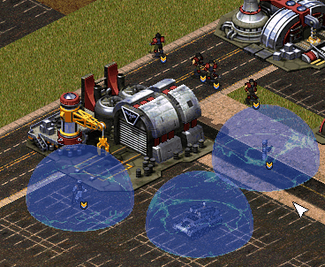
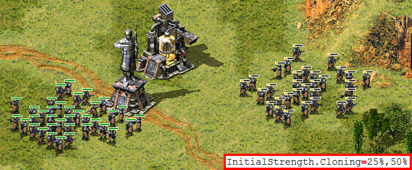

# New / Enhanced Logics

This page describes all the engine features that are either new and introduced by Phobos or significantly extended or expanded.

## New types / ingame entities

### Attached effects

- Similar (but not identical) to Ares' AttachEffect, but with some differences and new features. The largest difference is that here attached effects are explicitly defined types.
  - `Duration` determines how long the effect lasts for. It can be overriden by `DurationOverrides` on TechnoTypes and Warheads.
  - `Cumulative`, if set to true, allows the same type of effect to be applied on same object multiple times, up to `Cumulative.MaxCount` number or with no limit if `Cumulative.MaxCount` is a negative number. If the target already has `Cumulative.MaxCount` number of the same effect applied on it, trying to attach another will refresh duration of the attached instance with shortest remaining duration.
  - `Powered` controls whether or not the effect is rendered inactive if the object it is attached to is deactivated (`PoweredUnit` or affected by EMP) or on low power. What happens to animation is controlled by `Animation.OfflineAction`.
  - `DiscardOn` accepts a list of values corresponding to conditions where the attached effect should be discarded. Defaults to `none`, meaning it is never discarded.
    - `entry`: Discard on exiting the map when entering transports or buildings etc.
    - `move`: Discard when the object the effect is attached on moves. Ignored if the object is a building.
    - `stationary`: Discard when the object the effect is attached on stops moving. Ignored if the object is a building.
    - `drain`: Discard when the object is being affected by a weapon with `DrainWeapon=true`.
    - `inrange`: Discard if within weapon range from current target. Distance can be overridden via `DiscardOn.RangeOverride`.
    - `outofrange`: Discard if outside weapon range from current target. Distance can be overridden via `DiscardOn.RangeOverride`.
    - `firing`: Discard when firing a weapon. This counts special weapons that are not actually fired such as ones with `Spawner=true` or `DrainWeapon=true`.
  - If `PenetratesIronCurtain` is not set to true, the effect is not applied on currently invulnerable objects.
    - `PenetratesForceShield` can be used to set this separately for Force Shielded objects, defaults to value of `PenetratesIronCurtain`.
  - `Animation` defines animation to play in an indefinite loop for as long as the effect is active on the object it is attached to.
    - If `Animation.ResetOnReapply` is set to true, the animation playback is reset every time the effect is applied if `Cumulative=false`.
    - `Animation.OfflineAction` determines what happens to the animation when the attached object is deactivated or not powered. Only applies if `Powered=true`.
    - `Animation.TemporalAction` determines what happens to the animation when the attached object is under effect of `Temporal=true` Warhead.
    - `Animation.UseInvokerAsOwner` can be used to set the house and TechnoType that created the effect (e.g firer of the weapon that applied it) as the animation's owner & invoker instead of the object the effect is attached to.
    - `Animation.HideIfAttachedWith` contains list of other AttachEffectTypes that if attached to same techno as the current one, will hide this effect's animation.
  - `CumulativeAnimations` can be used to declare a list of animations used for `Cumulative=true` types instead of `Animation`. An animation is picked from the list in order matching the number of active instances of the type on the object, with last listed animation used if number is higher than the number of listed animations. This animation is only displayed once and is transferred from the effect to another of same type (specifically one with longest remaining duration), if such exists, upon expiration or removal. Note that because `Cumulative.MaxCount` limits the number of effects of same type that can be applied this can cause animations to 'flicker' here as effects expire before new ones can be applied in some circumstances.
    - `CumulativeAnimations.RestartOnChange` determines if the animation playback is restarted when the type of animation changes, if not then playback resumes at frame at same position relative to the animation's length.
  - Attached effect can fire off a weapon when expired / removed / object dies by setting `ExpireWeapon`.
    - `ExpireWeapon.TriggerOn` determines the exact conditions upon which the weapon is fired, defaults to `expire` which means only if the effect naturally expires.
    - `ExpireWeapon.CumulativeOnlyOnce`, if set to true, makes it so that `Cumulative=true` attached effects only detonate the weapon once period, instead of once per active instance. On `remove` and `expire` condition this means it will only detonate after last instance has expired or been removed.
  - `Tint.Color` & `Tint.Intensity` can be used to set a color tint effect and additive lighting increase/decrease on the object the effect is attached to, respectively.
    - `Tint.VisibleToHouses` can be used to control which houses can see the tint effect.
  - `FirepowerMultiplier`, `ArmorMultiplier`, `SpeedMultiplier` and `ROFMultiplier` can be used to modify the object's firepower, armor strength, movement speed and weapon reload rate, respectively.
    - `ArmorMultiplier.AllowWarheads` and `ArmorMultiplier.DisallowWarheads` can be used to restrict which Warheads the armor multiplier is applied to when dealing damage.
    - If `ROFMultiplier.ApplyOnCurrentTimer` is set to true, `ROFMultiplier` is applied on currently running reload timer (if any) when the effect is first applied.
  - If `Cloakable` is set to true, the object the effect is attached to is granted ability to cloak itself for duration of the effect.
  - `ForceDecloak`, if set to true, will uncloak and make the object the effect is attached to unable to cloak itself for duration of the effect.
  - `WeaponRange.Multiplier` and `WeaponRange.ExtraRange` can be used to multiply the weapon firing range of the object the effect is attached to, or give it an increase / decrease (measured in cells), respectively. `ExtraRange` is cumulatively applied from all attached effects after all `Multiplier` values have been applied.
    - `WeaponRange.AllowWeapons` can be used to list only weapons that can benefit from this range bonus and `WeaponRange.DisallowWeapons` weapons that are not allowed to, respectively.
    - On TechnoTypes with `OpenTopped=true`, `OpenTopped.UseTransportRangeModifiers` can be set to true to make passengers firing out use the transport's active range bonuses instead.
  - `Crit.Multiplier` and `Crit.ExtraChance` can be used to multiply the [critical hit](#chance-based-extra-damage-or-warhead-detonation--critical-hits) chance or grant a fixed bonus to it for the object the effect is attached to, respectively.
    - `Crit.AllowWarheads` can be used to list only Warheads that can benefit from this critical hit chance multiplier and `Crit.DisallowWarheads` weapons that are not allowed to, respectively.
  - `RevengeWeapon` can be used to temporarily grant the specified weapon as a [revenge weapon](#revenge-weapon) for the attached object.
    - `RevengeWeapon.AffectsHouses` customizes which houses can trigger the revenge weapon.
  - `ReflectDamage` can be set to true to have any positive damage dealt to the object the effect is attached to be reflected back to the attacker. `ReflectDamage.Warhead` determines which Warhead is used to deal the damage, defaults to `[CombatDamage]`->`C4Warhead`. If `ReflectDamage.Warhead.Detonate` is set to true, the Warhead is fully detonated instead of used to simply deal damage. `ReflectDamage.Multiplier` is a multiplier to the damage received and then reflected back. Already reflected damage cannot be further reflected back.
    - Warheads can prevent reflect damage from occuring by setting `SuppressReflectDamage` to true. `SuppressReflectDamage.Types` can control which AttachEffectTypes' reflect damage is suppressed, if none are listed then all of them are suppressed.
  - `DisableWeapons` can be used to disable ability to fire any and all weapons.
    - On TechnoTypes with `OpenTopped=true`, `OpenTopped.CheckTransportDisableWeapons` can be set to true to make passengers not be able to fire out if transport's weapons are disabled by `DisableWeapons`.
  - It is possible to set groups for attach effect types by defining strings in `Groups`.
    - Groups can be used instead of types for removing effects and weapon filters.

- AttachEffectTypes can be attached to TechnoTypes using `AttachEffect.AttachTypes`.
  - `AttachEffect.DurationOverrides` can be used to override the default durations. Duration matching the position in `AttachTypes` is used for that type, or the last listed duration if not available.
  - `AttachEffect.Delays` can be used to set the delays for recreating the effects on the TechnoType after they expire. Defaults to 0 (immediately), negative values mean the effects are not recreated. Delay matching the position in `AttachTypes` is used for that type, or the last listed delay if not available.
  - `AttachEffect.InitialDelays` can be used to set the delays before first creating the effects on TechnoType. Defaults to 0 (immediately). Delay matching the position in `AttachTypes` is used for that type, or the last listed delay if not available.
  - `AttachEffect.RecreationDelays` is used to determine if the effect can be recreated if it is removed completely (e.g `AttachEffect.RemoveTypes`), and if yes, how long this takes. Defaults to -1, meaning no recreation. Delay matching the position in `AttachTypes` is used for that type, or the last listed delay if not available.

- AttachEffectTypes can be attached to objects via Warheads using `AttachEffect.AttachTypes`.
  - `AttachEffect.DurationOverrides` can be used to override the default durations. Duration matching the position in `AttachTypes` is used for that type, or the last listed duration if not available.
  - `AttachEffect.CumulativeRefreshAll` if set to true makes it so that trying to attach `Cumulative=true` effect to a target that already has `Cumulative.MaxCount` amount of effects will refresh duration of all attached effects of the same type instead of only the one with shortest remaining duration. If `AttachEffect.CumulativeRefreshAll.OnAttach` is also set to true, this refresh applies even if the target does not have maximum allowed amount of effects of same type.
  - `AttachEffect.CumulativeRefreshSameSourceOnly` controls whether or not trying to apply `Cumulative=true` effect on target requires any existing effects of same type to come from same Warhead by same firer for them to be eligible for duration refresh.
  - Attached effects can be removed from objects by Warheads using `AttachEffect.RemoveTypes` or `AttachEffect.RemoveGroups`.
    - `AttachEffect.CumulativeRemoveMinCounts` sets minimum number of active instaces per `RemoveTypes`/`RemoveGroups` required for `Cumulative=true` types to be removed.
    - `AttachEffect.CumulativeRemoveMaxCounts` sets maximum number of active instaces per `RemoveTypes`/`RemoveGroups` for `Cumulative=true` that are removed at once by this Warhead.

- Weapons can require attached effects on target to fire, or be prevented by firing if specific attached effects are applied.
  - `AttachEffect.RequiredTypes` can be used to list attached effects required to be on target to fire, all listed effect types must be present to allow firing.
  - `AttachEffect.DisallowedTypes` can be used to list attached effects that when present prevent the weapon from firing, any of the listed effect types will prevent firing if present.
  - `AttachEffect.Required/DisallowedGroups` have the same effect except applied with/to all types that have one of the listed groups in their `Groups` listing.
  - `AttachEffect.(Required|Disallowed)MinCounts & (Required|Disallowed)MaxCounts` can be used to set the minimum and maximum number of instances required / disallowed to be on the Techno for `Cumulative=true` types (ignored for other types) respectively.
  - `AttachEffect.IgnoreFromSameSource` can be set to true to ignore effects that have been attached by the firer of the weapon and its Warhead.
  - `AttachEffect.CheckOnFirer` is set to true makes it so that the required / disallowed attached effects are checked from the firer of the weapon instead of the target.

In `rulesmd.ini`:
```ini
[AttachEffectTypes]
0=SOMEATTACHEFFECT

[SOMEATTACHEFFECT]                                 ; AttachEffectType
Duration=0                                         ; integer - game frames or negative value for indefinite duration
Cumulative=false                                   ; boolean
Cumulative.MaxCount=-1                             ; integer
Powered=false                                      ; boolean
DiscardOn=none                                     ; list of discard condition enumeration (none|entry|move|stationary|drain|inrange|outofrange)
DiscardOn.RangeOverride=                           ; floating point value, distance in cells
PenetratesIronCurtain=false                        ; boolean
PenetratesForceShield=                             ; boolean
Animation=                                         ; Animation
Animation.ResetOnReapply=false                     ; boolean
Animation.OfflineAction=Hides                      ; AttachedAnimFlag (None, Hides, Temporal, Paused or PausedTemporal)
Animation.TemporalAction=None                      ; AttachedAnimFlag (None, Hides, Temporal, Paused or PausedTemporal)
Animation.UseInvokerAsOwner=false                  ; boolean
Animation.HideIfAttachedWith=                      ; List of AttachEffectTypes
CumulativeAnimations=                              ; list of animations
CumulativeAnimations.RestartOnChange=true          ; boolean
ExpireWeapon=                                      ; WeaponType
ExpireWeapon.TriggerOn=expire                      ; List of expire weapon trigger condition enumeration (none|expire|remove|death|discard|all)
ExpireWeapon.CumulativeOnlyOnce=false              ; boolean
Tint.Color=                                        ; integer - R,G,B
Tint.Intensity=                                    ; floating point value
Tint.VisibleToHouses=all                           ; list of Affected House Enumeration (none|owner/self|allies/ally|team|enemies/enemy|all)
FirepowerMultiplier=1.0                            ; floating point value
ArmorMultiplier=1.0                                ; floating point value
ArmorMultiplier.AllowWarheads=                     ; list of WarheadTypes
ArmorMultiplier.DisallowWarheads=                  ; list of WarheadTypes
SpeedMultiplier=1.0                                ; floating point value
ROFMultiplier=1.0                                  ; floating point value
ROFMultiplier.ApplyOnCurrentTimer=true             ; boolean
Cloakable=false                                    ; boolean
ForceDecloak=false                                 ; boolean
WeaponRange.Multiplier=1.0                         ; floating point value
WeaponRange.ExtraRange=0.0                         ; floating point value
WeaponRange.AllowWeapons=                          ; list of WeaponTypes
WeaponRange.DisallowWeapons=                       ; list of WeaponTypes
Crit.Multiplier=1.0                                ; floating point value
Crit.ExtraChance=0.0                               ; floating point value
Crit.AllowWarheads=                                ; list of WarheadTypes
Crit.DisallowWarheads=                             ; list of WarheadTypes
RevengeWeapon=                                     ; WeaponType
RevengeWeapon.AffectsHouses=all                    ; list of Affected House Enumeration (none|owner/self|allies/ally|team|enemies/enemy|all)
ReflectDamage=false                                ; boolean
ReflectDamage.Warhead=                             ; WarheadType
ReflectDamage.Warhead.Detonate=false               ; WarheadType
ReflectDamage.Multiplier=1.0                       ; floating point value, percents or absolute
ReflectDamage.AffectsHouses=all                    ; list of Affected House Enumeration (none|owner/self|allies/ally|team|enemies/enemy|all)
DisableWeapons=false                               ; boolean
Groups=                                            ; comma-separated list of strings (group IDs)

[SOMETECHNO]                                       ; TechnoType
AttachEffect.AttachTypes=                          ; List of AttachEffectTypes
AttachEffect.DurationOverrides=                    ; integer - duration overrides (comma-separated) for AttachTypes in order from first to last.
AttachEffect.Delays=                               ; integer - delays (comma-separated) for AttachTypes in order from first to last.
AttachEffect.InitialDelays=                        ; integer - initial delays (comma-separated) for AttachTypes in order from first to last.
AttachEffect.RecreationDelays=                     ; integer - recreation delays (comma-separated) for AttachTypes in order from first to last.
OpenTopped.UseTransportRangeModifiers=false        ; boolean
OpenTopped.CheckTransportDisableWeapons=false      ; boolean

[SOMEWEAPON]                                       ; WeaponType
AttachEffect.RequiredTypes=                        ; List of AttachEffectTypes
AttachEffect.DisallowedTypes=                      ; List of AttachEffectTypes
AttachEffect.RequiredGroups=                       ; comma-separated list of strings (group IDs)
AttachEffect.DisallowedGroups=                     ; comma-separated list of strings (group IDs)
AttachEffect.RequiredMinCounts=                    ; integer - minimum required instance count (comma-separated) for cumulative types in order from first to last.
AttachEffect.RequiredMaxCounts=                    ; integer - maximum required instance count (comma-separated) for cumulative types in order from first to last.
AttachEffect.DisallowedMinCounts=                  ; integer - minimum disallowed instance count (comma-separated) for cumulative types in order from first to last.
AttachEffect.DisallowedMaxCounts=                  ; integer - maximum disallowed instance count (comma-separated) for cumulative types in order from first to last.
AttachEffect.IgnoreFromSameSource=false            ; boolean
AttachEffect.CheckOnFirer=false                    ; boolean

[SOMEWARHEAD]
AttachEffect.AttachTypes=                          ; List of AttachEffectTypes
AttachEffect.CumulativeRefreshAll=false            ; boolean
AttachEffect.CumulativeRefreshAll.OnAttach=false   ; boolean
AttachEffect.CumulativeRefreshSameSourceOnly=true  ; boolean
AttachEffect.RemoveTypes=                          ; List of AttachEffectTypes
AttachEffect.RemoveGroups=                         ; comma-separated list of strings (group IDs)
AttachEffect.CumulativeRemoveMinCounts=            ; integer - minimum required instance count (comma-separated) for cumulative types in order from first to last.
AttachEffect.CumulativeRemoveMaxCounts=            ; integer - maximum removed instance count (comma-separated) for cumulative types in order from first to last.
AttachEffect.DurationOverrides=                    ; integer - duration overrides (comma-separated) for AttachTypes in order from first to last.
SuppressReflectDamage=false                        ; boolean
SuppressReflectDamage.Types=                       ; List of AttachEffectTypes
```

### Custom Radiation Types


*Mixing different radiation types*

- Any weapon can now have a custom radiation type. More details on radiation [here](https://www.modenc.renegadeprojects.com/Radiation).
- There are several new properties available to all radiation types.
  - `RadApplicationDelay.Building` can be set to value higher than 0 to allow radiation to damage buildings. How many times a single radiation site can deal this damage to same building (every cell of the foundation is hit by all radiation sites on a cell) can be customized with `RadBuildingDamageMaxCount`, negative values mean no limit.
  - `RadSiteWarhead.Detonate` can be set to make `RadSiteWarhead` detonate on affected objects rather than only be used to dealt direct damage. This enables most Warhead effects, display of animations etc. If `RadSiteWarhead.Detonate.Full` is set to false instead, instead of full Warhead detonation it only applies area damage and Phobos Warhead effects.
  - `RadHasOwner`, if set to true, makes damage dealt by the radiation count as having been dealt by the house that fired the projectile that created the radiation field. This means that Warhead controls such as `AffectsAllies` will be respected and any units killed will count towards that player's destroyed units count.
  - `RadHasInvoker`, if set to true, makes the damage dealt by the radiation count as having been dealt by the TechnoType (the 'invoker') that fired the projectile that created the radiation field. In addition to the effects of `RadHasOwner`, this will also grant experience from units killed by the radiation to the invoker. Note that if the invoker dies at any point during the radiation's lifetime it continues to behave as if not having an invoker.
- By default `UseGlobalRadApplicationDelay` is set to true. This makes game always use `RadApplicationDelay` and `RadApplicationDelay.Building` from `[Radiation]` rather than specific radiation types. This is a performance-optimizing measure that should be disabled if a radiation type declares different application delay.

In `rulesmd.ini`:
```ini
[RadiationTypes]
0=SOMERADTYPE

[Radiation]
UseGlobalRadApplicationDelay=true  ; boolean

[SOMEWEAPON]                       ; WeaponType
RadType=Radiation                  ; RadType to use instead of default of [Radiation]

[SOMERADTYPE]                      ; RadType
RadDurationMultiple=1              ; integer
RadApplicationDelay=16             ; integer
RadApplicationDelay.Building=0     ; integer
RadBuildingDamageMaxCount=-1       ; integer
RadLevelMax=500                    ; integer
RadLevelDelay=90                   ; integer
RadLightDelay=90                   ; integer
RadLevelFactor=0.2                 ; floating point value
RadLightFactor=0.1                 ; floating point value
RadTintFactor=1.0                  ; floating point value
RadColor=0,255,0                   ; integer - R,G,B
RadSiteWarhead=RadSite             ; WarheadType
RadSiteWarhead.Detonate=false      ; boolean
RadSiteWarhead.Detonate.Full=true  ; boolean
RadHasOwner=false                  ; boolean
RadHasInvoker=false                ; boolean
```

### Laser Trails


*Laser trails used in [Rise of the East](https://www.moddb.com/mods/riseoftheeast)*

- Technos, Projectiles, and VoxelAnims can now have colorful trails of different transparency, thickness and color, which are drawn via laser drawing code.
- Technos, Projectiles, and VoxelAnims can have multiple laser trails. For technos each trail can have custom laser trail type and FLH offset relative to turret and body.

```{warning}
Laser trails are very resource intensive! Due to the game not utilizing GPU having a lot of trails can quickly drop the FPS on even good machines. To reduce that effect:
 - don't put too many laser trails on units and projectiles;
 - make sure you set as high `SegmentLength` value as possible without trails being too jagged;
 - try to keep the length of the trail minimal (can be achieved with smaller `FadeDuration` durations).
```

In `artmd.ini`:
```ini
[LaserTrailTypes]
0=SOMETRAIL

[SOMETRAIL]                      ; LaserTrailType name
IsHouseColor=false               ; boolean
Color=255,0,0                    ; integer - R,G,B
FadeDuration=64                  ; integer
Thickness=4                      ; integer
SegmentLength=128                ; integer, minimal length of each trail segment
IgnoreVertical=false             ; boolean, whether the trail won't be drawn on vertical movement
IsIntense=false                  ; boolean, whether the laser is "supported" (AKA prism forwarding)
CloakVisible=false               ; boolean, whether the laser is visible when the attached unit is cloaked
CloakVisible.DetectedOnly=false  ; boolean, whether CloakVisible=true laser is visible only to those who can detect the attached unit

[SOMEPROJECTILE]                 ; BulletType Image
LaserTrail.Types=SOMETRAIL       ; list of LaserTrailTypes

[SOMETECHNO]                     ; TechnoType Image
LaserTrailN.Type=SOMETRAIL       ; LaserTrailType
LaserTrailN.FLH=0,0,0            ; integer - Forward,Lateral,Height
LaserTrailN.IsOnTurret=false     ; boolean, whether the trail origin is turret
; where N = 0, 1, 2, ...
```

In `rulesmd.ini`:
```ini
[SOMEVOXELANIM]             ; VoxelAnim
LaserTrail.Types=SOMETRAIL  ; list of LaserTrailTypes
```

### Shields


*Buildings, Infantries and Vehicles with Shield in [Fantasy ADVENTURE](https://www.moddb.com/mods/fantasy-adventure)*

In `rulesmd.ini`:
```ini
[AudioVisual]
Shield.ConditionYellow=                     ; floating point value, percents or absolute
Shield.ConditionRed=                        ; floating point value, percents or absolute
Pips.Shield=-1,-1,-1                        ; integer, frames of pips.shp (zero-based) for Green, Yellow, Red
Pips.Shield.Building=-1,-1,-1               ; integer, frames of pips.shp (zero-based) for Green, Yellow, Red
Pips.Shield.Background=PIPBRD.SHP           ; filename - including the .shp/.pcx extension
Pips.Shield.Building.Empty=0                ; integer, frame of pips.shp (zero-based) for empty building pip

[ShieldTypes]
0=SOMESHIELDTYPE

[SOMESHIELDTYPE]                            ; ShieldType name
Strength=0                                  ; integer
InitialStrength=0                           ; integer
ConditionYellow=                            ; floating point value, percents or absolute
ConditionRed=                               ; floating point value, percents or absolute
Armor=none                                  ; ArmorType
InheritArmorFromTechno=false                ; boolean
Powered=false                               ; boolean
AbsorbOverDamage=false                      ; boolean
SelfHealing=0.0                             ; floating point value, percents or absolute
SelfHealing.Rate=0.0                        ; floating point value, ingame minutes
SelfHealing.RestartInCombat=true            ; boolean
SelfHealing.RestartInCombatDelay=0          ; integer, game frames
Respawn=0.0                                 ; floating point value, percents or absolute
Respawn.Rate=0.0                            ; floating point value, ingame minutes
BracketDelta=0                              ; integer - pixels
Pips=-1,-1,-1                               ; integer, frames of pips.shp (zero-based) for Green, Yellow, Red
Pips.Building=-1,-1,-1                      ; integer, frames of pips.shp (zero-based) for Green, Yellow, Red
Pips.Background=                            ; filename - including the .shp/.pcx extension
Pips.Building.Empty=                        ; integer, frame of pips.shp (zero-based) for empty building pip
IdleAnim=                                   ; Animation
IdleAnim.ConditionYellow=                   ; Animation
IdleAnim.ConditionRed=                      ; Animation
IdleAnimDamaged=                            ; Animation
IdleAnimDamaged.ConditionYellow=            ; Animation
IdleAnimDamaged.ConditionRed=               ; Animation
IdleAnim.OfflineAction=Hides                ; AttachedAnimFlag (None, Hides, Temporal, Paused or PausedTemporal)
IdleAnim.TemporalAction=Hides               ; AttachedAnimFlag (None, Hides, Temporal, Paused or PausedTemporal)
BreakAnim=                                  ; Animation
HitAnim=                                    ; Animation
HitFlash=false                              ; boolean
HitFlash.FixedSize=                         ; integer
HitFlash.Red=true                           ; boolean
HitFlash.Green=true                         ; boolean
HitFlash.Blue=true                          ; boolean
HitFlash.Black=false                        ; boolean
BreakWeapon=                                ; WeaponType
AbsorbPercent=1.0                           ; floating point value
PassPercent=0.0                             ; floating point value
ReceivedDamage.Minimum=-2147483648          ; integer
ReceivedDamage.Maximum=2147483647           ; integer
AllowTransfer=                              ; boolean
ImmuneToBerserk=no                          ; boolean
ImmuneToCrit=no                             ; boolean
Tint.Color=                                 ; integer - R,G,B
Tint.Intensity=0.0                          ; floating point value
Tint.VisibleToHouses=all                    ; list of Affected House Enumeration (none|owner/self|allies/ally|team|enemies/enemy|all)

[SOMETECHNO]                                ; TechnoType
ShieldType=SOMESHIELDTYPE                   ; ShieldType; none by default

[SOMEWARHEAD]                               ; WarheadType
Shield.Penetrate=false                      ; boolean
Shield.Break=false                          ; boolean
Shield.BreakAnim=                           ; Animation
Shield.HitAnim=                             ; Animation
Shield.SkipHitAnim=false                    ; boolean
Shield.HitFlash=true                        ; boolean
Shield.BreakWeapon=                         ; WeaponType
Shield.AbsorbPercent=                       ; floating point value
Shield.PassPercent=                         ; floating point value
Shield.ReceivedDamage.Minimum=              ; integer
Shield.ReceivedDamage.Maximum=              ; integer
Shield.ReceivedDamage.MinMultiplier=1.0     ; floating point value
Shield.ReceivedDamage.MaxMultiplier=1.0     ; floating point value
Shield.Respawn.Duration=0                   ; integer, game frames
Shield.Respawn.Amount=0.0                   ; floating point value, percents or absolute
Shield.Respawn.Rate=-1.0                    ; floating point value, ingame minutes
Shield.Respawn.RestartTimer=false           ; boolean
Shield.SelfHealing.Duration=0               ; integer, game frames
Shield.SelfHealing.Amount=0.0               ; floating point value, percents or absolute
Shield.SelfHealing.Rate=-1.0                ; floating point value, ingame minutes
Shield.SelfHealing.RestartInCombat=         ; boolean
Shield.SelfHealing.RestartInCombatDelay=-1  ; integer, game frames
Shield.SelfHealing.RestartTimer=false       ; boolean
Shield.AffectTypes=                         ; List of ShieldType names
Shield.Penetrate.Types=                     ; List of ShieldType names
Shield.Break.Types=                         ; List of ShieldType names
Shield.Respawn.Types=                       ; List of ShieldType names
Shield.SelfHealing.Types=                   ; List of ShieldType names
Shield.AttachTypes=                         ; List of ShieldType names
Shield.RemoveTypes=                         ; List of ShieldType names
Shield.RemoveAll=false                      ; boolean
Shield.ReplaceOnly=false                    ; boolean
Shield.ReplaceNonRespawning=false           ; boolean
Shield.MinimumReplaceDelay=0                ; integer, game frames
Shield.InheritStateOnReplace=false          ; boolean
```
- Now you can have a shield for any TechnoType. It serves as a second health pool with independent `Armor` and `Strength` values.
  - Shield will not take damage if the TechnoType is under effects of `Temporal` warhead, is Iron Curtained / Force Shielded, has `Immune=true` or if it has `TypeImmune=true` and the damage source is another instance of same TechnoType belonging to same house.
  - Negative damage will recover shield, unless shield has been broken. If shield isn't full, all negative damage will be absorbed by shield.
    - Negative damage weapons will consider targets with active, but not at full health shields in need of healing / repairing unless the Warhead has `Shield.Penetrate=true`, in which case only object health is considered.
  - When a TechnoType has an unbroken shield, `[ShieldType]->Armor` will replace `[TechnoType]->Armor` for targeting and damage calculation purposes.
    - `InheritArmorFromTechno` can be set to true to override this so that `[TechnoType]->Armor` is used even if shield is active and `[ShieldType]->Armor` is ignored.
  - `InitialStrength` can be used to set a different initial strength value from maximum.
  - `ConditionYellow` and `ConditionRed` can be used to set the thresholds for shield damage states, defaulting to `[AudioVisual]` -> `Shield.ConditionYellow` & `Shield.ConditionRed` respectively which in turn default to just `ConditionYellow` & `ConditionRed`.
- When executing `DeploysInto` or `UndeploysInto`, if both of the TechnoTypes have shields, the transformed unit/building would keep relative shield health (in percents), same as with `Strength`. If one of the TechnoTypes doesn't have shields, it's shield's state on conversion will be preserved until converted back.
  - This also works with Ares' `Convert.*`.
- `Powered` controls whether or not the shield is active when a unit is running low on power or it is affected by EMP.
  - Attention, if TechnoType itself is not `Powered`, then the shield won't be offline when low power.
- `AbsorbOverDamage` controls whether or not the shield absorbs damage dealt beyond shield's current strength when the shield breaks.
- `SelfHealing` and `Respawn` respect the following settings: 0.0 disables the feature, 1%-100% recovers/respawns the shield strength in percentage, other number recovers/respawns the shield strength directly. Specially, `SelfHealing` with a negative number deducts the shield strength.
  - If you want shield recovers/respawns 1 HP per time, currently you need to set tag value to any number between 1 and 2, like `1.1`.
  - If `SelfHealing.RestartInCombat` is set, self-healing timer pauses and then resumes after `SelfHealing.RestartInCombatDelay` frames have passed when the shield gets damaged.
- `SelfHealing.Rate` and `Respawn.Rate` respect the following settings: 0.0 instantly recovers the shield, other values determine the frequency of shield recovers/respawns in ingame minutes.
- `IdleAnim`, if set, will be played while the shield is intact. This animation is automatically set to loop indefinitely.
  - `IdleAnim.ConditionYellow` and `IdleAnim.ConditionRed` can be used to set different animations for when shield health is at or below the percentage defined in `[AudioVisual]`->`ConditionYellow`/`ConditionRed`, respectively. If `IdleAnim.ConditionRed` is not set it falls back to `IdleAnim.ConditionYellow`, which in turn falls back to `IdleAnim`.
  - `IdleAnimDamaged`, `IdleAnimDamaged.ConditionYellow` and `IdleAnimDamaged.ConditionRed` are used in an identical manner, but only when health of the object the shield is attached to is at or below `[AudioVisual]`->`ConditionYellow`. Follows similar fallback sequence to regular `IdleAnim` variants and if none are set, falls back to the regular `IdleAnim` or variants thereof.
  - `Bouncer=true` and `IsMeteor=true` animations can exhibit irregular behaviour when used as `IdleAnim` and should be avoided.
- `IdleAnim.OfflineAction` indicates what happens to the animation when the shield is in a low power state.
- `IdleAnim.TemporalAction` indicates what happens to the animation when the shield is attacked by temporal weapons.
- `BreakAnim`, if set, will be played when the shield has been broken.
- `HitAnim`, if set, will be played when the shield is attacked, similar to `WeaponNullifyAnim` for Iron Curtain.
- `HitFlash`, if set to true, makes it so that a light flash is generated when the shield is attacked by a Warhead unless it has `Shield.HitFlash=false`. Size of the flash is determined by damage dealt, unless `HitFlash.FixedSize` is set to a number, in which case that value is used instead (range of values that produces visible effect are increments of 4 from 81 to 252, anything higher or below does not have effect). Color can be customized via `HitFlash.Red/Green/Blue`. If `HitFlash.Black` is set to true, the generated flash will be black regardless of other color settings.
- `BreakWeapon`, if set, will be fired at the TechnoType once the shield breaks.
- `AbsorbPercent` controls the percentage of damage that will be absorbed by the shield. Defaults to 1.0, meaning full damage absorption.
- `PassPercent` controls the percentage of damage that will *not* be absorbed by the shield, and will be dealt to the unit directly even if the shield is active. Defaults to 0.0 - no penetration.
- `ReceivedDamage.Minimum` & `ReceivedDamage.Maximum` control the minimum and maximum amount of damage that can be dealt to shield in a single hit. This is applied after armor type and `AbsorbPercent` adjustments. If `AbsorbOverDamage=false`, the residual damage dealt to the TechnoType is still based on the original damage before the clamping to the range.
- `AllowTransfer` controls whether or not the shield can be transferred if the TechnoType changes (such as `(Un)DeploysInto` or Ares type conversion). If not set, defaults to true if shield was attached via `Shield.AttachTypes`, otherwise false.
- `ImmuneToBerserk` gives the immunity against `Psychedelic=yes` warhead. Otherwise the berserk effect penetrates shields by default. Note that this shouldn't prevent the unit from targeting at the shielded object. `Versus.shieldArmor=0%` is still required in this case.
- A tint effect similar to that used by Iron Curtain / Force Shield or `Psychedelic=true` Warheads can be applied to to TechnoTypes with shields by setting `Tint.Color` and/or `Tint Intensity`.
  - `Tint.Intensity` is additive lighting increase/decrease - 1.0 is the default object lighting.
  - `Tint.VisibleToHouses` can be used to customize which houses can see the tint effect.
- A TechnoType with a shield will show its shield Strength. An empty shield strength bar will be left after destroyed if it is respawnable. Several customizations are available for the shield strength pips.
  - By default, buildings use the 6th frame of `pips.shp` to display the shield strength while others use the 17th frame.
  - `Pips.Shield` can be used to specify which pip frame should be used as shield strength. If only 1 digit is set, then it will always display that frame, or if 3 digits are set, it will use those if shield's current strength is at or below `ConditionYellow` and `ConditionRed`, respectively. `Pips.Shield.Building` is used for BuildingTypes. -1 as value will use the default frame, whether it is fallback to first value or the aforementioned hardcoded defaults.
  - `Pips.Shield.Background` can be used to set the background or 'frame' for non-building pips, which defaults to `pipbrd.shp`. 4th frame is used to display an infantry's shield strength and the 3th frame for other units, or 2nd and 1st respectively if not enough frames are available.
  - `Pips.Shield.Building.Empty` can be used to set the frame of `pips.shp` displayed for empty building strength pips, defaults to 1st frame of `pips.shp`.
  - The above customizations are also available on per ShieldType basis, e.g `[ShieldType]`->`Pips` instead of `[AudioVisual]`->`Pips.Shield` and so on. ShieldType settings take precedence over the global ones, but will fall back to them if not set.
  - `BracketDelta` can be used as additional vertical offset (negative shifts it up) for shield strength bar. Much like `PixelSelectionBracketDelta`, it is not applied on buildings.
- Warheads have new options that interact with shields. Note that all of these that do not by their very nature require ability to target the shield (such as modifiers like `Shield.Break` or removing / attaching) still require Warhead `Verses` to affect the target unless `EffectsRequireVerses` is set to false on the Warhead.
  - `Shield.Penetrate` allows the warhead ignore the shield and always deal full damage to the TechnoType itself. It also allows targeting the TechnoType as if shield doesn't exist.
  - `Shield.Break` allows the warhead to always break shields of TechnoTypes. This is done before damage is dealt.
  - `Shield.BreakAnim` will be displayed instead of ShieldType `BreakAnim` if the shield is broken by the Warhead, either through damage or `Shield.Break`.
  - `Shield.HitAnim` will be displayed instead of ShieldType `HitAnim` if set when Warhead hits the shield.
  - If `Shield.SkipHitAnim` is set to true, no hit anim is shown when the Warhead damages the shield whatsoever.
  - `Shield.BreakWeapon` will be fired instead of ShieldType `BreakWeapon` if the shield is broken by the Warhead, either through damage or `Shield.Break`.
  - `Shield.AbsorbPercent` overrides the `AbsorbPercent` value set in the ShieldType that is being damaged.
  - `Shield.PassPercent` overrides the `PassPercent` value set in the ShieldType that is being damaged.
  - `Shield.ReceivedDamage.Minimum` & `Shield.ReceivedDamage.Maximum` override the values set in in the ShieldType that is being damaged.
    - `Shield.ReceivedDamage.MinMultiplier` and `Shield.ReceivedDamage.MinMultiplier` are multipliers to the effective `Shield.ReceivedDamage.Minimum` and `Shield.ReceivedDamage.Maximum` respectively that are applied when the Warhead deals damage to a shield.
  - `Shield.Respawn.Rate` & `Shield.Respawn.Amount` override ShieldType `Respawn.Rate` and `Respawn.Amount` for duration of `Shield.Respawn.Duration` amount of frames. Negative rate & zero or lower amount default to ShieldType values. If `Shield.Respawn.RestartTimer` is set, currently running shield respawn timer is reset, otherwise the timer's duration is adjusted in proportion to the new `Shield.Respawn.Rate` (e.g timer will be same percentage through before and after) without restarting the timer. If the effect expires while respawn timer is running, remaining time is adjusted to proportionally match ShieldType `Respawn.Rate`. Re-applying the effect resets the duration to `Shield.Respawn.Duration`
  - `Shield.SelfHealing.Rate` & `Shield.SelfHealing.Amount` override ShieldType `SelfHealing.Rate` and `SelfHealing.Amount` for duration of `Shield.SelfHealing.Duration` amount of frames. Negative rate & zero or lower amount default to ShieldType values. If `Shield.SelfHealing.RestartTimer` is set, currently running self-healing timer is restarted, otherwise timer's duration is adjusted in proportion to the new `Shield.SelfHealing.Rate` (e.g timer will be same percentage through before and after) without restarting the timer. If the effect expires while self-healing timer is running, remaining time is adjusted to proportionally match ShieldType `SelfHealing.Rate`. Re-applying the effect resets the duration to `Shield.SelfHealing.Duration`.
    - Additionally `Shield.SelfHealing.RestartInCombat` & `Shield.SelfHealing.RestartInCombatDelay` can be used to override ShieldType settings.
  - `Shield.AffectTypes` allows listing which ShieldTypes can be affected by any of the effects listed above. If none are listed, all ShieldTypes are affected.
    -  `Shield.AffectTypes` can be overriden for specific shield interactions by using keys `Shield.Penetrate.Types`, `Shield.Break.Types`, `Shield.Respawn.Types` and `Shield.SelfHealing.Types` respectively.
  - `Shield.AttachTypes` & `Shield.RemoveTypes` allows listing ShieldTypes that are attached or removed, respectively from any targets affected by the warhead (positive `Verses` values). Normally only first listed ShieldType in `Shield.AttachTypes` is applied.
    - If `Shield.ReplaceOnly` is set, shields from `Shield.AttachTypes` are only applied to affected targets from which shields were simultaneously removed, matching the order listed in `Shield.RemoveTypes`. If `Shield.AttachTypes` contains less items than `Shield.RemoveTypes`, last item from the former is used for any remaining removed shields.
    - If `Shield.ReplaceNonRespawning` is set, shield from `Shield.AttachTypes` replaces existing shields that have been broken and cannot respawn on their own.
    - If `Shield.RemoveAll` is set, all shield types are removed from the affected targets, even those that are not listed in `Shield.RemoveTypes`. If `Shield.ReplaceOnly` is set, first type listed in `Shield.AttachTypes` is used to replace any removed types not listed in `Shield.RemoveTypes`.
    - `Shield.MinimumReplaceDelay` can be used to control how long after the shield has been broken (in game frames) can it be replaced. If not enough frames have passed, it won't be replaced.
    - If `Shield.InheritStateOnReplace` is set, shields replaced via `Shield.ReplaceOnly` inherit the current strength (relative to ShieldType `Strength`) of the previous shield and whether or not the shield was currently broken. Self-healing and respawn timers are always reset.

## Animations

### Anim-to-Unit


- Animations can now create (or "convert" to) any unit (vehicles, aircraft and infantry) when they end via `CreateUnit`. This offers more settings than `MakeInfantry` does for infantry.
  - `CreateUnit.Owner` determines which house will own the created unit. This only works as expected if the animation has owner set.
    - Vehicle [destroy animations](Fixed-or-Improved-Logics.md#destroy-animations), animations from Warhead `AnimList/SplashList` and map trigger action `41 Play Anim At` will have the owner set correctly.
    - `CreateUnit.RemapAnim`, if set to true, will cause the animation to be drawn in unit palette and remappable to owner's team color.
  - `CreateUnit.Mission` determines the initial mission of the created unit. This can be overridden for AI players by setting `CreateUnit.AIMission`.
  - `CreateUnit.Facing` determines the initial facing of created unit.
    - `CreateUnit.RandomFacing`, if set to true, makes it so that a random facing is picked instead.
    - For VehicleTypes only, `CreateUnit.InheritFacings` and `CreateUnit.InheritTurretFacings` inherit facings for vehicle body and turret respectively from the destroyed vehicle if the animation is a vehicle destroy animation. `InheritTurretFacings` does not work with jumpjet vehicles due to technical constraints.
  - `CreateUnit.AlwaysSpawnOnGround`, if set to true, ensures the unit will be created on the cell at ground level even if animation is in air. If set to false, jumpjet units spawned on ground will take off automatically after being spawned regardless.
  - `CreateUnit.SpawnParachutedInAir`, if set to true, makes it so that the unit is created with a parachute if it is spawned in air. Has no effect if `CreateUnit.AlwaysSpawnOnGround` is set to true.
  - `CreateUnit.ConsiderPathfinding`, if set to true, will consider whether or not the cell where the animation is located is occupied by other objects or impassable to the unit being created and will attempt to find a nearby cell that is not. Otherwise the unit will be created at the animation's location despite these obstacles if possible.
  - `CreateUnit.SpawnAnim` can be used to play another animation at created unit's location after it has appeared. This animation has same owner and invoker as the parent animation.
  - `CreateUnit.SpawnHeight` can be set to override the animation's height when determining where to spawn the created unit if set to positive value. Has no effect if `CreateUnit.AlwaysSpawnOnGround` is set to true.

In `artmd.ini`:
```ini
[SOMEANIM]                             ; AnimationType
CreateUnit=                            ; TechnoType
CreateUnit.Owner=Victim                ; Owner house kind, Invoker/Killer/Victim/Civilian/Special/Neutral/Random
CreateUnit.RemapAnim=false             ; boolean
CreateUnit.Mission=Guard               ; MissionType
CreateUnit.AIMission=                  ; MissionType
CreateUnit.Facing=0                    ; Direction type (integers from 0-255)
CreateUnit.RandomFacing=true           ; boolean
CreateUnit.InheritFacings=false        ; boolean
CreateUnit.InheritTurretFacings=false  ; boolean
CreateUnit.AlwaysSpawnOnGround=false   ; boolean
CreateUnit.SpawnParachutedInAir=false  ; boolean
CreateUnit.ConsiderPathfinding=false   ; boolean
CreateUnit.SpawnAnim=                  ; Animation
CreareUnit.SpawnHeight=-1              ; integer, height in leptons
```

```{note}
Due to technical constraints, infantry death animations including Ares' `InfDeathAnim` cannot have `CreateUnit.Owner` correctly applied to them. You can use Ares' `MakeInfantryOwner` as a workaround instead, which should function for this use-case even without `MakeInfantry` set.
```

### Attached particle system

- It is now possible to attach a particle system to an animation. Only particle systems with `BehavesLike=Smoke` are supported. This works similarly to the identically named key on `VoxelAnims`.
  - On animations with `Next`, the particle system will be deleted when the next animation starts playing and new one created in its stead if the `Next` animation defines a different particle system.

In `artmd.ini`:
```ini
[SOMEANIM]       ; AnimationType
AttachedSystem=  ; ParticleSystem
```

### Customizable animation visibility settings

- It is now possible to customize which players can see an animation using `VisibleTo`.
  - `VisibleTo.ConsiderInvokerAsOwner`, if set, makes it so that animation's invoker house is considered as owner for purposes of `VisibleTo` instead of owning house of TechnoType it is attached to or animation's owning house. On most animations the they are the same, but it can be different for some.
  - Note that this is a purely visual feature, any logic attached to these animations like damage is still processed for all players.
- `RestrictVisibilityIfCloaked`, if set to true, makes so that attached animations or aircraft `Trailer` animations (due to technical constraints, spawned missile trailers are exempt from this) on cloaked objects are only visible to observers and players who can currently detect them.
- `DetachOnCloak` can be set to false to override vanilla game behaviour where attached animations are removed from cloaked objects.

In `artmd.ini`:
```ini
[SOMEANIM]                              ; AnimationType
VisibleTo=all                           ; list of Affected House Enumeration (none|owner/self|allies/ally|team|enemies/enemy|all)
VisibleTo.ConsiderInvokerAsOwner=false  ; boolean
RestrictVisibilityIfCloaked=false       ; boolean
DetachOnCloak=true                      ; boolean
```

### Play sound as a detached sound event

- It is now possible for animation to play a sound that is not attached to an audio event handler by using `DetachedReport`. By default animation `Report/StartSound` is played by an audio event handler, which allows the sound to loop and play at correct location even if it changes after its initial creation. This can also cause issues with animations that chain different types through `Next`, as the audio event handler resets when the animation restarts.

In `artmd.ini`:
```ini
[SOMEANIM]       ; AnimationType
DetachedReport=  ; sound entry
```

## Buildings

### Build area customizations

- There are now additional customizations available for building placement next to other buildings.
  - `Adjacent.Allowed` lists BuildingTypes this BuildingType can be placed off (within distance defined by `Adjacent`). If empty, any BuildingType not listed in `Adjacent.Disallowed` is okay.
  - `Adjacent.Disallowed` lists BuildingTypes this BuildingType cannot be placed next to. If empty, any BuildingTypes are okay as long as `Adjacent.Allowed` is empty or they are listed on it.
  - If `NoBuildAreaOnBuildup` is set to true, no building can be built next to this building regardless of any other settings if it is currently displaying its buildup animation.

In `rulesmd.ini`:
```ini
[SOMEBUILDING]              ; BuildingType
Adjacent.Allowed=           ; list of BuildingTypes
Adjacent.Disallowed=        ; list of BuildingTypes
NoBuildAreaOnBuildup=false  ; boolean
```

### Extended building upgrades


*Upgrading own and allied Power Plants in [CnC: Final War](https://www.moddb.com/mods/cncfinalwar)*

```{note}
Due to technical limitations, with Ares, upgrades placed through `PowersUp.Buildings` instead of `PowersUpBuilding` (note that internally `PowersUpBuilding` is set to first entry of `PowersUp.Buildings` if former is not set but latter is) **DO NOT** satisfy prerequisites. Suggested workaround is to use the upgrades to provide Superweapons that spawn in buildings via [LimboDelivery](#limbodelivery) logic to function as prerequisites, which are destroyed by another SW that becomes available if parent building is gone and so on.
```

- Building upgrades now can be placed on own buildings, on allied buildings and/or on enemy buildings. These three owners can be specified by `PowersUp.Owner`. When upgrade is placed on building, it automatically changes it's owner to match the building's owner.
- One upgrade can now be applied to multiple different types of buildings specified by `PowersUp.Buildings`.
  - Ares-introduced build limit for building upgrades works with this feature.

In `rulesmd.ini`:
```ini
[UPGRADENAME]       ; BuildingType
PowersUp.Owner=Self ; list of Affected House Enumeration (none|owner/self|allies/ally|team|enemies/enemy|all)
PowersUp.Buildings= ; list of BuildingTypes
```

### Destroyable pathfinding obstacles

- It is possible to make buildings be considered pathfinding obstacles that can be destroyed by setting `IsDestroyableBlockage` to true. What this does is make the building be considered impassable and impenetrable pathfinding obstacle to every unit that is not flying or have appropriate `MovementZone` (ones that allow destroyable obstacles to be overcome, e.g `(Infantry|Amphibious)Destroyer`) akin to wall overlays and TerrainTypes.
  - Keep in mind that if an unit has appropriate `MovementZone` but no means to actually destroy an obstacle (such as a weapon that can fire and deal damage at them), they will get stuck trying to go through them instead of pathing around.

In `rulesmd.ini`:
```ini
[SOMEBUILDING]               ; BuildingType
IsDestroyableObstacle=false  ; boolean
```

### Power plant enhancer

- When it exists, it can increase the power amount generated by the power plants.
  - When enchancing structures are sold or destroyed, the power amount returns to normal.

In `rulesmd.ini`:
```ini
[SOMEBUILDING]                     ; BuildingType
PowerPlantEnhancer.PowerPlants=    ; list of BuildingTypes
PowerPlantEnhancer.Amount=0        ; integer
PowerPlantEnhancer.Factor=1.0      ; floating point value
```

### Spy Effects

- Additional espionage bonuses can be toggled with `SpyEffect.Custom`.
  - `SpyEffect.VictimSuperWeapon` instantly launches a Super Weapon for the owner of the infiltrated building at building's coordinates.
  - `SpyEffect.InfiltratorSuperWeapon` behaves the same as above, with the Super Weapon's owner being the owner of the spying unit.

In `rulesmd.ini`:
```ini
[SOMEBUILDING]                     ; BuildingType
SpyEffect.Custom=false             ; boolean
SpyEffect.VictimSuperWeapon=       ; SuperWeaponType
SpyEffect.InfiltratorSuperWeapon=  ; SuperWeaponType
```

## Infantry

### Customizable FLH When Infantry Is Prone Or Deployed

- Now infantry can override `PrimaryFireFLH` and `SecondaryFireFLH` if is prone (crawling) or deployed. Also works in conjunction with [burst-index specific firing offsets](#firing-offsets-for-specific-burst-shots).

In `artmd.ini`:
```ini
[SOMEINFANTRY]             ; InfantryType image
PronePrimaryFireFLH=       ; integer - Forward,Lateral,Height
ProneSecondaryFireFLH=     ; integer - Forward,Lateral,Height
DeployedPrimaryFireFLH=    ; integer - Forward,Lateral,Height
DeployedSecondaryFireFLH=  ; integer - Forward,Lateral,Height
```

### Default disguise for individual InfantryTypes

- Infantry can now have its `DefaultDisguise` overridden per-type.
  - This tag's priority is higher than Ares' per-side `DefaultDisguise`.

In `rulesmd.ini`:
```ini
[SOMEINFANTRY]      ; InfantryType
DefaultDisguise=E2  ; InfantryType
```

### Random death animaton for NotHuman Infantry

- Infantry with `NotHuman=yes` can now play random death anim sequence between `Die1` to `Die5` instead of the hardcoded `Die1`.
  - Do not forget to tweak infantry anim sequences before enabling this feature, otherwise it will play invisible anim sequence.

In `rulesmd.ini`:
```ini
[SOMEINFANTRY]                    ; InfantryType
NotHuman.RandomDeathSequence=yes  ; boolean
```

### Shared Ammo

- Transports with `OpenTopped=yes` and `Ammo.Shared=yes` will transfer ammo to passengers that have `Ammo.Shared=yes`.
In addition, a transport can filter who will receive ammo if passengers have the same value in `Ammo.Shared.Group=<integer>` of the transport, ignoring other passengers with different groups values.
- Transports with `Ammo.Shared.Group=-1` will transfer ammo to any passenger with `Ammo.Shared=yes` ignoring the group.
- Transports must have ammo and should be able to reload ammo.

In `rulesmd.ini`:
```ini
[SOMETECHNO1]         ; TechnoType, transport with OpenTopped=yes
Ammo.Shared=no        ; boolean
Ammo.Shared.Group=-1  ; integer

[SOMETECHNO2]         ; TechnoType, passenger
Ammo.Shared=no        ; boolean
Ammo.Shared.Group=-1  ; integer
```

### Slaves' house decision customization when owner is killed

- You can now decide the slaves' house when the corresponding slave miner is killed using `Slaved.OwnerWhenMasterKilled`:
  - `suicide`: Kill each slave if the slave miner is killed.
  - `master`: Free the slaves but keep the house of the slave unchanged.
  - `neutral`: The slaves belong to civilian house.
  - `killer`: Free the slaves and give them to the house of the slave miner's killer. (vanilla behavior)

In `rulesmd.ini`
```ini
[SOMEINFANTRY]                       ; Slave type
Slaved=yes
Slaved.OwnerWhenMasterKilled=killer  ; enumeration (suicide | master | killer | neutral)
```

### Customizable `SlavesFreeSound`

- `SlavesFreeSound` is now dehardcoded from `AudioVisual` and can be set individually for each enslavable infantry type.

In `rulesmd.ini`

```ini
[SOMEINFANTRY]  ; Slave type
SlavesFreeSound=      ; sound entry
```

### Use land sequences even in water

- Setting `OnlyUseLandSequences` to true will make infantry display only the regular sequences used on land even if it is in water.

In `artmd.ini`
```ini
[SOMEINFANTRY]              ; InfantryType image
OnlyUseLandSequences=false  ; boolean
```

## Projectiles


### Projectile interception logic


*Interception logic used in [Tiberium Crisis](https://www.moddb.com/mods/tiberium-crisis) mod*

- Projectiles can now be made interceptable by certain TechnoTypes by setting `Interceptable=true` on them. The TechnoType scans for interceptable projectiles within a range if it has no other target and will use one of its weapons to shoot at them. Projectiles can define `Armor` and `Strength`. Weapons that cannot target the projectile's armor type will not attempt to intercept it. On interception, if the projectile has `Armor` set, an amount equaling to the intercepting weapon's `Damage` adjusted by Warhead `Verses` and the TechnoType's firepower multipliers is deducted from the projectile's current strength. Regardless of if the current projectile strength was reduced or not, if it sits at 0 or below after interception, the projectile is detonated.
  - `Interceptor.Weapon` determines the weapon (0 = `Primary`, 1 = `Secondary`) to be used for intercepting projectiles.
    - The interceptor weapon may need `AG` and/or `AA` set to true on its projectile to be able to target projectiles depending on their elevation from ground. If you don't set those then the weapon won't be able to target low-flying or high-flying projectiles respectively.
  - `Interceptor.CanTargetHouses` controls which houses the projectiles (or rather their firers) can belong to be eligible for interception.
  - `Interceptor.GuardRange` (and `Interceptor.(Rookie|Veteran|EliteGuardRange`) is maximum range of the unit to intercept projectile. The unit weapon range will limit the unit interception range though.
  - `Interceptor.MinimumGuardRange` (and `Interceptor.(Rookie|Veteran|EliteMinimumGuardRange`) is the minimum range of the unit to intercept projectile. Any projectile under this range will not be intercepted.
  - `Interceptable.DeleteOnIntercept` determines whether or not the projectile will simply be deleted on detonation upon interception, or if it will properly detonate. Will be overridden by `Interceptor.DeleteOnIntercept` setting on the interceptor.
  - `Interceptable.WeaponOverride` can be set to a WeaponType that will be used to override characteristics such as `Damage` and `Warhead` of the current projectile for detonation after interception. Will be overridden by `Interceptor.WeaponOverride` setting on the interceptor.
    - On interceptors, `Interceptor.WeaponReplaceProjectile` can be set to true to make `Interceptor.WeaponOverride` also replace the intercepted projectile's type (including `Image` and other projectile characteristics) and `Speed` with its own. Does not replace particle systems (`AttachedSystem`, *Ares feature*).
    - On interceptors, `Interceptor.WeaponCumulativeDamage` can be set to true to make `Damage` from `Interceptor.WeaponOverride` weapon be added on the projectile's damage rather than override it.
  - `Interceptor.KeepIntact` can be set to true to allow intercepted projectiles to continue traveling as if they were not intercepted, but effects such as `Interceptor.WeaponOverride` will still be applied.

In `rulesmd.ini`:
```ini
[SOMETECHNO]                               ; TechnoType
Interceptor=false                          ; boolean
Interceptor.Weapon=0                       ; integer, weapon slot index (0 or 1)
Interceptor.CanTargetHouses=enemies        ; Affected House Enumeration (none|owner/self|allies/ally|team|enemies/enemy|all)
Interceptor.GuardRange=0.0                 ; floating point value
Interceptor.VeteranGuardRange=             ; floating point value
Interceptor.EliteGuardRange=               ; floating point value
Interceptor.MinimumGuardRange=0.0          ; floating point value
Interceptor.VeteranMinimumGuardRange=      ; floating point value
Interceptor.EliteMinimumGuardRange=        ; floating point value
Interceptor.DeleteOnIntercept=false        ; boolean
Interceptor.WeaponOverride=                ; WeaponType
Interceptor.WeaponReplaceProjectile=false  ; boolean
Interceptor.WeaponCumulativeDamage=false   ; boolean
Interceptor.KeepIntact=false               ; boolean

[SOMEPROJECTILE] ; Projectile
Interceptable=false                    ; boolean
Interceptable.DeleteOnIntercept=false  ; boolean
Interceptable.WeaponOverride=          ; WeaponType
Strength=0                             ; integer
Armor=                                 ; ArmorType
```

```{note}
Currently interceptor weapons with projectiles that do not have `Inviso=true` will be unable to intercept projectiles if the firer of the interceptor weapon dies before the interceptor weapon projectile reaches its target. This may change in future.
```

### Projectile trajectories

- Projectiles can now have customizable trajectories.
  - `Trajectory` should not be combined with original game's projectile trajectory logics (`Arcing`, `ROT`, `Vertical` or `Inviso`). Attempt to do so will result in the other logics being disabled and a warning being written to log file.
  - Initial speed of the projectile is defined by `Trajectory.Speed`, which unlike `Speed` used by `ROT` > 0 projectiles is defined on projectile not weapon.

  In `rulesmd.ini`:
```ini
[SOMEPROJECTILE]        ; Projectile
Trajectory.Speed=100.0  ; floating point value
```

#### Straight trajectory


*Straight trajectory used to make blasters in a private mod by @brsajo#9745*

- Self-explanatory, is a straight-shot trajectory.
  - `Trajectory.Straight.DetonationDistance` controls the maximum distance in cells from intended target (checked at start of each game frame, before the projectile moves) at which the projectile will be forced to detonate. Set to 0 to disable forced detonation (note that this can cause the projectile to overshoot the target). If `Trajectory.Straight.ApplyRangeModifiers` is set to true, any applicable weapon range modifiers from the firer are applied here as well.
  - `Trajectory.Straight.TargetSnapDistance` controls the maximum distance in cells from intended target the projectile can be at moment of detonation to make the projectile 'snap' on the intended target. Set to 0 to disable snapping.
  - `Trajectory.Straight.PassThrough` enables special case logic where the projectile does not detonate in contact with the target but nstead travels up to a distance defined by `Trajectory.Straight.DetonationDistance`. Note that the firing angle of the projectile is adjusted with this in mind, making it fire straight ahead if the target is on same elevation.

In `rulesmd.ini`:
```ini
[SOMEPROJECTILE]                               ; Projectile
Trajectory=Straight                            ; Trajectory type
Trajectory.Straight.DetonationDistance=0.4     ; floating point value
Trajectory.Straight.ApplyRangeModifiers=false  ; boolean
Trajectory.Straight.TargetSnapDistance=0.5     ; floating point value
Trajectory.Straight.PassThrough=false          ; boolean
```

#### Bombard trajectory

- Similar trajectory to `Straight`, but targets a coordinate above the intended target (height determined by `Trajectory.Bombard.Height`). When the projectile approaches that coordinate, it will free fall and explodes when it hits the target or ground.

In `rulesmd.ini`:
```ini
[SOMEPROJECTILE]               ; Projectile
Trajectory=Bombard             ; Trajectory type
Trajectory.Bombard.Height=0.0  ; double
```

### Shrapnel enhancements


*Shrapnel appearing against ground & buildings* ([Project Phantom](https://www.moddb.com/mods/project-phantom))

- `ShrapnelWeapon` can now be triggered against ground & buildings via `Shrapnel.AffectsGround` and `Shrapnel.AffectsBuildings`.
- Setting `Shrapnel.UseWeaponTargeting` now allows weapon target filtering to be enabled for `ShrapnelWeapon`. Target's `LegalTarget` setting, Warhead `Verses` against `Armor` as well as `ShrapnelWeapon` [weapon targeting filters](#weapon-targeting-filter) & [AttachEffect filters](#attached-effects) will be checked.
  - Do note that this overrides the normal check of only allowing shrapnels to hit non-allied objects. Use `CanTargetHouses=enemies` to manually enable this behaviour again.

In `rulesmd.ini`:
```ini
[SOMEPROJECTILE]                   ; Projectile
Shrapnel.AffectsGround=false       ; boolean
Shrapnel.AffectsBuildings=false    ; boolean
Shrapnel.UseWeaponTargeting=false  ; boolean
```

### Projectiles blocked by land or water

- It is now possible to make projectiles consider either land or water as obstacles that block their path by setting `SubjectToLand/Water` to true, respectively. Weapons firing such projectiles will consider targets blocked by such obstacles as out of range and will attempt to reposition themselves so they can fire without being blocked by the said obstacles before firing and if `SubjectToLand/Water.Detonate` is set to true, the projectiles will detonate if they somehow manage to collide with the said obstacles.
  - `Level=true` projectiles detonate on tiles belonging to non-water tilesets by default, but will not consider such tiles as true obstacles. This behaviour can be overridden by setting these keys.

In `rulesmd.ini`:
```ini
[SOMEPROJECTILE]              ; Projectile
SubjectToLand=                ; boolean
SubjectToLand.Detonate=true   ; boolean
SubjectToWater=               ; boolean
SubjectToWater.Detonate=true  ; boolean
```

### Return weapon

- It is now possible to make another weapon & projectile go off from a detonated projectile (in somewhat similar manner to `AirburstWeapon` or `ShrapnelWeapon`) straight back to the firer by setting `ReturnWeapon`. If the firer perishes before the initial projectile detonates, `ReturnWeapon` is not fired off.

In `rulesmd.ini`:
```ini
[SOMEPROJECTILE]  ; Projectile
ReturnWeapon=     ; WeaponType
```

```{note}
This currently has same limitations as `AirburstWeapon` in that it does not properly support `Arcing=true` projectiles.
```

## Super Weapons

### AI Superweapon delay timer

- By default AI houses only process superweapon logic e.g checks if it can fire any superweapons firing them at randomized intervals of 106 to 112 game frames. This behaviour can now be customized by setting explicit delay, or disabling it entirely. Values of 0 and below disable the delay and cause AI houses to check superweapons on every game frame.

In `rulesmd.ini`:
```ini
[General]
AISuperWeaponDelay=  ; integer, game frames
```

### Convert TechnoType

- Warheads can now change TechnoTypes of affected units to other Types in the same category (infantry to infantry, vehicles to vehicles, aircraft to aircraft).
  - `ConvertN.From` (where N is 0, 1, 2...) specifies which TechnoTypes are valid for conversion. This entry can have many types listed, meanging that many types will be converted at once. When no types are included, conversion will affect all valid targets.
  - `ConvertN.To` specifies the TechnoType which is the result of conversion.
  - `ConvertN.AffectedHouses` specifies whose units can be converted.
  - `Convert.From`, `Convert.To` and `Convert.AffectedHouses` (without numbers) are a valid alternative to `Convert0.From`, `Convert0.To` and `Convert0.AffectedHouses` if only one pair is specified.
  - Conversion affects *all* existing units of set TechnoTypes, this includes units in: transports, occupied buildings, buildings with `InfantryAbsorb=yes` or `UnitAbsorb=yes`, buildings with `Bunker=yes`.

In example, this superweapon would convert all owned and friendly `SOLDIERA` and `SOLDIERB` to `NEWSOLDIER`:
```ini
[SOMESW]
Convert.From=SOLDIERA,SOLDIERB
Convert.To=NEWSOLDIER
Convert.AffectedHouses=team
```

```{warning}
This feature has the same limitations as [Ares' Type Conversion](https://ares-developers.github.io/Ares-docs/new/typeconversion.html). This feature does not support BuildingTypes.
```

```{warning}
This feature requires Ares 3.0 or higher to function! When Ares 3.0+ is not detected, not all properties of a unit may be updated.
```

In `rulesmd.ini`:
```ini
[SOMESW]                        ; SuperWeapon
ConvertN.From=                  ; list of TechnoTypes
ConvertN.To=                    ; TechnoType
ConvertN.AffectedHouses=owner   ; list of Affected House Enumeration (none|owner/self|allies/ally|team|enemies/enemy|all)
; where N = 0, 1, 2, ...
; or
Convert.From=                   ; list of TechnoTypes
Convert.To=                     ; TechnoType
Convert.AffectedHouses=owner    ; list of Affected House Enumeration (none|owner/self|allies/ally|team|enemies/enemy|all)
```

### EMPulse settings

- It is possible to customize which weapon a building with `EMPulseCannon=true` fires when an associated `Type=EMPulse` superweapon (**only** if `EMPulse.TargetSelf=false` or omitted) is fired by setting `EMPulse.WeaponIndex`.
  - Note that if you fire another `Type=EMPulse` superweapon with different weapon index that the same building is capable of launching before the first weapon was fired, the latter superweapon's settings will take precedence.
  - Additionally, due to technical limitations the targeting constraints will always default to primary weapon's `Range/MinimumRange` unless `SW.RangeMinimum/SW.RangeMaximum` are explicitly set.
- Is is now also possible to have all other `Type=EMPulse` superweapons that can be fired by same buildings as current one be put on hold until first of the buildings currently set to fire goes off if the firing superweapon has `EMPulse.SuspendOthers=true`.

In `rulesmd.ini`:
```ini
[SOMESW]                     ; SuperWeapon
EMPulse.WeaponIndex=0        ; integer, weapon slot index
EMPulse.SuspendOthers=false  ; boolean
```

```{note}
`Type=EMPulse` superweapon and any associated keys are [Ares features](https://ares-developers.github.io/Ares-docs/new/superweapons/types/empulse.html).
```

### LimboDelivery

- Superweapons can now deliver off-map buildings that act as if they were on the field.
  - `LimboDelivery.Types` is the list of BuildingTypes that will be created when the Superweapons fire. Superweapon `Type` and coordinates do not matter.
  - `LimboDelivery.IDs` is the list of numeric IDs that will be assigned to buildings. Necessary for LimboKill to work.

- Created buildings are not affected by any on-map threats. The only way to remove them from the game is by using a Superweapon with `LimboKill.IDs` set.
  - `LimboKill.Affected` sets which houses are affected by this feature.
  - `LimboKill.IDs` lists IDs that will be targeted. Buildings with these IDs will be removed from the game instantly.

- Delivery can be made random with these optional tags. The game will randomly choose only a single building from the list for each roll chance provided.
  - `LimboDelivery.RollChances` lists chances of each "dice roll" happening. Valid values range from 0% (never happens) to 100% (always happens). Defaults to a single sure roll.
  - `LimboDelivery.RandomWeightsN` lists the weights for each "dice roll" that increase the probability of picking a specific building. Valid values are 0 (don't pick) and above (the higher value, the bigger the likelyhood). `RandomWeights` are a valid alias for `RandomWeights0`. If a roll attempt doesn't have weights specified, the last weights will be used.

Note: This feature might not support every building flag. Flags that are confirmed to work correctly are listed below:
  - FactoryPlant
  - OrePurifier
  - SpySat
  - KeepAlive (Ares 3.0)
  - Prerequisite, PrerequisiteOverride, Prerequisite.List# (Ares 0.1), Prerequisite.Negative (Ares 0.1), GenericPrerequisites (Ares 0.1)
  - SuperWeapon, SuperWeapon2, SuperWeapons (Ares 0.9), SW.AuxBuildings (Ares 0.9), SW.NegBuildings (Ares 0.9)

Note: In order for this feature to work with AITriggerTypes conditions ("Owning house owns ???" and "Enemy house owns ???"), `LegalTarget` must be set to true.

```{warning}
Remember that Limbo Delivered buildings don't exist physically! This means they should never have enabled machanics that require interaction with the game world (i.e. factories, cloning vats, service depots, helipads). They also **should have either `KeepAlive=no` set or be killable with LimboKill** - otherwise the game might never end.
```
In `rulesmd.ini`:
```ini
[SOMESW]                        ; Superweapon
LimboDelivery.Types=            ; List of BuildingTypes
LimboDelivery.IDs=              ; List of numeric IDs. -1 cannot be used.
LimboDelivery.RollChances=      ; List of percentages.
LimboDelivery.RandomWeightsN=   ; List of integers.
LimboKill.Affected=self         ; Affected House Enumeration (none|owner/self|allies/ally|team|enemies/enemy|all)
LimboKill.IDs=                  ; List of numeric IDs.
```

### Next

Superweapons can now launch other superweapons at the same target. Launched types can be additionally randomized using the same rules as with LimboDelivery (see above).
  - `SW.Next.RealLaunch` controls whether the owner who fired the initial superweapon must own all listed superweapons and sufficient funds to support `Money.Amout`. Otherwise they will be launched forcibly.
  - `SW.Next.IgnoreInhibitors` ignores `SW.Inhibitors`/`SW.AnyInhibitor` of each superweapon, otherwise only non-inhibited superweapons are launched.
  - `SW.Next.IgnoreDesignators` ignores `SW.Designators`/`SW.AnyDesignator` respectively.

In `rulesmd.ini`:
```ini
[SOMESW]                        ; Super Weapon
SW.Next=                        ; List of Superweapons
SW.Next.RealLaunch=true         ; boolean
SW.Next.IgnoreInhibitors=false  ; boolean
SW.Next.IgnoreDesignators=true  ; boolean
SW.Next.RollChances=            ; List of percentages.
SW.Next.RandomWeightsN=         ; List of integers.
```

### Warhead or Weapon detonation at target cell

- Any superweapon can now detonate a Warhead or a weapon at superweapon's target cell.
  - If both `Detonate.Warhead` and `Detonate.Weapon` are set, latter takes precedence.
  - `Detonate.Warhead.Full` customizes whether or not the Warhead is detonated fully (as part of a dummy weapon) or simply deals area damage and applies Phobos' Warhead effects.
  - `Detonate.Damage`, if not set, defaults to weapon `Damage` for `Detonate.Weapon` and 0 for `Detonate.Warhead`.
  - Both the weapon and Warhead behave as if fired by whatever building fired the Superweapon. This respects controls like `SW.RangeMinimum/Maximum` (similar to Ares' GenericWarhead superweapon in this regard). If firing building could not be found, the house the Superweapon belonged to is still used to deal damage and apply Phobos-introduced Warhead effects.
  - If `Detonate.AtFirer` is set to true, the weapon or Warhead is detonated at the firing building instead of the superweapon's target cell. If there is no firer, no detonation will occur.

In `rulesmd.ini`:
```ini
[SOMESW]                    ; Super Weapon
Detonate.Warhead=           ; WarheadType
Detonate.Warhead.Full=true  ; boolean
Detonate.Weapon=            ; WeaponType
Detonate.Damage=            ; integer
Detonate.AtFirer=false      ; boolean
```

### Customize SuperWeapon TabIndex

- You can now assign a Super Weapon's cameo to any sidebar tab using `TabIndex`.
  - Valid values are: 0 (buildings tab), 1 (arsenal tab), 2 (infantry tab), 3 (vehicle tab).

In `rulesmd.ini`:
```ini
[SOMESW]    ; Super Weapon
TabIndex=1  ; integer
```

## Technos

### Aircraft spawner customizations


*Limited pursue range for spawns in [Fantasy ADVENTURE](https://www.moddb.com/mods/fantasy-adventure)*

- If `Spawner.LimitRange` is set, the spawned units will abort their pursuit if the enemy is out of the range of the largest weapon `Range` of a `Spawner=true` weapon of the spawner.
  - `Spawner.ExtraLimitRange` adds extra pursuit range on top of the weapon range.
- `Spawner.DelayFrames` can be used to set the minimum number of game frames in between each spawn ejecting from the spawner. By default this is 9 frames for missiles and 20 for everything else.
- If `Spawner.AttackImmediately` is set to true, spawned aircraft will assume attack mission immediately after being spawned instead of waiting for the remaining aircraft to spawn first.

In `rulesmd.ini`:
```ini
[SOMETECHNO]                     ; TechnoType
Spawner.LimitRange=false         ; boolean
Spawner.ExtraLimitRange=0        ; integer, range in cells
Spawner.DelayFrames=             ; integer, game frames
Spawner.AttackImmediately=false  ; boolean
```

### Automatic passenger deletion

- Transports can erase passengers over time. Passengers are deleted in order of entering the transport, from first to last.
  - `PassengerDeletion.Rate` determines the interval in game frames that it takes to erase a single passenger.
    - If `PassengerDeletion.Rate.SizeMultiply` is set to true, this time interval is multiplied by the passenger's `Size`.
  - `PassengerDeletion.UseCostAsRate`, if set to true, changes the time interval for erasing a passenger to be based on the passenger's `Cost`. This does not factor in modifiers like `FactoryPlant`.
    - `PassengerDeletion.CostMultiplier` can be used to modify the cost-based time interval.
    - `PassengerDeletion.CostRateCap` can be used to set a cap to the cost-based time interval.
  - `PassengerDeletion.AllowedHouses` determines which houses passengers can belong to be eligible for deletion.
  - `PassengerDeletion.DontScore`, if set to true, makes it so that the deleted passengers are not counted as having been killed by the transport (no experience, not recorded towards owning house's score etc).
  - If `PassengerDeletion.Soylent` is set to true, an amount of credits is refunded to the owner of the transport. The exact amount refunded is determined by the passengers `Soylent`, or if not set, its `Cost` (this is affected by modifiers such as `FactoryPlant`).
    - `PassengerDeletion.SoylentMultiplier` is a direct multiplier applied to the refunded amount of credits.
    - `PassengerDeletion.SoylentAllowedHouses` determines which houses passengers can belong to be eligible for refunding.
    - `PassengerDeletion.DisplaySoylent` can be set to true to display the amount of credits refunded on the transport. `PassengerDeletion.DisplaySoylentToHouses` determines which houses can see this and `PassengerDeletion.DisplaySoylentOffset` can be used to adjust the display offset.
  - `PassengerDeletion.ReportSound` and `PassengerDeletion.Anim` can be used to specify a sound and animation to play when a passenger is erased, respectively.

In `rulesmd.ini`:
```ini
[SOMETECHNO]                                    ; TechnoType
PassengerDeletion.Rate=0                        ; integer, game frames
PassengerDeletion.Rate.SizeMultiply=true        ; boolean
PassengerDeletion.UseCostAsRate=false           ; boolean
PassengerDeletion.CostMultiplier=1.0            ; floating point value, percents or absolute
PassengerDeletion.CostRateCap=                  ; integer, game frames
PassengerDeletion.AllowedHouses=all             ; Affected House Enumeration (none|owner/self|allies/ally|team|enemies/enemy|all)
PassengerDeletion.DontScore=false               ; boolean
PassengerDeletion.Soylent=false                 ; boolean
PassengerDeletion.SoylentMultiplier=1.0         ; float, percents or absolute
PassengerDeletion.SoylentAllowedHouses=enemies  ; Affected House Enumeration (none|owner/self|allies/ally|team|enemies/enemy|all)
PassengerDeletion.DisplaySoylent=false          ; boolean
PassengerDeletion.DisplaySoylentToHouses=All    ; Affected House Enumeration (none|owner/self|allies/ally|team|enemies/enemy|all)
PassengerDeletion.DisplaySoylentOffset=0,0      ; X,Y, pixels relative to default
PassengerDeletion.ReportSound=                  ; Sound
PassengerDeletion.Anim=                         ; Animation
```

### Automatic passenger owner change to match transport owner

- Transports with `Passengers.SyncOwner` set to true will have the owner of their passengers changed to match the transport if transport's owner changes.
  - On `OpenTopped=true` transports this will also disable checks that prevent target acquisition by passengers when the transport is temporarily mind controlled.
  - `Passengers.SyncOwner.RevertOnExit`, if set to true (which is the default), changes the passengers' owner back to whatever it was originally when they entered the transport when they are ejected.
  - Does not work on passengers acquired through use of `Abductor=true` weapon *(Ares feature)*.

In `rulesmd.ini`:
```ini
[SOMETECHNO]                            ; TechnoType
Passengers.SyncOwner=false              ; boolean
Passengers.SyncOwner.RevertOnExit=true  ; boolean
```

### Automatically firing weapons

- You can now make TechnoType automatically fire its weapon(s) without having to scan for suitable targets by setting `AutoFire`, on either its base cell (in which case the weapon that is used for force-firing is used) or itself (in which case normal targeting and weapon selection rules and are respected) depending on if `AutoFire.TargetSelf` is set or not.

In `rulesmd.ini`:
```ini
[SOMETECHNO]               ; TechnoType
AutoFire=false             ; boolean
AutoFire.TargetSelf=false  ; boolean
```

### Build limit group
- You can now make different technos share build limit in a group.
- `BuildLimitGroup.Types` determines the technos that'll be used for build limit conditions of the selected techno. Note that the limit won't be applied to technos in the list. To do this, you'll have to manually define the limit per techno.
- `BuildLimitGroup.Nums` determines the amount of technos that would reach the build limit. If using a single integer, it'll use the sum of all technos in the group to calculate build limit. If using a list of integers with the same size of `BuildLimitGroup.Types`, it'll calculate build limit per techno with value matching the position in `BuildLimitGroup.Types` is used for that type.
- `BuildLimitGroup.Factor` determines each of this techno instance will count as what value when calculating build limit.
  - This is only used by BuildLimitGroup. No other place will use it when counting owned objects, including `BuildLimitGroup.ExtraLimit`.
- `BuildLimitGroup.ContentIfAnyMatch` determines the rule of calculating build limit per techno. If set to true, build limit will be content if the amount of any techno in the group reaches its `BuildLimitGroup.Nums` value. If set to false, then it'll only be content if the amount of all technos in the group reached.
- `BuildLimitGroup.NotBuildableIfQueueMatch` determines the moment to stop the techno's production. If set to true, its production will be stopped once the condition is content by the sum of real technos and technos in production queue. If set to false, it'll only be stopped when the condition is content by real technos.
- You can also add an extra value into `BuildLimitGroup.Nums`, determined by the amount of specific technos owned by its house.
  - `BuildLimitGroup.ExtraLimit.Types` determines the technos that'll be used for extra value calculation.
  - `BuildLimitGroup.ExtraLimit.Nums` determines the actual value of increment. Value matching the position in `BuildLimitGroup.ExtraLimit.Types` is used for that type. For each of these technos, it'll increase the extra value by its amount * corresponding value from the list.
  - `BuildLimitGroup.ExtraLimit.MaxCount` determines the maximum amount of technos being counted into the extra value calculation. Value matching the position in `BuildLimitGroup.ExtraLimit.Types` is used for that type. If not set or set to a value below 1, it'll be considered as no maximum count.
  - `BuildLimitGroup.ExtraLimit.MaxNum` determines the maximum of values in `BuildLimitGroup.Nums` after extra limit calculation. If not set or set to a value below 1, it'll be considered as no maximum value.

  In `rulesmd.ini`:
```ini
[SOMETECHNO]                                    ; TechnoType
BuildLimitGroup.Types=                          ; list of TechnoType names
BuildLimitGroup.Nums=                           ; integer, or a list of integers
BuildLimitGroup.Factor=1                        ; integer
BuildLimitGroup.ContentIfAnyMatch=false         ; boolean
BuildLimitGroup.NotBuildableIfQueueMatch=false  ; boolean
BuildLimitGroup.ExtraLimit.Types=               ; list of TechnoType names
BuildLimitGroup.ExtraLimit.Nums=                ; list of integers
BuildLimitGroup.ExtraLimit.MaxCount=            ; list of integers
BuildLimitGroup.ExtraLimit.MaxNum=0             ; integer
```

### Customizable OpenTopped properties

- You can now override global `OpenTopped` transport properties per TechnoType.
- `OpenTopped.IgnoreRangefinding` can be used to disable `OpenTopped` transport rangefinding behaviour where smallest weapon range between transport and all passengers is used when approaching targets that are out of range and when scanning for potential targets.
- `OpenTopped.AllowFiringIfDeactivated` can be used to customize whether or not passengers can fire out when the transport is deactivated (EMP, powered unit etc).
- `OpenTopped.ShareTransportTarget` controls whether or not the current target of the transport itself is passed to the passengers as well.

```ini
[SOMETECHNO]                              ; TechnoType
OpenTopped.RangeBonus=                    ; integer, override of the global default
OpenTopped.DamageMultiplier=              ; floating point value, override of the global default
OpenTopped.WarpDistance=                  ; integer, override of the global default
OpenTopped.IgnoreRangefinding=false       ; boolean
OpenTopped.AllowFiringIfDeactivated=true  ; boolean
OpenTopped.ShareTransportTarget=true      ; boolean
```

### Disabling fallback to (Elite)Secondary weapon

- It is now possible to disable the fallback to `(Elite)Secondary` weapon from `(Elite)Primary` weapon if it cannot fire at the chosen target by setting `NoSecondaryWeaponFallback` to true (defaults to false). `NoSecondaryWeaponFallback.AllowAA` controls whether or not fallback because of projectile `AA` setting and target being in air is still allowed. This does not apply to special cases where `(Elite)Secondary` weapon is always chosen, including but not necessarily limited to the following:
  - `OpenTransportWeapon=1` on an unit firing from inside `OpenTopped=true` transport.
  - `NoAmmoWeapon=1` on an unit with  `Ammo` value higher than 0 and current ammo count lower or  equal to `NoAmmoAmount`.
  - Deployed `IsSimpleDeployer=true` units with`DeployFireWeapon=1` set or omitted.
  - `DrainWeapon=true` weapons against enemy `Drainable=yes` buildings.
  - Units with `IsLocomotor=true` set on `Warhead` of `(Elite)Primary` weapon against buildings.
  - Weapons with `ElectricAssault=true` set on `Warhead` against `Overpowerable=true` buildings belonging to owner or allies.
  - `Overpowerable=true` buildings that are currently overpowered.
  - Any system using `(Elite)WeaponX`, f.ex `Gunner=true` or `IsGattling=true` is also wholly exempt.

In `rulesmd.ini`:
```ini
[SOMETECHNO]                             ; TechnoType
NoSecondaryWeaponFallback=false          ; boolean
NoSecondaryWeaponFallback.AllowAA=false  ; boolean
```

### Disguise logic additions (disguise-based movement speed, disguise blinking visibility)

- `DisguiseBlinkingVisibility` can be used to customize which players can see disguises blinking on units. This does not affect targeting but does affect veterancy insignia visibility - blinking disguise means the original unit's insignia is visible always instead of disguise's.
  - Another thing to note is that in singleplayer missions, for purposes of the disguise blinking, disguised objects owned by any player-controlled houses are also considered to be owned by the current player even if they are not allied, meaning players are always able to see their disguises blinking unless `DisguiseBlinkingVisibility` is set to `none` or `enemies`.
- `UseDisguiseMovementSpeed`, if set, makes disguised unit adjust its movement speed to match that of the disguise, if applicable. Note that this applies even when the disguise is revealed, as long as it has not been removed.

In `rulesmd.ini`:
```ini
[General]
DisguiseBlinkingVisibility=owner  ; list of Affected House Enumeration (none|owner/self|allies/ally|team|enemies/enemy|all)

[SOMETECHNO]                      ; TechnoType
UseDisguiseMovementSpeed=false    ; boolean
```

### Firing offsets for specific Burst shots

- You can now specify separate firing offsets for each of the shots fired by weapon with `Burst` via using `(Elite)(Prone/Deployed)PrimaryFire|SecondaryFire|WeaponX|FLH.BurstN` keys, depending on which weapons your TechnoType makes use of. *N* in `BurstN` is zero-based burst shot index, and the values are parsed sequentially until no value for either regular or elite weapon is present, with elite weapon defaulting to regular weapon FLH if only it is missing. If no burst-index specific value is available, value from the base key (f.ex `PrimaryFireFLH`) is used.
- Burst-index specific firing offsets are absolute firing offsets and the lateral shifting based on burst index that occurs with the base firing offsets is not applied.

In `artmd.ini`:
```ini
[SOMETECHNO]    ; TechnoType Image
FLHKEY.BurstN=  ; integer - Forward,Lateral,Height. FLHKey refers to weapon-specific FLH key name and N is zero-based burst shot index.
```

### Forcing specific weapon against certain targets


*Naval underwater target behavior with `ForceWeapon.Naval.Decloaked` in [C&C: Reloaded](https://www.moddb.com/mods/cncreloaded)*

- Can be used to override normal weapon selection logic to force specific weapons to use against certain targets. If multiple are set and target satisfies the conditions, the first one in listed order satisfied takes effect.
  - `ForceWeapon.Naval.Decloaked` forces specified weapon to be used against uncloaked naval targets. Useful if your naval unit has one weapon only for underwater and another weapon for surface targets.
  - `ForceWeapon.Cloaked` forces specified weapon to be used against any cloaked targets.
  - `ForceWeapon.Disguised` forces specified weapon to be used against any disguised targets.

In `rulesmd.ini`:
```ini
[SOMETECHNO]                    ; TechnoType
ForceWeapon.Naval.Decloaked=-1  ; integer. 0 for primary weapon, 1 for secondary weapon, -1 to disable
ForceWeapon.Cloaked=-1          ; integer. 0 for primary weapon, 1 for secondary weapon, -1 to disable
ForceWeapon.Disguised=-1        ; integer. 0 for primary weapon, 1 for secondary weapon, -1 to disable
```

### Make units try turning to target when firing with `OmniFire=yes`
- The unit will try to turn the body to target even firing with `OmniFire=yes`
  - Jumpjets are recommended to have the same value of body `ROT` and `JumpjetTurnRate`

In `rulesmd.ini`:
```ini
[SOMEWEAPONTYPE]          ; WeaponType
OmniFire=yes
OmniFire.TurnToTarget=no  ; boolean
```

### Initial strength for TechnoTypes and cloned infantry


*Initial strength for cloned infantry example in [C&C: Reloaded](https://www.moddb.com/mods/cncreloaded)*

- `InitialStrength` can be used to set how many hitpoints a TechnoType starts with.
- `InitialStrength.Cloning` can be used to specify a percentage of hitpoints (single value or a range from which a random value is picked) cloned infantry produced by `Cloning=true` building start with.

In `rulesmd.ini`:
```ini
[SOMETECHNO]              ; TechnoType
InitialStrength=          ; integer

[SOMEBUILDING]            ; BuildingType
InitialStrength.Cloning=  ; floating point value - single or comma-sep. range (percentages)
```

```{note}
Both `InitialStrength` and `InitialStrength.Cloning` never surpass the type's `Strength`, even if your values are bigger than it.
```

### Kill Object Automatically

- Objects can be destroyed automatically if *any* of these conditions is met:
  - `OnAmmoDepletion`: The object will die if the remaining ammo reaches 0.
  - `AfterDelay`: The object will die if the countdown (in frames) reaches 0.
  - `TechnosExist` / `TechnosDontExist`: The object will die if TechnoTypes exist or do not exist, respectively.
    - `Technos(Dont)Exist.Any` controls whether or not a single listed TechnoType is enough to satisfy the requirement or if all are required.
    - `Technos(Dont)Exist.AllowLimboed` controls whether or not limboed TechnoTypes (f.ex those in transports) are counted.
    - `Technos(Dont)Exist.Houses` controls which houses are checked.

- The auto-death behavior can be chosen from the following:
  - `kill`: The object will be destroyed normally.
  - `vanish`: The object will be directly removed from the game peacefully instead of actually getting killed.
  - `sell`: If the object is a **building** with buildup, it will be sold instead of destroyed.

If this option is not set, the self-destruction logic will not be enabled. `AutoDeath.VanishAnimation` can be set to animation to play at object's location if `vanish` behaviour is chosen.

```{note}
Please notice that if the object is a unit which carries passengers, they will not be released even with the `kill` option **if you are not using Ares 3.0+**.
```

This logic also supports buildings delivered by [LimboDelivery](#LimboDelivery). However in this case, all `AutoDeath.Behavior` values produce identical result where the building is simply deleted.

In `rulesmd.ini`:
```ini
[SOMETECHNO]                                   ; TechnoType
AutoDeath.Behavior=                            ; enumeration (kill | vanish | sell), default not set
AutoDeath.VanishAnimation                      ; Animation
AutoDeath.OnAmmoDepletion=no                   ; boolean
AutoDeath.AfterDelay=0                         ; positive integer
AutoDeath.TechnosDontExist=                    ; list of TechnoType names
AutoDeath.TechnosDontExist.Any=false           ; boolean
AutoDeath.TechnosDontExist.AllowLimboed=false  ; boolean
AutoDeath.TechnosDontExist.Houses=owner        ; Affected House Enumeration (none|owner/self|allies/ally|team|enemies/enemy|all)
AutoDeath.TechnosExist=                        ; list of TechnoType names
AutoDeath.TechnosExist.Any=true                ; boolean
AutoDeath.TechnosExist.AllowLimboed=false       ; boolean
AutoDeath.TechnosExist.Houses=owner            ; Affected House Enumeration (none|owner/self|allies/ally|team|enemies/enemy|all)
```

### Mind Control enhancement


*Mind Control Range Limit used in [Fantasy ADVENTURE](https://www.moddb.com/mods/fantasy-adventure)*

*Multiple Mind Control unit auto-releases the first victim in [Fantasy ADVENTURE](https://www.moddb.com/mods/fantasy-adventure)*

- Mind controllers now can have the upper limit of the control distance. Tag values greater than 0 will activate this feature.
- Mind controllers with multiple controlling slots can now release the first controlled unit when they have reached the control limit and are ordered to control a new target.
- Allows Warheads to play custom `MindControl.Anim` which defaults to `ControlledAnimationType`.

In `rulesmd.ini`:
```ini
[SOMETECHNO]                          ; TechnoType
MindControlRangeLimit=-1.0            ; floating point value
MultiMindControl.ReleaseVictim=false  ; boolean

[SOMEWARHEAD]                         ; Warhead
MindControl.Anim=                     ; Animation, defaults to ControlledAnimationType
```

### No Manual Move

- You can now specify whether a TechnoType is unable to receive move command.

```ini
[SOMETECHNO]        ; TechnoType
NoManualMove=false  ; boolean
```

### Promoted Spawns


*Promoted Spawns in [Fantasy ADVENTURE](https://www.moddb.com/mods/fantasy-adventure)*

- The spawned units will promote as their owner's veterancy.

In `rulesmd.ini`:
```ini
[SOMETECHNO]                 ; TechnoType
Promote.IncludeSpawns=false  ; boolean
```

### Revenge weapon

- Similar to `DeathWeapon` in that it is fired after a TechnoType is killed, but with the difference that it will be fired on whoever dealt the damage that killed the TechnoType. If TechnoType died of sources other than direct damage dealt by another TechnoType, `RevengeWeapon` will not be fired.
  - `RevengeWeapon.AffectsHouses` can be used to filter which houses the damage that killed the TechnoType is allowed to come from to fire the weapon.
  - It is possible to grant revenge weapons through [attached effects](#attached-effects) as well.
  - f a Warhead has `SuppressRevengeWeapons` set to true, it will not trigger revenge weapons. `SuppressRevengeWeapons.Types` can be used to list WeaponTypes affected by this, if none are listed all WeaponTypes are affected.

In `rulesmd.ini`:
```ini
[SOMETECHNO]                    ; TechnoType
RevengeWeapon=                  ; WeaponType
RevengeWeapon.AffectsHouses=all ; list of Affected House Enumeration (none|owner/self|allies/ally|team|enemies/enemy|all)

[SOMEWARHEAD]                   ; WarheadType
SuppressRevengeWeapons=false    ; boolean
SuppressRevengeWeapons.Types=   ; List of WeaponTypes
```

### Weapons fired on warping in / out

- It is now possible to add weapons that are fired on a teleporting TechnoType when it warps in or out. They are at the same time as the appropriate animations (`WarpIn` / `WarpOut`) are displayed.
  - `WarpInMinRangeWeapon` is used instead of `WarpInWeapon` if the distance traveled (in leptons) was less than `ChronoRangeMinimum`. This works regardless of if `ChronoTrigger` is set or not. If `WarpInMinRangeWeapon` is not set, it defaults to `WarpInWeapon`.
  - If `WarpInWeapon.UseDistanceAsDamage` is set, `Damage` of `WarpIn(MinRange)Weapon` is overriden by the number of whole cells teleported across.

In `rulesmd.ini`:
```ini
[SOMETECHNO]                            ; TechnoType
WarpInWeapon=                           ; WeaponType
WarpInMinRangeWeapon=                   ; WeaponType
WarpInWeapon.UseDistanceAsDamage=false  ; boolean
WarpOutWeapon=                          ; WeaponType
```

### Custom tint on TechnoTypes

- A tint effect similar to that used by Iron Curtain / Force Shield or `Psychedelic=true` Warheads can be applied to TechnoTypes naturally by setting `Tint.Color` and/or `Tint Intensity`.
  - `Tint.Intensity` is additive lighting increase/decrease - 1.0 is the default object lighting.
  - `Tint.VisibleToHouses` can be used to customize which houses can see the tint effect.
  - Tint effects can also be applied by [attached effects](#attached-effects) and on shields.

In `rulesmd.ini`:
```ini
[SOMETECHNO]              ; TechnoType
Tint.Color=               ; integer - R,G,B
Tint.Intensity=0.0        ; floating point value
Tint.VisibleToHouses=all  ; list of Affected House Enumeration (none|owner/self|allies/ally|team|enemies/enemy|all)
```
### Customize EVA voice and `SellSound` when selling units

- When a building or a unit is sold, a sell sound as well as an EVA is played to the owner. These configurations have been deglobalized.
  - `EVA.Sold` is used to customize the EVA voice when selling, default to `EVA_StructureSold` for buildings and `EVA_UnitSold` for vehicles.
  - `SellSound` is used to customize the report sound when selling, default to `[AudioVisual]->SellSound`. Note that vanilla game played vehicles' SellSound globally. This has been changed in consistency with buildings' SellSound.

In `rulesmd.ini`:
```ini
[SOMETECHNO]    ; BuildingType or UnitType
EVA.Sold=       ; EVA entry
SellSound=      ; sound entry
```

### Sound entry on unit's creation

- When a unit is created, sound specified in `VoiceCreated` will be played for the unit owner.
- If `IsVoiceCreatedGlobal` is set to true, `VoiceCreated` will be played globally instead of `EVA_UnitReady`.

In `rulesmd.ini`:
```ini
[AudioVisual]
IsVoiceCreatedGlobal=false   ; boolean

[SOMETECHNO]                 ; UnitType
VoiceCreated=                ; sound entry
```

### Promotion animation

- You can now specify an animation on the unit or structure promotion.
  - `Promote.VeteranAnimation` is used when unit or structure is promoted to veteran.
  - `Promote.EliteAnimation` is used when unit or structure is promoted to elite. If `Promote.EliteAnimation` is not defined, `Promote.VeteranAnimation` will play instead when unit or structure is promoted to elite.

In `rulesmd.ini`:
```ini
[AudioVisual]
Promote.VeteranAnimation=         ; Animation
Promote.EliteAnimation=           ; Animation
```

### Convert TechnoType on owner house change
- You can now change a unit's type when changing ownership from human to computer or from computer to human.

In `rulesmd.ini`:
```ini
[SOMETECHNO]
Convert.HumanToComputer =   ; TechnoType
Convert.ComputerToHuman =   ; TechnoType
```

## Terrain

### Destroy animation & sound

- You can now specify a destroy animation and sound for a TerrainType that are played when it is destroyed.

In `rulesmd.ini`:
```ini
[SOMETERRAINTYPE]  ; TerrainType
DestroyAnim=       ; Animation
DestroySound=      ; Sound
```

## Warheads

```{hint}
All new Warhead effects
- Can be used with CellSpread and Ares' GenericWarhead superweapon where applicable.
- Cannot be used with `MindControl.Permanent=yes` of Ares.
- Respect `Verses` where applicable unless `EffectsRequireVerses` is set to false. If target has an active shield, its armor type is used instead unless warhead can penetrate the shield.
```

### Break Mind Control on impact


*Mind control break warhead being utilized* ([RA2: Reboot](https://www.moddb.com/mods/reboot))

- Warheads can now break mind control (doesn't apply to perma-MC-ed objects).

In `rulesmd.ini`:
```ini
[SOMEWARHEAD]            ; Warhead
RemoveMindControl=false  ; boolean
```

### Chance-based extra damage or Warhead detonation / 'critical hits'

- Warheads can now apply additional chance-based damage or Warhead detonation ('critical hits') with the ability to customize chance, damage, affected targets, affected target HP threshold and animations of critical hit.
  - `Crit.Chance` determines chance for a critical hit to occur. By default this is checked once when the Warhead is detonated and every target that is susceptible to critical hits will be affected. If `Crit.ApplyChancePerTarget` is set, then whether or not the chance roll is successful is determined individually for each target.
  - `Crit.ExtraDamage` determines the damage dealt by the critical hit. If `Crit.Warhead` is set, the damage is used to detonate the specified Warhead on each affected target, otherwise the damage is directly dealt based on current Warhead's `Verses` settings.
  - `Crit.Warhead` can be used to set a Warhead to detonate instead of using current Warhead. `Crit.Warhead.FullDetonation` controls whether or not the Warhead is detonated fully on the targets (as part of a dummy weapon) or simply deals area damage and applies Phobos' Warhead effects.
  - `Crit.Affects` can be used to customize types of targets that this Warhead can deal critical hits against. Critical hits cannot affect empty cells or cells containing only TerrainTypes, overlays etc.
  - `Crit.AffectsHouses` can be used to customize houses that this Warhead can deal critical hits against.
  - `Crit.AffectBelowPercent` can be used to set minimum percentage of their maximum `Strength` that targets must have left to be affected by a critical hit.
  - `Crit.AnimList` can be used to set a list of animations used instead of Warhead's `AnimList` if Warhead deals a critical hit to even one target. If `Crit.AnimList.PickRandom` is set (defaults to `AnimList.PickRandom`) then the animation is chosen randomly from the list. If `Crit.AnimList.CreateAll` is set (defaults to `AnimList.CreateAll`), all animations from the list are created.
    - `Crit.AnimOnAffectedTargets`, if set, makes the animation(s) from `Crit.AnimList` play on each affected target *in addition* to animation from Warhead's `AnimList` playing as normal instead of replacing `AnimList` animation. Note that because these animations are independent from `AnimList`, `Crit.AnimList.PickRandom` and `Crit.AnimList.CreateAll` will not default to their `AnimList` counterparts here and need to be explicitly set if needed.
  - `Crit.ActiveChanceAnims` can be used to set animation to be always displayed at the Warhead's detonation coordinates if the current Warhead has a chance to critically hit. If more than one animation is listed, a random one is selected.
  - `Crit.SuppressWhenIntercepted`, if set, prevents critical hits from occuring at all if the warhead was detonated from a [projectile that was intercepted](#projectile-interception-logic).
  - `ImmuneToCrit` can be set on TechnoTypes and ShieldTypes to make them immune to critical hits.

In `rulesmd.ini`:
```ini
[SOMEWARHEAD]                       ; Warhead
Crit.Chance=0.0                     ; floating point value, percents or absolute (0.0-1.0)
Crit.ApplyChancePerTarget=false     ; boolean
Crit.ExtraDamage=0                  ; integer
Crit.Warhead=                       ; Warhead
Crit.Warhead.FullDetonation=true    ; boolean
Crit.Affects=all                    ; list of Affected Target Enumeration (none|land|water|infantry|units|buildings|all)
Crit.AffectsHouses=all              ; list of Affected House Enumeration (none|owner/self|allies/ally|team|enemies/enemy|all)
Crit.AffectBelowPercent=1.0         ; floating point value, percents or absolute (0.0-1.0)
Crit.AnimList=                      ; list of animations
Crit.AnimList.PickRandom=           ; boolean
Crit.AnimList.CreateAll=            ; boolean
Crit.ActiveChanceAnims=             ; list of animations
Crit.AnimOnAffectedTargets=false    ; boolean
Crit.SuppressWhenIntercepted=false  ; boolean

[SOMETECHNO]                        ; TechnoType
ImmuneToCrit=no                     ; boolean
```

```{warning}
If you set `Crit.Warhead` to the same Warhead it is defined on, or create a chain of Warheads with it that loops back to the first one there is a possibility for the game to get stuck in a loop and freeze or crash afterwards.
```

### Convert TechnoType on impact

- Warheads can now change TechnoTypes of affected units to other Types in the same category (infantry to infantry, vehicles to vehicles, aircraft to aircraft).
  - `ConvertN.From` (where N is 0, 1, 2...) specifies which TechnoTypes are valid for conversion. This entry can have many types listed, meanging that many types will be converted at once. When no types are included, conversion will affect all valid targets.
  - `ConvertN.To` specifies the TechnoType which is the result of conversion.
  - `ConvertN.AffectedHouses` specifies whose units can be converted.
  - `Convert.From`, `Convert.To` and `Convert.AffectedHouses` (without numbers) are a valid alternative to `Convert0.From`, `Convert0.To` and `Convert0.AffectedHouses` if only one pair is specified.

In example, this warhead would convert all affected owned and friendly `SOLDIERA` and `SOLDIERB` to `NEWSOLDIER`:
```ini
[SOMEWARHEAD]
Convert.From=SOLDIERA,SOLDIERB
Convert.To=NEWSOLDIER
Convert.AffectedHouses=team
```

```{warning}
This feature has the same limitations as [Ares' Type Conversion](https://ares-developers.github.io/Ares-docs/new/typeconversion.html). This feature does not support BuildingTypes.
```

```{warning}
This feature requires Ares 3.0 or higher to function! When Ares 3.0+ is not detected, not all properties of a unit may be updated.
```

In `rulesmd.ini`:
```ini
[SOMEWARHEAD]                   ; Warhead
ConvertN.From=                  ; list of TechnoTypes
ConvertN.To=                    ; TechnoType
ConvertN.AffectedHouses=all     ; list of Affected House Enumeration (none|owner/self|allies/ally|team|enemies/enemy|all)
; where N = 0, 1, 2, ...
; or
Convert.From=                   ; list of TechnoTypes
Convert.To=                     ; TechnoType
Convert.AffectedHouses=all      ; list of Affected House Enumeration (none|owner/self|allies/ally|team|enemies/enemy|all)
```


### Custom 'SplashList' on Warheads


- Allows Warheads to play custom water splash animations. See vanilla's [Conventional](https://www.modenc.renegadeprojects.com/Conventional) system here. `SplashList.PickRandom` can be set to true to pick a random animation to play from the list.

In `rulesmd.ini`:
```ini
[SOMEWARHEAD]                ; Warhead
SplashList=<none>            ; list of animations
SplashList.PickRandom=false  ; boolean
```

### Detonate Warhead on all objects on map

```{warning}
While this feature can provide better performance than a large `CellSpread` value, it still has potential to slow down the game, especially if used in conjunction with things like animations, alpha lights etc. Modder discretion and use of the filter keys (`AffectTargets/Houses/Types` etc.) is advised.
```

- Setting `DetonateOnAllMapObjects` to true allows a Warhead that is detonated by a projectile (for an example, this excludes things like animation `Warhead` and Ares' GenericWarhead superweapon but includes `Crit.Warhead` and animation `Weapon`) and consequently any `Airburst/ShrapnelWeapon` that may follow to detonate on each object currently alive and existing on the map regardless of its actual target, with optional filters. Note that this is done immediately prior Warhead detonation so after `PreImpactAnim` *(Ares feature)* has been displayed.
  - `DetonateOnAllMapObjects.Full` customizes whether or not the Warhead is detonated fully on the targets (as part of a dummy weapon) or simply deals area damage and applies Phobos' Warhead effects.
  - `DetonateOnAllMapObjects.AffectTargets` is used to filter which types of targets (TechnoTypes) are considered valid and must be set to a valid value other than `none` for this feature to work. Only `none`, `all`, `aircraft`, `buildings`, `infantry` and `units` are valid values. This is set to `none` by default as inclusion of all object types can be performance-heavy.
  - `DetonateOnAllMapObjects.AffectHouses` is used to filter which houses targets can belong to be considered valid and must be set to a valid value other than `none` for this feature to work. Only applicable if the house that fired the projectile is known. This is set to `none` by default as inclusion of all houses can be performance-heavy.
  - `DetonateOnAllMapObjects.AffectTypes` can be used to list specific TechnoTypes to be considered as valid targets. If any valid TechnoTypes are listed, then only matching objects will be targeted. Note that `DetonateOnAllMapObjects.AffectTargets` and `DetonateOnAllMapObjects.AffectHouses` take priority over this setting.
  - `DetonateOnAllMapObjects.IgnoreTypes` can be used to list specific TechnoTypes to be never considered as valid targets.
  - `DetonateOnAllMapObjects.RequireVerses`, if set to true, only considers targets whose armor type the warhead has non-zero `Verses` value against as valid. On targets with active shields, shield's armor type is used unless the Warhead has `Shield.Penetrate=true`. This is checked after all other filters listed above.

 In `rulesmd.ini`:
```ini
[SOMEWARHEAD]                                ; Warhead
DetonateOnAllMapObjects=false                ; boolean
DetonateOnAllMapObjects.Full=true            ; boolean
DetonateOnAllMapObjects.AffectTargets=none   ; list of Affected Target Enumeration (none|aircraft|buildings|infantry|units|all)
DetonateOnAllMapObjects.AffectHouses=none    ; list of Affected House Enumeration (none|owner/self|allies/ally|team|enemies/enemy|all)
DetonateOnAllMapObjects.AffectTypes=         ; list of TechnoType names
DetonateOnAllMapObjects.IgnoreTypes=         ; list of TechnoType names
DetonateOnAllMapObjects.RequireVerses=false  ; boolean
```

### Generate credits on impact


*`TransactMoney` used in [Rise of the East](https://www.moddb.com/mods/riseoftheeast) mod*

- Warheads can now give credits to its owner at impact.
  - `TransactMoney.Display` can be set to display the amount of credits given or deducted. The number is displayed in green if given, red if deducted and will move upwards after appearing.
    - `TransactMoney.Display.AtFirer` if set, makes the credits display appear on firer instead of target. If set and firer is not known, it will display at target regardless.
    - `TransactMoney.Display.Houses` determines which houses can see the credits display.
    - `TransactMoney.Display.Offset` is additional pixel offset for the center of the credits display, by default (0,0) at target's/firer's center.

In `rulesmd.ini`:
```ini
[SOMEWARHEAD]                        ; Warhead
TransactMoney=0                      ; integer - credits added or subtracted
TransactMoney.Display=false          ; boolean
TransactMoney.Display.AtFirer=false  ; boolean
TransactMoney.Display.Houses=All     ; Affected House Enumeration (none|owner/self|allies/ally|team|enemies/enemy|all)
TransactMoney.Display.Offset=0,0     ; X,Y, pixels relative to default
```

### Iron Curtain & Force Shield damage penetration

- It is now possible to have Warhead be able to deal damage to Iron Curtained and/or Force Shielded objects. `PenetratesForceShield` defaults to value of `PenetratesIronCurtain`.
  - Note that this does not affect any Warhead effects other than those adjacent to damage (e.g `Psychedelic`) and things like debris generation and detonation of `AirburstWeapon` that do not normally occur if the hit was nullified.

In `rulesmd.ini`:
```ini
[SOMEWARHEAD]                ; Warhead
PenetratesIronCurtain=false  ; boolean
PenetratesForceShield=       ; boolean
```

### Launch superweapons on impact

- Superweapons can now be launched when a warhead is detonated.
  - `LaunchSW` specifies the superweapons to launch when the warhead is detonated. If superweapon has negative `Money.Amount`, the firing house must have enough credits in order for it to be fired.
  - `LaunchSW.RealLaunch` controls whether the owner who fired the warhead must own all listed superweapons. Otherwise they will be launched out of nowhere.
  - `LaunchSW.IgnoreInhibitors` ignores `SW.Inhibitors`/`SW.AnyInhibitor` of each superweapon, otherwise only non-inhibited superweapons are launched.
  - `LaunchSW.IgnoreDesignators` ignores `SW.Designators`/`SW.AnyDesignator` respectively.
  - `LaunchSW.DisplayMoney` can be set to display the amount of credits given or deducted by the launched superweapon by `Money.Amount`. The number is displayed in green if given, red if deducted and will move upwards after appearing.
    - `LaunchSW.DisplayMoney.Houses` determines which houses can see the credits display.
    - `LaunchSW.DisplayMoney.Offset` is additional pixel offset for the center of the credits display, by default (0,0) at superweapon's target cell.

```{note}
- For animation warheads/weapons to take effect, `Damage.DealtByInvoker` must be set.

- Due to the nature of some superweapon types, not all superweapons are suitable for launch. **Please use with caution!**

- The superweapons are launched on the *cell* where the warhead is detonated, instead of being click-fired.
```

In `rulesmd.ini`:
```ini
[SOMEWARHEAD]                     ; Warhead
LaunchSW=                         ; list of superweapons
LaunchSW.RealLaunch=true          ; boolean
LaunchSW.IgnoreInhibitors=false   ; boolean
LaunchSW.IgnoreDesignators=true   ; boolean
LaunchSW.DisplayMoney=false       ; boolean
LaunchSW.DisplayMoney.Houses=all  ; Affected House Enumeration (none|owner/self|allies/ally|team|enemies/enemy|all)
LaunchSW.DisplayMoney.Offset=0,0  ; X,Y, pixels relative to default
```

### Parasite removal

- By default if unit takes negative damage from a Warhead (before `Verses` are calculated), any parasites infecting it are removed and deleted. This behaviour can now be customized to disable the removal for negative damage, or enable it for any arbitrary warhead.

In `rulesmd.ini`:
```ini
[SOMEWARHEAD]     ; Warhead
RemoveParasite=  ; boolean
```

### Remove disguise on impact

- Warheads can now remove disguise from disguised spies or mirage tanks. This will work even if the disguised was acquired by default through `PermaDisguise`.

In `rulesmd.ini`:
```ini
[SOMEWARHEAD]         ; Warhead
RemoveDisguise=false  ; boolean
```

### Reveal map for owner on impact

- Warheads can now reveal the entire map on impact.
  - Reveal only applies to the owner of the warhead.

In `rulesmd.ini`:
```ini
[SOMEWARHEAD]  ; Warhead
SpySat=false   ; boolean
```

### Shroud map for enemies on impact

- Warheads can now shroud the entire map on impact.
- Shroud only applies to enemies of the warhead owner.

In `rulesmd.ini`:
```ini
[SOMEWARHEAD]  ; Warhead
BigGap=false   ; boolean
```

### Spawn powerup crate

- Warheads can now spawn powerup crates of specified type(s) on their impact cells (if free, or nearby cells if occupied something other than a crate) akin to map trigger action 108 ('Create Crate').
  - `SpawnsCrateN` where N is a number starting from 0, parsed until no key is found can be used to define the type of crate spawned.
  - `SpawnsCrateN.Weight` is a number that determines relative weighting of spawning corresponding crate type vs. other listed ones (0 is no chance, higher means higher probability) defaulting to 1 if not defined.
  - `SpawnsCrate.Type/Weight` is an alias for `SpawnsCrate0.Type/Weight` if latter is not set.

In `rulesmd.ini`:
```ini
[SOMEWARHEAD]            ; Warhead
SpawnsCrate(N).Type=     ; Powerup crate type enum (money|unit|healbase|cloak|explosion|napalm|squad|reveal|armor|speed|firepower|icbm|invulnerability|veteran|ionstorm|gas|tiberium|pod)
SpawnsCrate(N).Weight=1  ; integer
```

### Trigger specific NotHuman infantry Death anim sequence
- Warheads are now able to trigger specific `NotHuman=yes` infantry `Death` anim sequence using the corresponding tag. It's value represents sequences from `Die1` to `Die5`.

In `rulesmd.ini`:
```ini
[SOMEWARHEAD]            ; Warhead
NotHuman.DeathSequence=  ; integer (1 to 5)
```

## Weapons

### AreaFire target customization

- You can now specify how AreaFire weapon picks its target. By default it targets the base cell the firer is currently on, but this can now be changed to fire on the firer itself or at a random cell within the radius of the weapon's `Range` by setting `AreaFire.Target` to `self` or `random` respectively.
- `AreaFire.Target=self` respects normal targeting rules (Warhead Verses etc.) against the firer itself.
- `AreaFire.Target=random` ignores cells that are ineligible or contain ineligible objects based on listed values in weapon's `CanTarget` & `CanTargetHouses`.

In `rulesmd.ini`:
```ini
[SOMEWEAPON]         ; WeaponType
AreaFire.Target=base ; AreaFire Target Enumeration (base|self|random)
```

### Burst delay customizations

- `Burst.Delays` allows specifying weapon-specific burst shot delays. Takes precedence over the old `BurstDelayX` logic available on VehicleTypes, functions with Infantry & BuildingType weapons (AircraftTypes are not supported due to their weapon firing system being completely different) and allows every shot of `Burst` to have a separate delay instead of only first four shots.
  - If no delay is defined for a shot, it falls back to last delay value defined (f.ex `Burst=3` and `Burst.Delays=10` would use 10 as delay for all shots).
  - Using `-1` as delay reverts back to old logic (`BurstDelay0-3` for VehicleTypes if available or random value between 3-5 otherwise) for that shot.
- `Burst.FireWithinSequence` is only used if the weapon is fired by InfantryTypes, and setting it to true allows infantry to fire multiple `Burst` shots within same firing sequence.
  - First shot is always fired at sequence frame determined by firing frame controls on InfantryType image (`FireUp` et al).
  - Following shots come at intervals determined by `Burst.Delays` (with minimum delay of 1 frame) or random delay between 3 to 5 frames if not defined. Note that if next shot would be fired at a frame that is beyond the firing sequence's length, burst shot count is reset and weapon starts reloading.
  - Burst shot counter is not immediately reset if firing is ceased mid-sequence after at least one shot, but the frame at which each burst shot is fired will not be influenced by this (in other words, resuming firing afterward without weapon reload taking place would restart firing sequence but no firing will take place until the frame at which next burst shot should be fired is hit).

In `rulesmd.ini`:
```ini
[SOMEWEAPON]                    ; WeaponType
Burst.Delays=-1                 ; integer - burst delays (comma-separated) for shots in order from first to last.
Burst.FireWithinSequence=false  ; boolean
```

### Extra warhead detonations

- It is now possible to have same weapon detonate multiple Warheads on impact by listing `ExtraWarheads`. The warheads are detonated at same location as the main one, after it in listed order. This only works in cases where a projectile has been fired by a weapon and still remembers it when it is detonated (due to currently existing technical limitations, this excludes `AirburstWeapon`).
  - `ExtraWarheads.DamageOverrides` can be used to override the weapon's `Damage` for the extra Warhead detonations. Value from position matching the position from `ExtraWarheads` is used if found, or last listed value if not found. If list is empty, WeaponType `Damage` is used.
  - `ExtraWarheads.DetonationChances` can be used to customize the chance of each extra Warhead detonation occuring. Value from position matching the position from `ExtraWarheads` is used if found, or last listed value if not found. If list is empty, every extra Warhead detonation is guaranteed to occur.
  - `ExtraWarheads.FullDetonation` can be used to customize whether or not each individual Warhead is detonated fully (as part of a dummy weapon) or simply deals area damage and applies Phobos' Warhead effects. Value from position matching the position from `ExtraWarheads` is used if found, or last listed value if not found. If list is empty, defaults to true.
  - Note that the listed Warheads must be listed in `[Warheads]` for them to work.

In `rulesmd.ini`:
```ini
[SOMEWEAPON]                      ; WeaponType
ExtraWarheads=                    ; list of WarheadTypes
ExtraWarheads.DamageOverrides=    ; list of integers
ExtraWarheads.DetonationChances=  ; list of floating-point values (percentage or absolute)
ExtraWarheads.FullDetonation=     ; list of booleans
```

### Feedback weapon


*`FeedbackWeapon` used to apply healing aura upon firing a weapon* ([Project Phantom](https://www.moddb.com/mods/project-phantom))

- You can now specify an auxiliary weapon to be fired on the firer itself when a weapon is fired.
  - `FireInTransport` setting of the feedback weapon is respected to determine if it can be fired when the original weapon is fired from inside `OpenTopped=true` transport. If feedback weapon is fired, it is fired on the transport. `OpenToppedDamageMultiplier` is not applied on feedback weapons.

In `rulesmd.ini`:
```ini
[SOMEWEAPON]     ; WeaponType
FeedbackWeapon=  ; WeaponType
```

### Radiation enhancements

- In addition to allowing custom radiation types, several enhancements are also available to the default radiation type defined in `[Radiation]`, such as ability to set owner & invoker or deal damage against buildings. See [Custom Radiation Types](#custom-radiation-types) for more details.

### Strafing aircraft weapon customization


*Strafing aircraft weapon customization in [Project Phantom](https://www.moddb.com/mods/project-phantom)*

- Some of the behavior of strafing aircraft weapons can now be customized.
  - `Strafing` controls if the aircraft can strafe when firing at the target. Default to `true` if the projectile's `ROT` < 2 and `Inviso=false`, otherwise `false`.
  - `Strafing.Shots` controls the number of times the weapon is fired during a single strafe run, defaults to 5 if not set. `Ammo` is only deducted at the end of the strafe run, regardless of the number of shots fired.
  - `Strafing.SimulateBurst` controls whether or not the shots fired during strafing simulate behavior of `Burst`, allowing for alternating firing offset. Only takes effect if weapon has `Burst` set to 1 or undefined.
  - `Strafing.UseAmmoPerShot`, if set to `true` overrides the usual behaviour of only deducting ammo after a strafing run and instead doing it after each individual shot.
- There is a special case for aircraft spawned by `Type=SpyPlane` superweapons on `SpyPlane Approach` or `SpyPlane Overfly` mission where `Strafing.Shots` only if explicitly set on its primary weapon, determines the maximum number of times the map revealing effect can activate irregardless of other factors.

In `rulesmd.ini`:
```ini
[SOMEWEAPON]                   ; WeaponType
Strafing=                      ; boolean
Strafing.Shots=                ; integer
Strafing.SimulateBurst=false   ; boolean
Strafing.UseAmmoPerShot=false  ; boolean
```

### Weapon targeting filter


*`Weapon target filter - different weapon used against enemies & allies as well as units & buildings* ([Project Phantom](https://www.moddb.com/mods/project-phantom))

- You can now specify which targets or houses a weapon can fire at. This also affects weapon selection, other than certain special cases where the selection is fixed.
  - Note that `CanTarget` explicitly requires either `all` or `empty` to be listed for the weapon to be able to fire at cells containing no TechnoTypes.

In `rulesmd.ini`:
```ini
[SOMEWEAPON]         ; WeaponType
CanTarget=all        ; list of Affected Target Enumeration (none|land|water|empty|infantry|units|buildings|all)
CanTargetHouses=all  ; list of Affected House Enumeration (none|owner/self|allies/ally|team|enemies/enemy|all)
```
