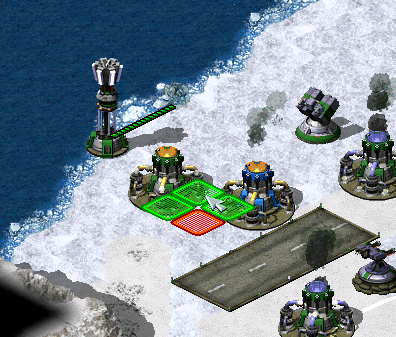

# New / Enhanced Logics

This page describes all the engine features that are either new and introduced by Phobos or significantly extended or expanded.

## Buildings

### Extended building upgrades logic

  
*Upgrading own and allied Power Plants in [CnC: Final War](https://www.moddb.com/mods/cncfinalwar)*

- Building upgrades now can be placed on own buildings, on allied buildings and/or on enemy buildings. These three owners can be specified via a new tag, comma-separated. When upgrade is placed on building, it automatically changes it's owner to match the building's owner.
- One upgrade can now be applied to multiple buildings via a new tag, comma-separated.
  - Currently Ares-introduced build limit for building upgrades doesn't work with this feature. This may change in future.

In `rulesmd.ini`:
```ini
[UPGRADENAME]       ; BuildingType
PowersUp.Owner=Self ; list of owners (Self, Ally and/or Enemy)
PowersUp.Buildings= ; list of BuildingTypes
```

## TechnoTypes

### Mind control maximum range

  
- Mind controllers now can have the upper limit of the control distance. Tag values greater than 0 will activate this feature.

In `rulesmd.ini`
```ini
[SOMETECHNO]               ; TechnoType
MindControlRangeLimit=-1.0 ; double
```

### Spawn range limit

  
*Limited pursue range for spawns in [Fantasy ADVENTURE](https://www.moddb.com/mods/fantasy-adventure)*

- The spawned units will abort the infinite pursuit if the enemy is out of range.
`Spawner.ExtraLimitRange` adds extra pursuit range to the spawned units.

In `rulesmd.ini`:
```ini
[SOMETECHNO]              ; TechnoType
Spawner.LimitRange=no     ; boolean
Spawner.ExtraLimitRange=0 ; integer
```

## Weapons

### Custom Radiation Types

  
*Mixing different radiation types*

- Allows to have custom radiation type for any weapon now. More details on radiation  [here](https://www.modenc.renegadeprojects.com/Radiation).

In `rulesmd.ini`
```ini
[SOMEWEAPON]                    ; WeaponType
RadLevel=0                      ; integer, vanilla tag; used to activate the feature
RadType=Radiation               ; RadType
                                ; name of custom RadType to use
                                ; of default [Radiation]

[SOMERADTYPE]                   ; custom RadType name
RadDurationMultiple=1           ; int
RadApplicationDelay=16          ; int
RadApplicationDelay.Building=0  ; int
RadLevelMax=500                 ; int
RadLevelDelay=90                ; int
RadLightDelay=90                ; int
RadLevelFactor=0.2              ; double
RadLightFactor=0.1              ; double
RadTintFactor=1.0               ; double
RadColor=0,255,0                ; RGB
RadSiteWarhead=RadSite          ; WarheadType
```

### Radiation enhancements

- Radiation now has owner by default, so any rad-kills will be scored.
  - `AffectsAllies`, `AffectsOwner` and `AffectsEnemies` on `RadSiteWarhead` are respected.
  - Currently the rad maker doesn't gain experience from kills, this may change in future.

In `rulesmd.ini`:
```ini
[SOMEWEAPON]    ; WeaponType
Rad.NoOwner=no  ; boolean
```

## Warheads

### Generate credits on impact

  
*`TransactMoney` used in [Rise of the East](https://www.moddb.com/mods/riseoftheeast) mod*

- Warheads can now give credits to its owner at impact.

In `rulesmd.ini`:
```ini
[SOMEWARHEAD]   ; Warhead
TransactMoney=0 ; integer - credits added or subtracted
```

### Reveal map for owner on impact

  
*`SpySat=yes` on `[NUKE]` warhead reveals the map when nuclear missile detonates*

- Warheads can now reveal the entire map on impact.
- Reveal only applies to the owner of the warhead.

In `rulesmd.ini`:
```ini
[SOMEWARHEAD] ; Warhead
SpySat=no     ; boolean
```

### Shroud map for enemies on impact

- Warheads can now shroud the entire map on impact.
- Shroud only applies to enemies of the warhead owner.

In `rulesmd.ini`:
```ini
[SOMEWARHEAD] ; Warhead
BigGap=no     ; boolean
```

### Remove disguise on impact

- Warheads can now remove disguise of spies.
- Can be used with `CellSpread` and Ares' `GenericWarhead` superweapon.

In `rulesmd.ini`:
```ini
[SOMEWARHEAD]                      ; Warhead
RemoveDisguise=no                  ; boolean
```

### Break Mind Control on impact

- Warheads can now break mind control (doesn't apply to perma-MC-ed objects).
- Can be used with `CellSpread` and Ares' `GenericWarhead` superweapon.

In `rulesmd.ini`:
```ini
[SOMEWARHEAD]                        ; Warhead
RemoveMindControl=no                 ; boolean
```

### Custom 'SplashList' on Warheads

  
- Allows Warheads to play custom water splash animations. See vanilla's [Conventional](https://www.modenc.renegadeprojects.com/Conventional) system here.

In `rulesmd.ini`:
```ini
[SOMEWARHEAD]            ; Warhead
SplashList=<none>        ; list of animations to play
SplashList.PickRandom=no ; play a random animation from the list? boolean, defaults to no
```

## Projectiles

### Projectile interception logic

  
*Interception logic used in [Tiberium Crisis](https://www.moddb.com/mods/tiberium-crisis) mod*

- Projectiles can now be made targetable by certain TechnoTypes. Interceptor TechnoType's projectile must be `Inviso=yes` in order for it to work and the projectile must be used in a primary Weapon. 

In `rulesmd.ini`:
```ini
[SOMETECHNO]                    ; TechnoType
Interceptor=no                  ; boolean
Interceptor.GuardRange=0.0      ; double
Interceptor.EliteGuardRange=0.0 ; double

[SOMEPROJECTILE] ; Projectile
Interceptable=no ; boolean
```

## ScriptType actions

### `71` Timed Area Guard

- Puts the TaskForce into Area Guard Mode for the given units of time. Unlike the orignal timed Guard script (`5,n`) that just stays in place doing a basic guard operation the "Area Guard" action has a more active role attacking nearby invasors or defending units that needs protection.

In `aimd.ini`:
```ini
[SOMESCRIPTTYPE]  ; ScriptType
x=71,n            ; integer, time in ingame seconds
```

### `72` Load Onto Transports

- If the TaskForce contains unit(s) that can be carried by the transports of the same TaskForce then this action will make the units enter the transports. In Single player missions the next action must be "Wait until fully loaded" (`43,0`) or the script will not continue.

In `aimd.ini`:
```ini
[SOMESCRIPTTYPE]  ; ScriptType
x=72,0
```
