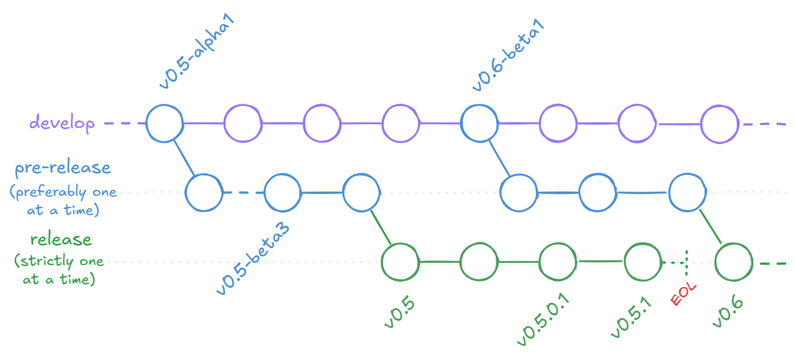

# Project guidelines and policies

## Phobos maintenance crew structure

Due to the size of the project and varying complexity of the codebase, we have established a maintenance crew structure to help with the project's development and maintenance. The structure is as follows:

- **Leads** (or `T3` maintainers) - primary decision makers, define where the project is headed and have the final say in case of disputes. They are responsible for the project's vision and direction, and are the main point of contact for the community.
- **`T2` maintainers** - assigned to more complex PRs, can make releases.
- **`T1` maintainers** - assigned to less complex PRs.
- **Triages** - help triage/label/assign PRs, issues, discussions, help with communication with the community.

Those roles are assigned based on the complexity of the PRs and the experience of the contributors. The roles are not fixed and can change based on the contributor's experience and the complexity of the PRs they are working on. Also only the commonly occured roles are established in the list, in case of need - individual permissions can be assigned to contributors by leads (for example, to help with documentation translations).

## Suggested reviewing amount

The amount of code that maintainers should review should be roughly the same as the amount of code in the PRs they submit themselves. However, considering that we already have a large backlog of PRs at present, we suggest that maintainers review more code than they submit (f.ex., 125%-150% of they submit). Only in this way can we continuously reduce the number of backlogged PRs.

At present this is not a hard rule, but we hope that each maintainer can try their best to achieve this.

## Types of contributions

To distribute the workload and make the project more manageable, we have established several commonly occuring types of contributions that can be made to the project. These types are as follows:

- Phobos bugfixes, including reconnection error (desync), crash (fatal error) fixes, and documentation fixes
  - `T1` complexity by default
- Vanilla bugfixes
  - `T1` complexity by default
- Unhardcodings/customizations - contributions that only make something customizable through the INI or other way (by the modder usually), without adding too much code to handle the customization
  - `T1` complexity by default
- Restored featues (from TS, RA2 etc.), assuming no extra changes or additions apart from the ones necessary to function in YR with extensions (the reviewer has to verify that)
  - `T1` complexity by default
- New features
  - Extensions of existing systems - add logic to existing systems, doesn't warrant it's own entity or type classes generally, but may introduce new hooks
    - Examples: feedback weapon logic, superweapon launch warhead logic, a new type of trajectory that uses existing custom trajectory framework, etc.
    - `T1` or `T2` complexity by default, depending on judgement of the one who assigns the PR
  - New systems - generally with their own classes that don't extend game classes/logics (or have such amount of code that should be separated into separate classes)
    - Examples: custom trajectories framework, interceptor logic, shield logic, etc.
    - `T2` complexity by default
- Contributions to project infrastructure - changes to the project's build system, CI, documentation, etc.
  - `T2` complexity by default
- Project policy changes - changes to the project's guidelines, contributing guidelines, etc.
  - `T3` complexity by default (has to be reviewed by leads)

```{hint}
Modders are highly encouraged to submit feedback on reusability of added features (preferably most important takeaways should be tracked in pull requests, discussions and issues) in order to not bloat the project with one-off features.
```

The list is not exhaustive, you are welcome to propose/submit changes to it (or to any project policies in order to improve how the project is maintained).

In absence of a fitting category - a lead should review it.

What can make any PR more controversial and requiring a higher level maintainer's assignment:
- Modifying/breaking previous (or vanilla) behavior
- Requiring migration
- Mixing contribution types
- Current level of maintainers not being sure about whether they can judge this PR

## Contribution process

To ensure your contribution goes smoothly, please stick to the following process when contributing to the project:
1. **Check whether there is already an open Pull Request** for whatever you want to contribute. If there is - comment on it and see if you can help with it instead of starting your own first. We hate to discard otherwise valid work just because it's a duplicate.
2. If all is clear - you should **get in touch with maintainers** of level respective to the complexity of your PR (see [Types of contributions](#types-of-contributions)) to review/merge your upcoming PR and **talk with them about key design aspects before you even submit a contribution**.
   - This is *especially* important for bigger and more fundamental improvements, when you're learning and when you're exploring "uncharted territories". Staying engaged in communication with the maintainers will help you to avoid unnecessary wasted effort and reworks later on and make sure that your contribution is aligned with how we do things. Not only that, but it also allows you to essentially get early reviews on important things and faster merges (which is especially important in light of our large amount of PRs) with higher level of confidence.
   - Currently the Phobos channel on Discord is the best place to brainstorm things like that, as it's the most accessible place to reach out to maintainers and discuss your ideas (or if there's nobody around - try messaging experienced maintainers privately).
     - GitHub issues, discussions and draft PRs (with not a lot of work done yet) are also OK to discuss things, but they are not as fast as Discord and are better used for persistent storage of info, and usually it's easier to grab someone's attention if you approach them personally in chat.
   - It's also a good thing to get opinions of multiple maintainers and not always consult specific one or a separate part of them. We should try to stay interconnected with each other, even if initially divided by language or habitually.
3. When we all have a clear idea of the plan you have in mind - all that is left to do is to finalize the design and implementation in the PR, and we'll review the minor things left and merge it.

## Project structure

Assuming you've successfully cloned and built the project before getting here, you should end up with the following project structure:
- `src/` - all the project's source code resides here.
  - `Commands/` - source code for new hotkey commands. Every command is a new class that inherits from `PhobosCommandClass` (defined in `Commands.h`) and is defined in a separate file with a few methods and then registered in `Commands.cpp`.
  - `New/` - source code for new ingame classes.
    - `Type/` - new enumerated types (types that are declared with a list section in an INI, for example, radiation types) implemented in the project. Every enumerated type class inherits `Enumerable<T>` (where `T` is an enum. type class) class that is defined in `Enumerable.h`.
    - `Entity/` - classes that represent ingame entities are located here.
  - `Ext/` - source code for vanilla engine class extensions. Extension classes form a parallel inheritance hierarchy mirroring the game's own class tree (`AbstractExt` from `Container.h` is the root; e.g. `BuildingExt : TechnoExt : RadioExt : MissionExt : ObjectExt : AbstractExt`), and every game object carries exactly one extension instance of the most derived matching type, cached inside the object at the unified `AbstractClass` `0x18` slot. Each class extension is kept in a separate folder named after vanilla engine class name and contains the following:
    - `Body.h` and `Body.cpp` contain class and method definitions/declarations and common extension hooks. Each extension class contains the following to work correctly:
      - new data members and (for appropriate classes) `LoadFromINIFile`/`SaveToStream`/`LoadFromStream` overrides, plus static helper methods;
      - `ExtContainer`/`ExtMap` - the per-class container (inherits `Container<T>` from `Container.h`) that tracks all live instances of one concrete extension class for bulk operations (allocation/removal, centralized savegame streaming, post-load relinking, scenario clearing); only concrete leaf classes (e.g. `BuildingExt`) have containers, while every level of the hierarchy provides typed `Fetch`/`TryFetch`. The container's own `Find`/`TryFind` lookups are deprecated compatibility forwards (`TechnoExt`/`TechnoTypeExt`, whose containers were split into per-leaf ones, keep a lookup-only `ExtMap` stand-in for the same reason), and every pre-rework class carries a deprecated `ExtData` alias of itself so code written against the old nested data classes keeps compiling;
      - `Fetch`/`TryFetch` statics - the O(1) lookup used at call sites (`TechnoExt::Fetch(pThis)`); `Fetch` fatals if the object carries no extension, `TryFetch` returns null instead (also the right choice while a savegame is loading);
      - constructor/destructor and (for appropriate classes) INI reading hooks. Serialization is centralized in `Phobos.Ext.cpp` - there are no per-class savegame hooks. The one exception is `CellExt`: the game treats cells as value objects with unstable identity (it re-initializes them in place and copies them around wholesale), so cell extensions are persisted inline within each cell's own savegame block instead (see `Ext/Cell/Body.cpp`).
    - Extensions subscribe to pointer invalidation by inheriting `Detach::Listener<T>` from `Utilities/Detach.h` and overriding `OnDetach` (see `HouseExt` for an example).
    - `Hooks.cpp` and `Hooks.*.cpp` contain non-common hooks to correctly patch in new custom logics.
  - `ExtraHeaders/` - extra header files to interact with / describe types included in game binary that are not included in YRpp yet.
  - `Misc/` - uncategorized source code, including hooks that don't belong to an extension class.
  - `Utilities/` - common code that is used across the project.
  - `Phobos.cpp`/`Phobos.h` - extension bootstrapping code.
  - `Phobos.Ext.cpp` - contains common processing code new or extended classes. If you define a new or extended class you have to add your new class into `MassActions` global variable type declaration in this file.
- `YRpp/` - contains the header files to interact with / describe types included in game binary and also macros to write hooks using Syringe. Included as a submodule.

## Code styleguide

We have established a couple of code style rules to keep things consistent. Some of the rules are enforced in `.editorconfig`, where applicable, so you can autoformat the code by pressing `Ctrl + K, D` hotkey chord in Visual studio. Still, it is advised to manually check the style before submitting the code.
- We use tabs instead of spaces to indent code.
- Curly braces are always to be placed on a new line ([Allman indentation style](https://en.wikipedia.org/wiki/Indentation_style#Allman_style)). One of the reasons for this is to clearly separate the end of the code block head and body in case of multiline bodies:
```cpp
if (SomeReallyLongCondition()
    || ThatSplitsIntoMultipleLines())
{
    DoSomethingHere();
    DoSomethingMore();
}
```
- Braceless code block bodies should be made only when both code block head and body are single line,  statements split into multiple lines and nested braceless blocks are not allowed within braceless blocks:
```cpp
// OK
if (Something())
    DoSomething();

// OK
if (SomeReallyLongCondition()
    || ThatSplitsIntoMultipleLines())
{
    DoSomething();
}

// OK
if (SomeCondition())
{
    if (SomeOtherCondition())
        DoSomething();
}

// OK
if (SomeCondition())
{
    return VeryLongExpression()
        || ThatSplitsIntoMultipleLines();
}
```
- Only empty curly brace blocks may be left on the same line for both opening and closing braces (if appropriate).
- If you use if-else you should either have all of the code blocks braced or braceless to keep things consistent.
- Big conditions which span multiple lines and are hard to read otherwise should be split into smaller logical parts to improve readability:
```cpp
// Not OK
if (This() && That() && AlsoThat()
    || (OrOtherwiseThis && OtherwiseThat && WhateverElse))
{
    DoSomething();
}

// OK
bool firstCondition = This() && That() && AlsoThat();
bool secondCondition = OrOtherwiseThis && OtherwiseThat && WhateverElse;

if (firstCondition || secondCondition)
    DoSomething();
```
- Code should have empty lines to make it easier to read. Use an empty line to split code into logical parts. It's mandatory to have empty lines to separate:
  - `return` statements (except when there is only one line of code except that statement);
  - local variable assignments that are used in the further code (you shouldn't put an empty line after one-line local variable assignments that are used only in the following code block though);
  - code blocks (braceless or not) or anything using code blocks (function or hook definitions, classes, namespaces etc.);
  - hook register input/output.
```cpp
// OK
auto localVar = Something();
if (SomeConditionUsing(localVar))
    ...

// OK
auto localVar = Something();
auto anotherLocalVar = OtherSomething();

if (SomeConditionUsing(localVar, anotherLocalVar))
    ...

// OK
auto localVar = Something();

if (SomeConditionUsing(localVar))
    ...

if (SomeOtherConditionUsing(localVar))
    ...

localVar = OtherSomething();

// OK
if (SomeCondition())
{
    Code();
    OtherCode();

    return;
}

// OK
if (SomeCondition())
{
    SmallCode();
    return;
}

```
- `auto` may be used to hide an unnecessary type declaration if it doesn't make the code harder to read. `auto` may not be used on primitive types.
- A space must be put between braces of empty curly brace blocks.
- To have less Git merge conflicts member initializer lists and other list-like syntax structures used in frequently modified places should be split per-item with item separation characters (commas, for example) placed *after newline character*:
```cpp
TerrainTypeExt(TerrainTypeClass* OwnerObject) : ObjectTypeExt(OwnerObject)
    , SpawnsTiberium_Type(0)
    , SpawnsTiberium_Range(1)
    , SpawnsTiberium_GrowthStage({ 3, 0 })
    , SpawnsTiberium_CellsPerAnim({ 1, 0 })
{ }
```
- Local variables and function/method args are named in the `camelCase` (using a `p` prefix to denote pointer type for every pointer nesting level) and a descriptive name, like `pTechnoType` for a local `TechnoTypeClass*` variable.
- Classes, namespaces, class fields and members are always written in `PascalCase`.
- Class fields that can be set via INI tags should be named exactly like ini tags with dots replaced with underscores.
- Pointer type declarations always have pointer sign `*` attached to the type declaration.
- Non-static class extension methods faked by declaring a static method with `pThis` as a first argument are only to be placed in the extension class for the class instance of which `pThis` is.
  - If it's crucial to fake `__thiscall` you may use `__fastcall` and use `void*` or `void* _` as a second argument to discard value passed through `EDX` register. Such methods are to be used for call replacement.
- Hooks have to be named using a following scheme: `HookedFunction_HookPurpose`, or `ClassName_HookedMethod_HookPurpose`. Defined-again hooks are exempt from this scheme due to impossibility to define different names for the same hook.
- Return addresses should use anonymous enums to make it clear what address means what, if applicable. The enum has to be placed right at the function start and include all addresses that are used in this hook:
```cpp
DEFINE_HOOK(0x48381D, CellClass_SpreadTiberium_CellSpread, 0x6)
{
    enum { SpreadReturn = 0x4838CA, NoSpreadReturn = 0x4838B0 };

    ...
}
```
- Even if the hook doesn't use `return 0x0` to execute the overriden instructions, you still have to write correct hook size (last parameter of `DEFINE_HOOK` macro) to reduce potential issues if the person editing this hook decides to use `return 0x0`.
- New ingame "entity" classes are to be named with `Class` postfix (like `RadTypeClass`). Extension classes are to be named with `Ext` postfix instead (like `RadTypeExt`).
- Do not pollute the namespace.
- Avoid introducing unnecessary macros if they can be replaced by equivalent `constexpr` or `__forceinline` functions.

```{note}
The styleguide is not exhaustive and may be adjusted in the future.
```

## Git branching model / Version lifecycle and release strategy

Starting from version 0.5, Phobos adopts a new release strategy to enable faster and more frequent releases.



*Image editable in [Excalidraw](https://excalidraw.com)*

```{important}
All changes are to be made **exclusively** to `develop` as the source of truth, and then cherry-picked to other branches!
```

```{hint}
A brief summary compared to old style:
- devbuilds are now called pre-releases (alpha, beta, RC etc.) and are almost a proper version with docs, all changes tracked in a special changelog subsection, released on the same cadence;
- each pre-release (new devbuild) materializes a version branch, bugfix followups committed to develop get ported to it;
- when enough bugs are fixed - a stable version is created;
- if some critical change that warrants a version bump needs to be applied (e.g. forgot to serialize a field, or fixed a critical bug from a feature released before upcoming version) - we introduce a new version (with docs, version change etc.) on the same branch;
- the new stable release is not the old stable: after 0.5 a stable version is "a devbuild with enough bug fixes", released on a faster cadence with less time spent per version.
```

The lifecycle of a version is as follows:

1. **Development phase**: New features and changes are committed to the `develop` branch. `develop` always carries the version it is working towards: as soon as a release branch is cut, `VERSION_MINOR` (or `VERSION_MAJOR`) in `src/Phobos.version.h` is bumped and `VERSION_REVISION`/`VERSION_PATCH` are reset to 0, so that nightlies are stamped with the version they lead up to instead of one that has already been released.
2. **Pre-release phase**: When enough features have accumulated on `develop`, a pre-release build (e.g., `v0.5-beta1`) is created. This build marks the start of a new *release branch* (e.g., `release/v0.5`) and signifies that active feature development for version 0.5 is complete. This branch will be used for all subsequent testing and the final stable release.
   - During this phase, multiple pre-release builds (which can be called beta, alpha, or release candidate) may be published for wider testing. Between pre-releases on the same version number, there shall be no changes that warrant a stable version changelog addition; in other words — only bug fixes, minor additions, and polish to the existing new version feature set are allowed.
     - If there's an urgent need to introduce a feature that would warrant new changelog addition on the same branch - it is allowed to **reset the pre-release prefix and increment the appropriate version number**, while also creating the corresponding doc changelog section.
3. **Stable release**: When the pre-release builds are deemed stable enough, a stable release (e.g., `v0.5`) is published from the release's branch.
4. **Maintenance phase**: After the stable release, the release branch enters maintenance mode, where only bug fixes are applied, resulting in patch releases (e.g., `v0.5.0.1`, `v0.5.0.2`).
5. **End of maintenance**: When a new stable release is published (e.g., `v0.6`), the previous minor version branch (e.g., `v0.5.x.y`) is officially deprecated and enters end-of-life, ceasing to receive any further updates, including bug fixes. Concurrently, the new stable release (e.g., `v0.6`) enters its own maintenance phase, and a new release branch for the next version (e.g., `release/v0.7`) may already have been created from the `develop` branch, initiating its pre-release cycle.

```{hint}
If needed, a new release branch may be started even before the previous one has had a stable release. Doing so will temporarily increase the burden of upkeeping multiple branches, so do it only when there's a valid reason for such.
```

```{important}
The `master` branch is deprecated; all development occurs in `develop`, and each version branches off from it.

**`develop` is the source of truth! Always apply your changes to `develop` first, then cherry-pick them onto the correct branch!**
```

### How to publish a release

Publishing a release is done from a release branch (see the lifecycle above). The steps are:

1. **Set the version** in `src/Phobos.version.h`. When a release branch is cut, bump `VERSION_MINOR` (or `VERSION_MAJOR`) and reset `VERSION_REVISION` and `VERSION_PATCH` to 0; patch releases only bump `VERSION_PATCH`.
2. **Decide whether it is a pre-release or a stable release.** The pre-release suffix is the knob: as long as `PRERELEASE_SUFFIX` is defined (e.g. `#define PRERELEASE_SUFFIX "beta1"`), a release build is a pre-release; remove the define entirely for a stable release. The suffix can be anything semantic versioning allows (e.g. `alpha5`, `beta1`, `rc3`).
3. **Create a GitHub release and tag** using the short user-facing version you've set in steps 1 and 2 (e.g. `v0.5-alpha1`). The `release.yml` workflow builds the DLL with `BuildType=RELEASE`;
   - The changelog is extracted from `docs/Whats-New.md` automatically. **Do not write the changelog yourself!** It will be appended to the text you wrote after you publish the release. Also **do not use GitHub's "Generate release notes" button!** It can't be configured to provide correct output.
   - The build is built and attached automatically. **Do not build Phobos releases manually!**
   - **GitHub "pre-release" checkbox doesn't affect the produced build type**, it only affects the release's display status for GitHub.
4. **Verify the artifacts** once the build finishes and the artifacts are attached, then announce the release.

The release tag and name use the short user-facing version (e.g. `v0.5-alpha1`); the DLL reports the full version with trailing zeros (e.g. `0.5.0.0-alpha1`) internally, so that is what appears in the file properties and what the `-HideVersionWarning` switch expects.

If you want to build a pre-release locally for testing, run `scripts\build.bat Release RELEASE` with the suffix still defined in `version.h`. A plain `scripts\build_debug.bat` or `scripts\build_release.bat` always produces a local build instead.

### Useful Git config

These commands will do the following for all repositories on your PC:
1) remove the automatic merge upon pull and replace it with a rebase;
2) highlight changes consisting of moving existing lines to another location with a different color.

```bash
git config --global pull.rebase true
git config --global branch.autoSetupRebase always
git config --global diff.colorMoved zebra
```

## Working with YRpp via submodules

Often when working on Phobos and/or researching the YR engine you'll need to implement corrections for YRpp. Generally the corrections need to be submitted to [YRpp repository](https://github.com/Phobos-developers/YRpp) and can be done separately from the actual features in Phobos, but frequently the improvements are to be submitted as a part of Phobos contribution process. To submit improvements to YRpp you have to create a branch in YRpp, then you can push it and submit a pull request to YRpp repository.

When you clone Phobos recursively - you also clone YRpp as a submodule. Basically submodules are just nested repositories. You can open it like any other repository, so the changes can be synchronized to Phobos and you don't need to rename stuff by hand.

The suggested workflow is as follows:
1. In your IDE of choice rename fields and functions using symbol renaming feature (`Rename...` feature in Visual Studio (regular or Code), `[F2]` by default), then you will have two "levels" of changes displayed in your Git client:
   - for Phobos repository - changes in the Phobos code (as regular changes) and changes to YRpp (as one submodule change).
   - for YRpp repository - changes to the field names and function names in YRpp as regular changes.
2. Create a branch in YRpp repository (create a fork of it if you didn't yet), commit and push the changes and submit it as a pull request. After pushing it you have two options in Phobos repository:
   - wait until it's accepted, then checkout YRpp at the newest commit, then commit and push - this will save you having to commit and push multiple times, but you won't be able to get a nightly build for people to test;
   - don't wait for YRpp changes to be merged, commit and push right after you pushed the YRpp changes to your YRpp branch - you will have an up-to-date build on Phobos pull request this way. Note that you must do this only after you committed to and pushed your YRpp branch, otherwise the build system won't know what are the changes as they are not exposed to the world, only available to you locally.
3. After the YRpp pull request gets accepted you will need to switch to the latest commit that was merged (you do that in the submodule), verify that it compiles like normal, and then commit and push it to your Phobos branch that you made for your pull request.
