(transfer-gifs)=
# Transfer Type examples with INI codes

## Predefined INI values

In all examples specific tags are as written below unless stated otherwise.

```ini
[General]
VeteranRatio=2.0

; -- Technos --
[PLASMDESO]
Strength=1000
Cost=500
Soylent=150
Primary=PlasmaBlast
Secondary=GreenDeploy

[LASERDESO]
Strength=1000
Cost=500
Soylent=150
Primary=LaserBlast
Secondary=RedDeploy

[ANYTANK]
Strength=500
Cost=250
Soylent=250

; -- Weapons --
[PlasmaBlast]
Damage=1
ROF=50
Warhead=PlasmaWH

[LaserBlast]
Damage=1
ROF=50
Warhead=LaserWH

; -- Radiations --
[GreenRad]
RadSiteWarhead=GreenRadWH

[RedRad]
RadSiteWarhead=RedRadWH

; -- Warheads --
[PlasmaWH]
Verses=1%,1%,1%,1%,1%,1%,1%,1%,1%,1%,1%
Transfer.Types=GreenPlasmaTransfer
CellSpread=1.5
PercentAtMax=0.5

[LaserWH]
Verses=1%,1%,1%,1%,1%,1%,1%,1%,1%,1%,1%
Transfer.Types=RedLaserTransfer
CellSpread=1.5
PercentAtMax=0.5

[GreenRadWH]
Verses=1%,1%,1%,1%,1%,1%,1%,1%,1%,1%,1%
Transfer.Types=GreenPlasmaTransfer

[RedRadWH]
Verses=1%,1%,1%,1%,1%,1%,1%,1%,1%,1%,1%
Transfer.Types=RedLaserTransfer

[SpecialWH]
Verses=200%,200%,200%,50%,50%,50%,0%,0%,0%,0%,0%
Versus.deso=-100%
```

## Basic usage
### Resource: money

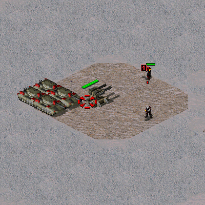

```ini
[GreenPlasmaTransfer]
Direction=targettosource
Send.Resource=money
Send.Value=100
Money.Display=...

[RedLaserTransfer]
Direction=targettosource
Send.Resource=money
Send.Value=-100
Money.Display=...
```

### Resource: experience

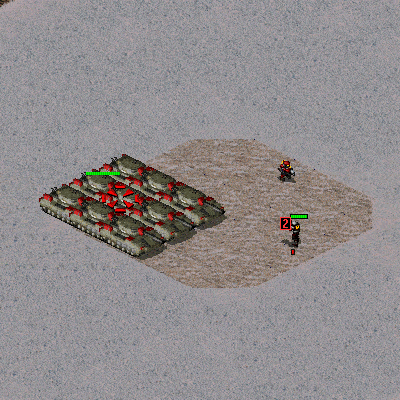

```ini
[GreenPlasmaTransfer]
Direction=targettosource
Send.Resource=experience
Send.Value=100

[RedLaserTransfer]
Direction=targettosource
Send.Resource=experience
Send.Value=-100
```

### Resource: health

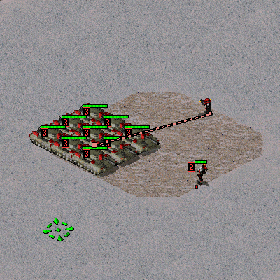

```ini
[GreenPlasmaTransfer]
Direction=targettosource
Send.Resource=health
Send.Value=100

[RedLaserTransfer]
Direction=targettosource
Send.Resource=health
Send.Value=-100
```

### Resource: ammo

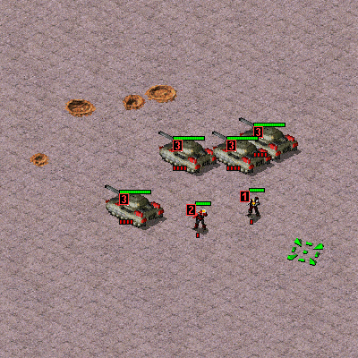

```ini
[GreenPlasmaTransfer]
Direction=targettosource
Send.Resource=ammo
Send.Value=4

[RedLaserTransfer]
Direction=targettosource
Send.Resource=ammo
Send.Value=-4
```

### Resource: gatlingrate

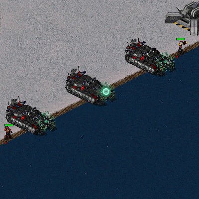

```ini
[GreenPlasmaTransfer]
Direction=targettosource
Send.Resource=gatlingrate
Send.Value=8

[RedLaserTransfer]
Direction=targettosource
Send.Resource=gatlingrate
Send.Value=-8
```

### Value.Type: current

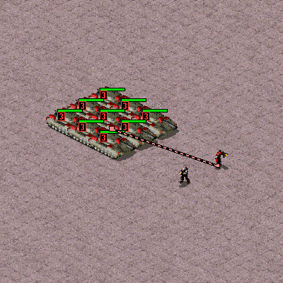

```ini
[GreenPlasmaTransfer]
Direction=targettosource
Send.Resource=health
Send.Value=50% ; note the % sign, otherwise it will become very high number
Send.Value.Type=current

[RedLaserTransfer]
Direction=targettosource
Send.Resource=health
Send.Value=-50% ; note the % sign, otherwise it will become very high number
Send.Value.Type=current
```

### Value.Type: missing


```ini
[GreenPlasmaTransfer]
Direction=targettosource
Send.Resource=health
Send.Value=50% ; note the % sign, otherwise it will become very high number
Send.Value.Type=missing

[RedLaserTransfer]
Direction=targettosource
Send.Resource=health
Send.Value=-50% ; note the % sign, otherwise it will become very high number
Send.Value.Type=missing
```

### Value.Type: total

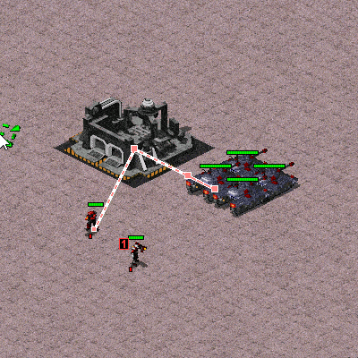

```ini
[GreenPlasmaTransfer]
Direction=targettosource
Send.Resource=health
Send.Value=50% ; note the % sign, otherwise it will become very high number
Send.Value.Type=total

[RedLaserTransfer]
Direction=targettosource
Send.Resource=health
Send.Value=-80% ; note the % sign, otherwise it will become very high number
Send.Value.Type=total
```

### Value.FlatLimits

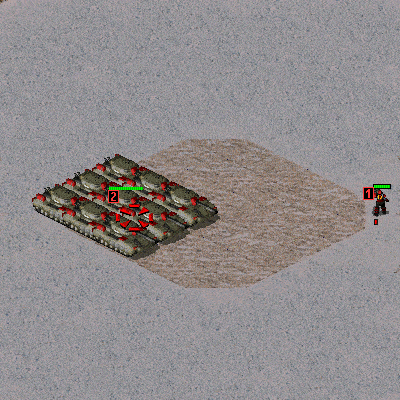

```ini
[RedLaserTransfer]
Direction=targettosource
Send.Resource=health
Send.Value=-100
; FlatLimits retains minimum,maximum order in numbers only
; in negative values first value is negative maximum, second is negative minimum
Send.Value.FlatLimits=-60,-50 ; -60 is maximum possible damage, -50 is minimum
```

## Intermediate usage

### Direction: sourcetotarget and targettosource

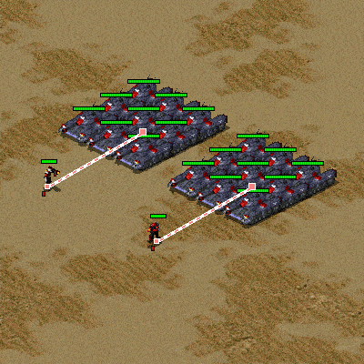

```ini
[GreenPlasmaTransfer]
Direction=targettosource
Send.Resource=money
Send.Value=-100
Receive.Resource=health
Receive.Value=-100
Money.Display.Sender=yes
Money.Display.Sender.Offset=0,-50

[RedLaserTransfer]
Direction=sourcetotarget
Send.Resource=money
Send.Value=-100
Receive.Resource=health
Receive.Value=-100
Money.Display.Sender=yes
Money.Display.Sender.Offset=0,-50
```

### Direction: sourcetosource and targettotarget


```ini
[GreenPlasmaTransfer]
Direction=targettotarget
Send.Resource=money
Send.Value=-100
Receive.Resource=health
Receive.Value=-100
Money.Display.Sender=yes
Money.Display.Sender.Offset=0,-50

[RedLaserTransfer]
Direction=sourcetosource
Send.Resource=money
Send.Value=-100
Receive.Resource=health
Receive.Value=-100
Money.Display.Sender=yes
Money.Display.Sender.Offset=0,-50
```

### Direction: targettoextra and extratotarget

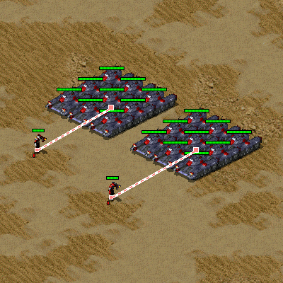

```ini
[SpecialWH]
CellSpread=0.1 ; extra only detects by CellSpread

[GreenPlasmaTransfer]
Direction=extratotarget
Extra.Warhead=SpecialWH
Send.Resource=money
Send.Value=-100
Receive.Resource=health
Receive.Value=-100
Money.Display.Sender=yes
Money.Display.Sender.Offset=0,-50

[RedLaserTransfer]
Direction=targettoextra
Extra.Warhead=SpecialWH
Send.Resource=money
Send.Value=-100
Receive.Resource=health
Receive.Value=-100
Money.Display.Sender=yes
Money.Display.Sender.Offset=0,-50
```

### Target.ConsiderArmor and Extra.ConsiderArmor

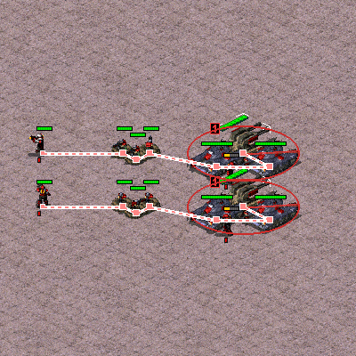

```ini
[GreenPlasmaTransfer]
Direction=targettosource
Send.Resource=health
Send.Value=-100

[RedLaserTransfer]
Direction=targettosource
Send.Resource=health
Send.Value=-100
Target.ConsiderArmor=yes
Target.VersusWarhead=SpecialWH
```

### Target.AffectHouses and Extra.AffectHouses

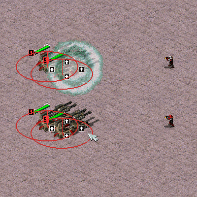

```ini
[GreenPlasmaTransfer]
Direction=targettosource
Send.Resource=health
Send.Value=-100

[RedLaserTransfer]
Direction=targettosource
Send.Resource=health
Send.Value=-100
Target.AffectHouses=enemy
```

### Target.Spread.IgnoreSelf

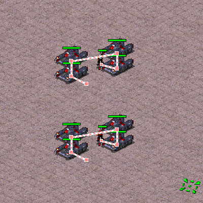

```ini
[GreenPlasmaTransfer]
Direction=targettosource
Send.Resource=health
Send.Value=-100

[RedLaserTransfer]
Direction=targettosource
Send.Resource=health
Send.Value=-100
Target.Spread.IgnoreSelf=yes
```

### Extra.Spread.EpicenterIsSource

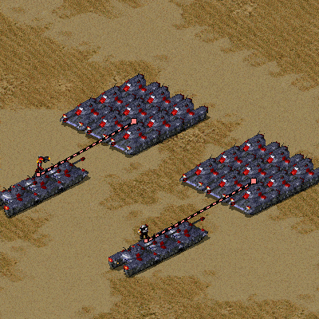

```ini
[SpecialWH]
CellSpread=1.5
PercentAtMax=0.5

[GreenPlasmaTransfer]
Direction=targettoextra
Extra.Warhead=SpecialWH
Extra.Spread.EpicenterIsSource=yes
Send.Resource=money
Send.Value=-100
Receive.Resource=health
Receive.Value=-100
Money.Display.Sender=yes
Money.Display.Sender.Offset=0,-50

[RedLaserTransfer]
Direction=targettoextra
Extra.Warhead=SpecialWH
Send.Resource=money
Send.Value=-100
Receive.Resource=health
Receive.Value=-100
Money.Display.Sender=yes
Money.Display.Sender.Offset=0,-50
```

### Extra.Spread.IgnoreEpicenter

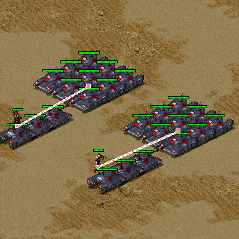

```ini
[SpecialWH]
CellSpread=1.5
PercentAtMax=0.5

[GreenPlasmaTransfer]
Direction=targettoextra
Extra.Warhead=SpecialWH
Extra.Spread.EpicenterIsSource=yes
Extra.Spread.IgnoreEpicenter=yes
Send.Resource=money
Send.Value=-100
Receive.Resource=health
Receive.Value=-100
Money.Display.Sender=yes
Money.Display.Sender.Offset=0,-50

[RedLaserTransfer]
Direction=targettoextra
Extra.Warhead=SpecialWH
Extra.Spread.IgnoreEpicenter=yes
Send.Resource=money
Send.Value=-100
Receive.Resource=health
Receive.Value=-100
Money.Display.Sender=yes
Money.Display.Sender.Offset=0,-50
```

### VeterancyMultiplier

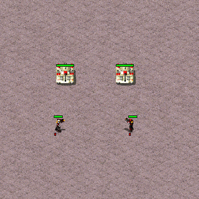

```ini
[GreenPlasmaTransfer]
Direction=targettosource
Send.Resource=money
Send.Value=-100
VeterancyMultiplier.SourceOverSender=0.2,-2.0
Money.Display=...

[RedLaserTransfer]
Direction=targettosource
Send.Resource=money
Send.Value=-100
VeterancyMultiplier.TargetOverTarget=0.2,-2.0
Money.Display=...
```

### Experience.PreventDemote

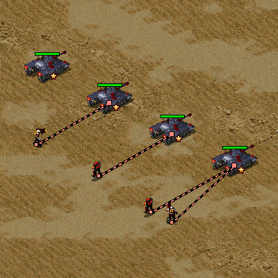

```ini
[GreenPlasmaTransfer]
Direction=targettosource
Send.Resource=experience
Send.Value=-100
Experience.PreventDemote=yes

[RedLaserTransfer]
Direction=targettosource
Send.Resource=experience
Send.Value=-100
```

### Health.PreventKill

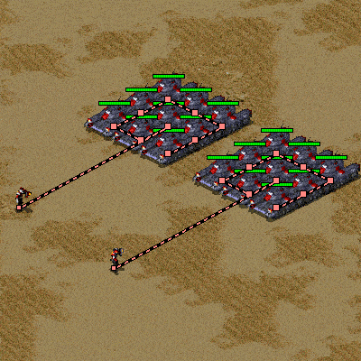

```ini
[GreenPlasmaTransfer]
Direction=targettosource
Send.Resource=health
Send.Value=-100
Health.PreventKill=yes

[RedLaserTransfer]
Direction=targettosource
Send.Resource=health
Send.Value=-100
```

### GatlingRate.LimitStageChange

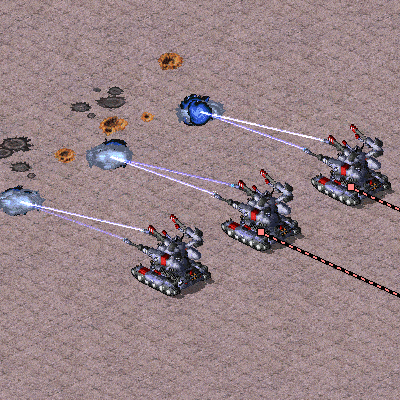

```ini
[GreenPlasmaTransfer]
Direction=targettosource
Send.Resource=gatlingrate
Send.Value=500
GatlingRate.LimitStageChange=0

[RedLaserTransfer]
Direction=targettosource
Send.Resource=gatlingrate
Send.Value=500
GatlingRate.LimitStageChange=2
```

## Advanced usage

### TODO