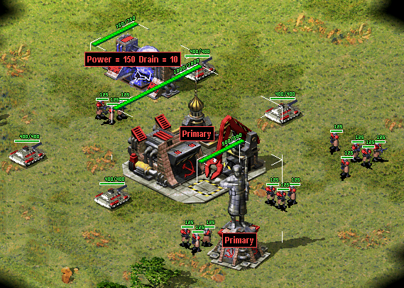
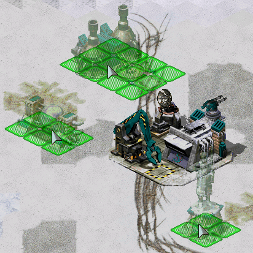

# User Interface

This page lists all user interface additions, changes, fixes that are implemented in Phobos.

## Bugfixes and miscellanous

- Enabled ability to load full-color non-paletted PCX graphics of any bitness. This applies to every single PCX file that is loaded, including the Ares-supported PCX files.
- You can specify custom `gamemd.exe` icon via `-icon` command line argument followed by absolute or relative path to an `*.ico` file (f. ex. `gamemd.exe -icon Resources/clienticon.ico`).
- Fixed `Blowfish.dll`-caused error `***FATAL*** String Manager failed to initialize properly`, which occurred if `Blowfish.dll` could not be registered in the OS, for example, it happened when the player did not have administrator rights. With Phobos, if the game did not find a registered file in the system, it will no longer try to register this file, but will load it bypassing registration.
- Fixed non-IME keyboard input to be working correctly for languages / keyboard layouts that use character ranges other than Basic Latin and Latin-1 Supplement (font support required).
- Fixed position and layer of info tip and reveal production cameo on selected building
- Timer (superweapon, mission etc) blinking color scheme can be customized by setting `[AudioVisual]` -> `TimerBlinkColorScheme`. Defaults to third color scheme listed in `[Colors]`.

```{note}
You can use the improved vanilla font which can be found on [Phobos supplementaries repo](https://github.com/Phobos-developers/PhobosSupplementaries) which has way more Unicode character coverage than the default one.
```

## Audio

- You can now specify which soundtrack themes would play on win or lose.

In `rulesmd.ini`:
```ini
[SOMESIDE]             ; Side
IngameScore.WinTheme=  ; Soundtrack theme ID
IngameScore.LoseTheme= ; Soundtrack theme ID
```

## Battle screen UI/UX

### Digital display


*Default configuration of digital display using example shapes from [Phobos supplementaries](https://github.com/Phobos-developers/PhobosSupplementaries).*

- You can now configure various types of numerical counters to be displayed over Techno to represent its attributes, such as health points or shield points.
 - `Anchor.Horizontal` and `Anchor.Vertical` set the anchor point from which the display is drawn (depending on `Align`) relative to unit's center/selection box. For buildings, `Anchor.Building` is used instead.
    - `Offset` and `Offset.ShieldDelta` (the latter applied when a shield is active) can be used to further modify the position.
  - By default, values are displayed in `current/maximum` format (i.e. 20/40). `HideMaxValue=yes` will make the counter show only the current value (i.e. 20). `Percentage=yes` changes the format to `percent%` (i.e. 50%).
  - `CanSee` and `CanSee.Observer` can limit visibility to specific players.
  - The digits can be either a custom shape (.shp) or text drawn using the game font. This depends on whether `Shape` is set.
    - `Text.Color`, `Text.Color.ConditionYellow` and `Text.Color.ConditionRed` allow customization of the font color. `Text.Background=yes` will additionally draw a black rectangle background.
    - When using shapes, a custom palette can be specified with `Palette`. `Shape.Spacing` controls pixel buffer between characters.
    - Frames 0-9 will be used as digits when the owner's health bar is green, 10-19 when yellow, 20-29 when red. For `/` and `%` characters, frame numbers are 30-31, 32-33, 34-35, respectively.
  - Default `Offset.ShieldDelta` for `InfoType=Shield` is `0,-10`, `0,0` for others.
  - Default `Shape.Spacing` for buildings is `4,-2`, `4,0` for others.
  - `ValueScaleDivisor` can be used to adjust scale of displayed values. Both the current & maximum value will be divided by the integer number given, if higher than 1.

In `rulesmd.ini`:
```ini
[DigitalDisplayTypes]
0=SOMEDIGITALDISPLAYTYPE

[AudioVisual]
Buildings.DefaultDigitalDisplayTypes=   ; list of DigitalDisplayTypes
Infantry.DefaultDigitalDisplayTypes=    ; list of DigitalDisplayTypes
Vehicles.DefaultDigitalDisplayTypes=    ; list of DigitalDisplayTypes
Aircraft.DefaultDigitalDisplayTypes=    ; list of DigitalDisplayTypes

[SOMEDIGITALDISPLAYTYPE]                ; DigitalDisplayType
; Generic
InfoType=Health                         ; Displayed value enumeration (health|shield|ammo|mindcontrol|spawns|passengers|tiberium|experience|occupants|gattlingstage)
Offset=0,0                              ; integers - horizontal, vertical
Offset.ShieldDelta=                     ; integers - horizontal, vertical
Align=right                             ; Text alignment enumeration (left|right|center/centre)
Anchor.Horizontal=right                 ; Horizontal position enumeration (left|center/centre|right)
Anchor.Vertical=top                     ; Vertical position enumeration (top|center/centre|bottom)
Anchor.Building=top                     ; Hexagon vertex enumeration (top|lefttop|leftbottom|bottom|rightbottom|righttop)
Percentage=false                        ; boolean
HideMaxValue=false                      ; boolean
VisibleToHouses=owner                   ; Affected house enumeration (none|owner/self|allies/ally|team|enemies/enemy|all)
VisibleToHouses.Observer=true           ; boolean
ValueScaleDivisor=1                     ; integer
; Text
Text.Color=0,255,0                      ; integers - Red, Green, Blue
Text.Color.ConditionYellow=255,255,0    ; integers - Red, Green, Blue
Text.Color.ConditionRed=255,0,0         ; integers - Red, Green, Blue
Text.Background=false                   ; boolean
; Shape
Shape=                                  ; filename with .shp extension, if not present, game-drawn text will be used instead
Palette=palette.pal                     ; filename with .pal extension
Shape.Spacing=                          ; integers - horizontal, vertical spacing between digits

[SOMETECHNOTYPE]
DigitalDisplay.Disable=false            ; boolean
DigitalDisplayTypes=                    ; list of DigitalDisplayTypes
```

In `RA2MD.ini`:
```ini
[Phobos]
DigitalDisplay.Enable=false             ; boolean
```

```{note}
An example shape file for digits can be found on [Phobos supplementaries repo](https://github.com/Phobos-developers/PhobosSupplementaries)).
```

### Show designator & inhibitor range

- It is now possible to display range of designator and inhibitor units when in super weapon targeting mode. Each instance of player owned techno types listed in `[SuperWeapon]->SW.Designators` will display a circle with radius set in `[TechnoType]->DesignatorRange` or `Sight`.
  - In a similar manner, each instance of enemy owned techno types listed in `[SuperWeapon]->SW.Inhibitors` will display a circle with radius set in `[TechnoType]->InhibitorRange` or `Sight`.
- This feature can be disabled globally with `[AudioVisual]->ShowDesignatorRange=false` or per SuperWeaponType with `[SuperWeapon]->ShowDesignatorRange=false`.
- This feature can be toggled *by the player* (if enabled in the mod) with `ShowDesignatorRange` in `Ra2MD.ini` or with "Toggle Designator Range" hotkey in "Interface" category.

In `rulesmd.ini`:
```ini
[AudioVisual]
ShowDesignatorRange=true    ; boolean

[SOMESW]                    ; SuperWeapon
ShowDesignatorRange=true    ; boolean
```

In `RA2MD.ini`:
```ini
[Phobos]
ShowDesignatorRange=false             ; boolean
```

### Hide health bars


*Health bars hidden in [CnC: Final War](https://www.moddb.com/mods/cncfinalwar)*

- Health bar display can now be turned off as needed, hiding both the health bar box and health pips.

In `rulesmd.ini`:
```ini
[SOMENAME]            ; TechnoType
HealthBar.Hide=false  ; boolean
```

### Light flash effect toggling

- It is possible to toggle certain light flash effects off. These light flash effects include:
  - Combat light effects (`Bright=true`) and everything that uses same functionality e.g Iron Curtain / Force Field impact flashes.
  - Alpha images attached to ParticleSystems or Particles that are generated through a Warhead's `Particle` if `[AudioVisual]` -> `WarheadParticleAlphaImageIsLightFlash` or on Warhead `Particle.AlphaImageIsLightFlash` is set to true, latter defaults to former.
    - Additionally these alpha images are not created if `[AudioVisual]`->`LightFlashAlphaImageDetailLevel` is higher than current detail level, regardless of the `HideLightFlashEffects` setting.

In `rulesmd.ini`:
```ini
[AudioVisual]
WarheadParticleAlphaImageIsLightFlash=false  ; boolean
LightFlashAlphaImageDetailLevel=0            ; integer

[SOMEWARHEAD]                                ; WarheadType
Particle.AlphaImageIsLightFlash=             ; boolean
```

In `RA2MD.ini`:
```ini
[Phobos]
HideLightFlashEffects=false  ; boolean
```

### Low priority for box selection


*Harvesters not selected together with battle units in [Rise of the East](https://www.moddb.com/mods/riseoftheeast) mod*

- You can now set lower priority for an ingame object (currently has effect on units mostly), which means it will be excluded from box selection if there's at least one normal priority unit in the box. Otherwise it would be selected as normal. Works with box+type selecting (type select hotkey + drag) and regular box selecting. Box shift-selection adds low-priority units to the group if there are no normal priority units among the appended ones.

In `rulesmd.ini`:
```ini
[SOMETECHNO]                ; TechnoType
LowSelectionPriority=false  ; boolean
```

- This behavior is designed to be toggleable by users. For now you can only do that externally via client or manually.

In `RA2MD.ini`:
```ini
[Phobos]
PrioritySelectionFiltering=true  ; boolean
```

### Visual indication of income from grinders and refineries

- `DisplayIncome` can be set to display the amount of credits acquired when a building is grinding units / receiving ore dump from harvesters or slaves.
- Multiple income within less than one in-game second have their amounts coalesced into single display.
  - `DisplayIncome.Houses` determines which houses can see the credits display.
    - If you don't want players to see how AI cheats with `VirtualPurifiers` for example, `DisplayIncome.AllowAI` can be set to false to disable the display. It overrides the previous option.
  - `DisplayIncome.Offset` is additional pixel offset for the center of the credits display, by default (0,0) at building's center.
  -`[AudioVisual]->DisplayIncome` also allows to display the amount of credits when selling a unit on a repair bay.

In `rulesmd.ini`:
```ini
[AudioVisual]
DisplayIncome=false       ; boolean
DisplayIncome.Houses=All  ; Affected House Enumeration (none|owner/self|allies/ally|team|enemies/enemy|all)
DisplayIncome.AllowAI=yes ; boolean

[SOMEBUILDING]            ; BuildingType
DisplayIncome=            ; boolean, defaults to [AudioVisual]->DisplayIncome
DisplayIncome.Houses=     ; Affected House Enumeration, defaults to [AudioVisual]->DisplayIncome.Houses
DisplayIncome.Offset=0,0  ; X,Y, pixels relative to default
```

### Placement preview


*Building placement preview using 50% translucency in [Rise of the East](https://www.moddb.com/mods/riseoftheeast)*

- Building previews can now be enabled when placing a building for construction. This can be enabled on a global basis with `[AudioVisual]->PlacementPreview` and then further customized for each building with `[SOMEBUILDING]->PlacementPreview`.
- The building placement grid (`place.shp`) translucency setting can be adjusted via `PlacementGrid.Translucency` if `PlacementPreview` is disabled and `PlacementGrid.TranslucencyWithPreview` if enabled.
- If using the building's appropriate `Buildup` is not desired, customizations allow for you to choose the exact SHP and frame you'd prefer to show as preview through `PlacementPreview.Shape`, `PlacementPreview.ShapeFrame` and `PlacementPreview.Palette`.
  - You can specify theater-specific palettes and shapes by putting three `~` marks to the theater specific part of the filename. `~~~` is replaced with the theater’s three-letter extension.
- `PlacementPreview.ShapeFrame=` tag defaults to building's artmd.ini `Buildup` entry's last non-shadow frame. If there is no 'Buildup' specified it will instead attempt to default to the building's normal first frame (animation frames and bibs are not included in this preview).

In `rulesmd.ini`:
```ini
[AudioVisual]
PlacementGrid.Translucency=0            ; translucency level (0/25/50/75)
PlacementGrid.TranslucencyWithPreview=  ; translucency level (0/25/50/75), defaults to [AudioVisual]->PlacementGrid.Translucency

PlacementPreview=no                  ; boolean
PlacementPreview.Translucency=75     ; translucency level (0/25/50/75)

[SOMEBUILDING]
PlacementPreview=yes                 ; boolean
PlacementPreview.Shape=              ; filename - including the .shp extension. If not set uses building's artmd.ini Buildup SHP (based on Building's Image)
PlacementPreview.ShapeFrame=         ; integer, zero-based frame index used for displaying the preview
PlacementPreview.Offset=0,-15,1      ; integer, expressed in X,Y,Z used to alter position preview
PlacementPreview.Remap=yes           ; boolean, does this preview use player remap colors
PlacementPreview.Palette=            ; filename - including the .pal extension
PlacementPreview.Translucency=       ; translucency level (0/25/50/75), defaults to [AudioVisual]->PlacementPreview.Translucency
```

```{note}
The `PlacementPreview.Palette` option is not used when `PlacementPreview.Remap=yes` is set to yes. This may change in future.
```

- This behavior is designed to be toggleable by users. For now you can only do that externally via client or manually.

In `RA2MD.ini`:
```ini
[Phobos]
ShowPlacementPreview=yes   ; boolean
```

### Real time timers

- Timers can now display values in real time, taking game speed into account. This can be enabled with `RealTimeTimers=true`.
- By default, time is calculated relative to desired framerate. Enabling `RealTimeTimers.Adaptive` (always true for unlimited FPS and custom speeds) will calculate time relative to *current* FPS, accounting for lag.
  - When playing with unlimited FPS (or custom speed above 60 FPS), the timers might constantly change value because of the unstable nature.
- This option respects custom game speeds.

- This behavior is designed to be toggleable by users. For now you can only do that externally via client or manually.

In `ra2md.ini`:
```ini
[Phobos]
RealTimeTimers=false            ; boolean
RealTimeTimers.Adaptive=false   ; boolean
```

### SuperWeapon ShowTimer sorting

- You can now sort the timers of superweapons in ascending order from top to bottom according to a given priority value.

In `rulesmd.ini`
```ini
[SOMESWTYPE]
ShowTimer=yes
ShowTimer.Priority=0  ; integer
```

### Flashing Technos on selecting

Selecting technos, controlled by player, now may show a flash effect by setting `SelectionFlashDuration` parameter. Set `SelectionFlashDuration=0` to disable it.

In `rulesmd.ini`:
```ini
[AudioVisual]
SelectionFlashDuration=0  ; integer, number of frames
```

## Hotkey Commands

### `[ ]` Display Damage Numbers

- Switches on/off floating numbers when dealing damage. See [this](Miscellanous.md#display-damage-numbers) for details.
- For localization add `TXT_DISPLAY_DAMAGE` and `TXT_DISPLAY_DAMAGE_DESC` into your `.csf` file.

### `[ ]` Dump Object Info

- Writes currently hovered or last selected object info in log and shows a message. See [this](Miscellanous.md#dump-object-info) for details.
- For localization add `TXT_DUMP_OBJECT_INFO` and `TXT_DUMP_OBJECT_INFO_DESC` into your `.csf` file.

### `[ ]` Next Idle Harvester

- Selects and centers the camera on the next TechnoType that is counted via the [harvester counter](#harvester-counter) and is currently idle.
- For localization add `TXT_NEXT_IDLE_HARVESTER` and `TXT_NEXT_IDLE_HARVESTER_DESC` into your `.csf` file.

### `[ ]` Quicksave

- Save the current singleplayer game.
- For localization, add `TXT_QUICKSAVE`, `TXT_QUICKSAVE_DESC`, `TXT_QUICKSAVE_SUFFIX` and `MSG:NotAvailableInMultiplayer` into your `.csf` file.
    - These vanilla CSF entries will be used: `TXT_SAVING_GAME`, `TXT_GAME_WAS_SAVED` and `TXT_ERROR_SAVING_GAME`.
    - The save should be looks like `Allied Mission 25: Esther's Money - QuickSaved`

### `[ ]` Save Variables

- Save local & global variables to an INI file. See [this](Miscellanous.html#save-variables-to-file) for details.
- For localization add `TXT_SAVE_VARIABLES` and `TXT_SAVE_VARIABLES_DESC` into your `.csf` file.

### `[ ]` Toggle Designator Range
- Switches on/off super weapon designator range indicator. See [this](#show-designator--inhibitor-range) for details.
- For localization add `TXT_DESIGNATOR_RANGE` and `TXT_DESIGNATOR_RANGE_DESC` into your `.csf` file.

### `[ ]` Toggle Digital Display
- Switches on/off [digital display types](#digital-display).
- For localization add `TXT_DIGITAL_DISPLAY` and `TXT_DIGITAL_DISPLAY_DESC` into your `.csf` file.

### `[ ]` Toggle Frame By Frame Mode
- Switches on/off [frame by frame mode](Miscellanous.html#frame-step-in).
- For localization add `TXT_FRAME_BY_FRAME` and `TXT_FRAME_BY_FRAME_DESC` into your `.csf` file.

## Loading screen

- PCX files can now be used as loadscreen images.
  - You can specify custom loadscreen with Ares tag `File.LoadScreen`.
  - Campaign loading screen (`missionmd.ini->[LS800BkgdName]`) can also use PCX image.
  - Observer loading screen can use `ls800obs.pcx` *(or `ls640obs.pcx` when screen width is 640)* for this feature.
- The loadscreen size can now be different from the default `800x600` one; if the image is bigger than the screen it's centered and cropped.
  - This feature works in conjunction with CnCNet5 spawner DLL which resizes loadscreen window to actual monitor size and places the image in center. If there's no CnCNet5 spawner loaded, the window resolution will be always `800x600`.
  - Same applies to campaign loading screen (`missionmd.ini->[LS800BkgdName]`).
- You can now disable hardcoded black dots that YR engine shows over empty spawn locations, which allows to use prettier and more correctly placed markers that are produced by Map Renderer instead.

In `uimd.ini`:
```ini
[LoadingScreen]
DisableEmptySpawnPositions=false  ; boolean
```

## Sidebar / Battle UI

### Cameo Sorting

- You can now specify Cameo Priority for any TechnoType/SuperWeaponType. Vanilla sorting rules are [here](https://modenc.renegadeprojects.com/Cameo_Sorting).
  - The Cameo Priority is checked just before evevything vanilla. Greater `CameoPriority` wins.

In `rulesmd.ini`:
```ini
[SOMENAME]             ; TechnoType / SuperWeaponType
CameoPriority=0        ; integer
```

### Center pause menu background

- Pause menu background (`bkgdXX(y).shp`) can now optionally be centered on the center of the available space instead of top-left corner. This allows for backgrounds to be better designed with resolutions larger than `1024x768` in mind.

In `uimd.ini`:
```ini
[Sidebar]
CenterPauseMenuBackground=false  ; boolean
```

### Custom Missing Cameo (`XXICON.SHP`)

- You can now specify any SHP/PCX file as XXICON.SHP for missing cameo.

In `rulesmd.ini`:
```ini
[AudioVisual]
MissingCameo=XXICON.SHP  ; filename - including the .shp/.pcx extension
```

### Harvester counter


*Harvester Counter in [Fantasy ADVENTURE](https://www.moddb.com/mods/fantasy-adventure)*

- An additional counter for your active / total harvesters can be added near the credits indicator.
  - You can specify which TechnoType should be counted as a Harvester with `Harvester.Counted`. If not set, the techno with `Harvester=yes` or `Enslaves=SOMESLAVE` will be counted.
    - Can be set to true on buildings with `ProduceCashAmount` to count them as active 'harvesters' while generating credits.
  - The counter is displayed with the format of `Label(Active Harvesters)/(Total Harvesters)`. The label is `⛏ U+26CF` by default.
  - You can adjust counter position by `Sidebar.HarvesterCounter.Offset`, negative means left/up, positive means right/down.
  - By setting `HarvesterCounter.ConditionYellow` and `HarvesterCounter.ConditionRed`, the game will warn player by changing the color of counter whenever the active percentage of harvesters less than or equals to them, like HP changing with `ConditionYellow` and `ConditionRed`.
  - The feature can be toggled on/off by user if enabled in mod via `ShowHarvesterCounter` setting in `RA2MD.ini`.

In `uimd.ini`:
```ini
[Sidebar]
HarvesterCounter.Show=false           ; boolean
HarvesterCounter.Label=<none>         ; CSF entry key
HarvesterCounter.ConditionYellow=99%  ; floating point value, percents
HarvesterCounter.ConditionRed=50%     ; floating point value, percents
```

In `rulesmd.ini`:
```ini
[SOMETECHNO]                                    ; TechnoType
Harvester.Counted=                              ; boolean

[SOMESIDE]                                      ; Side
Sidebar.HarvesterCounter.Offset=0,0             ; X,Y, pixels relative to default
Sidebar.HarvesterCounter.ColorYellow=255,255,0  ; integer - R,G,B
Sidebar.HarvesterCounter.ColorRed=255,0,0       ; integer - R,G,B
```

In `RA2MD.ini`:
```ini
[Phobos]
ShowHarvesterCounter=true  ; boolean
```

```{note}
If you use the vanilla font in your mod, you can use the improved font (v4 and higher; can be found on [Phobos supplementaries repo](https://github.com/Phobos-developers/PhobosSupplementaries)) which among everything already includes the mentioned icons. Otherwise you'd need to draw them yourself using [WWFontEditor](http://nyerguds.arsaneus-design.com/project_stuff/2016/WWFontEditor/release/?C=M;O=D), for example.

Additionally, default position for harvester counter overlaps with [weeds counter](#weeds-counter).
```

### Power delta counter


*Power delta Counter in [Assault Amerika](https://www.moddb.com/mods/assault-amerika)*

- An additional counter for your power delta (surplus) can be added near the credits indicator.
  - The counter is displayed with the format of `Label(sign)(Power Delta)`. The label is `PowerLabel` used in `ToolTips` (by default `⚡ U+26A1`).
  - When the power of the player is blacked-out by a spy or force-shield, `PowerBlackoutLabel` in `ToolTips` is displayed instead (by default ⚡❌ `U+26A1 U+274C`), the text color is `Sidebar.PowerDelta.ColorGrey`.
  - You can adjust counter position by `Sidebar.PowerDelta.Offset`, negative means left/up, positive means right/down.
  - You can adjust counter text alignment by `Sidebar.PowerDelta.Align`, acceptable values are left, right, center/centre.
  - By setting `PowerDelta.ConditionYellow` and `PowerDelta.ConditionRed`, the game will warn player by changing the color of counter whenever the percentage of used power exceeds the value (i.e. when drain to output ratio is above 100%, the counter will turn red).
  - The exception for this rule is when both power output and drain are 0 - in this case the counter will default to yellow.
  - The feature can be toggled on/off by user if enabled in mod via `ShowPowerDelta` setting in `RA2MD.ini`.

In `uimd.ini`:
```ini
[Sidebar]
PowerDelta.Show=false           ; boolean
PowerDelta.ConditionYellow=75%  ; floating point value, percents
PowerDelta.ConditionRed=100%    ; floating point value, percents
```

In `rulesmd.ini`:
```ini
[SOMESIDE]                                ; Side
Sidebar.PowerDelta.Offset=0,0             ; X,Y, pixels relative to default
Sidebar.PowerDelta.ColorGreen=0,255,0     ; integer - R,G,B
Sidebar.PowerDelta.ColorYellow=255,255,0  ; integer - R,G,B
Sidebar.PowerDelta.ColorRed=255,0,0       ; integer - R,G,B
Sidebar.PowerDelta.ColorGrey=128,128,128  ; integer - R,G,B
Sidebar.PowerDelta.Align=left             ; Alignment enumeration - left | center/centre | right
```

In `RA2MD.ini`:
```ini
[Phobos]
ShowPowerDelta=true  ; boolean
```

```{note}
If you use the vanilla font in your mod, you can use the improved font (v4 and higher; can be found on [Phobos supplementaries repo](https://github.com/Phobos-developers/PhobosSupplementaries)) which among everything already includes the mentioned icons. Otherwise you'd need to draw them yourself using [WWFontEditor](http://nyerguds.arsaneus-design.com/project_stuff/2016/WWFontEditor/release/?C=M;O=D), for example.
```

### Weeds counter

- Counter for amount of [weeds in storage](Fixed-or-Improved-Logics.md#weeds-weed-eaters) can be added near the credits indicator.
  - You can adjust counter position by `Sidebar.WeedsCounter.Offset` (per-side setting), negative means left/up, positive means right/down.
  - Counter is by default displayed in side's tooltip color, which can be overridden per side by setting `Sidebar.WeedsCounter.Color`.
  - The feature can be toggled on/off by user if enabled in mod via `ShowWeedsCounter` setting in `RA2MD.ini`.

In `uimd.ini`:
```ini
[Sidebar]
WeedsCounter.Show=false          ; boolean
```

In `rulesmd.ini`:
```ini
[SOMESIDE]                       ; Side
Sidebar.WeedsCounter.Offset=0,0  ; X,Y, pixels relative to default
Sidebar.WeedsCounter.Color=      ; integer - R,G,B
```

In `RA2MD.ini`:
```ini
[Phobos]
ShowWeedsCounter=true  ; boolean
```

```{note}
Default position for weeds counter overlaps with [harvester counter](#harvester-counter).
```

### Producing Progress


*Producing Progress bars in [Fantasy ADVENTURE](https://www.moddb.com/mods/fantasy-adventure)*

- You can now know your factories' status via sidebar!
- You need to draw your own assets (`tab0xpp.shp`, x is replaced by 0-3) and put them into `sidec0x.mix`.

In `uimd.ini`:
```ini
[Sidebar]
ProducingProgress.Show=false  ; boolean
```

In `rulesmd.ini`:
```ini
[SOMESIDE]                            ; Side
Sidebar.ProducingProgress.Offset=0,0  ; X,Y, pixels relative to default
```

### Specify Sidebar style

- It's now possible to switch hardcoded sidebar button coords to use GDI sidebar coords by setting `Sidebar.GDIPosition`. Defaults to true for first side, false for all others.

In `rulesmd.ini`:
```ini
[SOMESIDE]             ; Side
Sidebar.GDIPositions=  ; boolean
```

## Tooltips


*Extended tooltips used in [CnC: Final War](https://www.moddb.com/mods/cncfinalwar)*

- Sidebar tooltips can now display extended information about the TechnoType/SWType when hovered over it's cameo. In addition the low character limit is lifted when the feature is enabled via the corresponding tag, allowing for 1024 character long tooltips.
- TechnoType's tooltip would display it's name, cost, power, build time and description (when applicable).
- SWType's tooltip would display it's name, cost,  and recharge time (when applicable).
  - If `SW.Shots` from Ares is used, a C-style format string default to `Shots: %d` is appended. The format is customizable in csf. If a 2-parameter format (like `%d/%d shots left`) is used, the second integer is `SW.Shots`.
- Extended tooltips don't use `TXT_MONEY_FORMAT_1` and `TXT_MONEY_FORMAT_2`. Instead you can specify cost, power and time labels (displayed before correspoding values) with the corresponding tags. Characters `$ U+0024`, `⚡ U+26A1` and `⌚ U+231A` are used by default.
- Fixed a bug when switching build queue tabs via QWER didn't make tooltips disappear as they should, resulting in stuck tooltips.
- The tooltips can now go over the sidebar bounds to accommodate for longer contents. You can control maximum text width with a new tag (paddings are excluded from the number you specify).
- `AnchoredToolTips` positions the tooltip always to the left of sidebar, only applies to if `ExtendedToolTips` is set to true and they are enabled in user settings.

In `uimd.ini`:
```ini
[ToolTips]
ExtendedToolTips=false     ; boolean
AnchoredToolTips=false     ; boolean
CostLabel=<none>           ; CSF entry key
PowerLabel=<none>          ; CSF entry key
PowerBlackoutLabel=<none>  ; CSF entry key
TimeLabel=<none>           ; CSF entry key
SWShotsFormat=<none>       ; CSF entry key
MaxWidth=0                 ; integer, pixels
```
In `rulesmd.ini`:
```ini
[SOMENAME]            ; TechnoType or SWType
UIDescription=<none>  ; CSF entry key
```

- The descriptions are designed to be toggleable by users. For now you can only do that externally via client or manually.

In `RA2MD.ini`:
```ini
[Phobos]
ToolTipDescriptions=true  ; boolean
```

```{note}
Same as with harvester counter, you can download the improved font (v4 and higher; can be found on [Phobos supplementaries repo](https://github.com/Phobos-developers/PhobosSupplementaries)) or draw your own icons.
```

- The background color and opacity of tooltips can now be customized globally or per side.

In `rulesmd.ini`:
```ini
[SOMESIDE]
ToolTip.Background.Color=0,0,0      ; integer - R,G,B, defaults to [AudioVisual]->ToolTip.Background.Color, which defaults to `0,0,0`
ToolTip.Background.Opacity=100      ; integer, ranged in [0, 100], defaults to [AudioVisual]->ToolTip.Background.Opacity, which defaults to `100`
ToolTip.Background.BlurSize=0.0     ; float, defaults to [AudioVisual]->ToolTip.Background.BlurSize, which defaults to `0.0`
```

```{note}
The blur effect is resource intensive. Please make sure you really want to enable this effect, otherwise leave it to 0.0 so it stays disabled.
```

In `RA2MD.ini`:
```ini
[Phobos]
ToolTipBlur=false  ; boolean, whether the blur effect of tooltips will be enabled.
```
## Miscellanous

### Skip saving game on starting a new campaign

When starting a new campaign, the game automatically saves the game. Now you can decide whether you want that to happen or not.

In `RA2MD.ini`:
```ini
[Phobos]
SaveGameOnScenarioStart=true ; boolean
```
